**Công cụ tìm kiếm**
- Google: cho phép các toán tử tìm kiếm như
    + `""`: tìm kiếm trang có đúng từ khóa trong dấu `""`
    + `site`: chỉ định chính xác tên miền muốn tìm kiếm 
    + `-`: bỏ qua các kết quả tìm kiếm có chứa từ khóa sau dấu `-`
    + `filetype`: chỉ định loại kết quả cần tìm ở dạng file (.docx, .pdf,...) `filetype:ppt`
- Shodan: 
    + công cụ tìm kiếm các thiết bị được kết nối với internet, cho biết các thông tin về loại và phiên bản cụ thể của thiết bị,...
    + tập trung vào các thiết bị và hệ thống kết nối Internet
    + có thể xem có bao nhiêu server đang hoạt động

    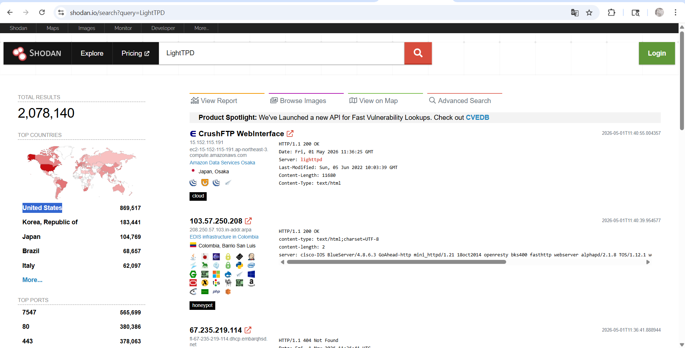
- Censys: 
    + tương tự như Shodan
    + tập trung vào các máy chủ kết nối Internet, trang web, chứng chỉ và các tài sản Internet khác: liệt kê các tên miền, port,...
- VirusTotal:
    + trang web trực tuyến cung cấp dịch vụ quét virus cho các tập tin bằng nhiều công cụ chống virus khác nhau
    + user có thể tải lên các tập tin hoặc cung cấp URL

    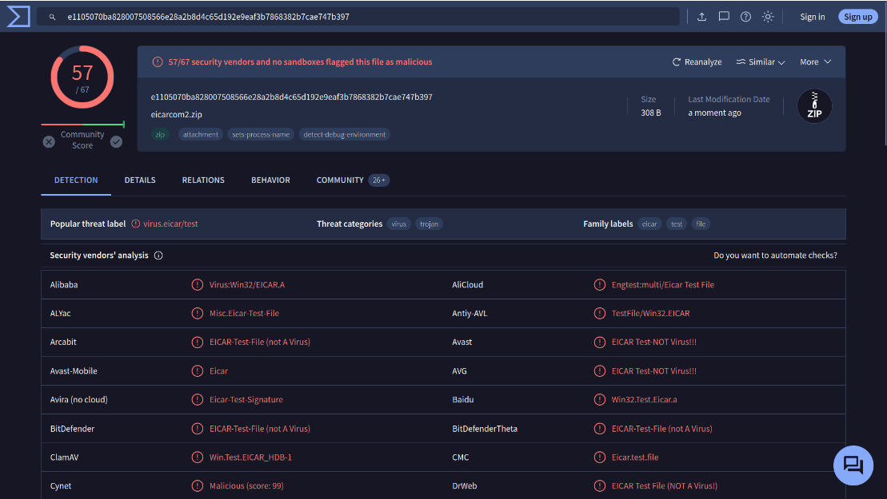
- Have I Been Pwned
    + nhập email => cho ra kết quả email đó đã xuất hiện trong vụ rò rỉ dữ liệu chưa

**CVE**
- Từ điển về các lỗ hổng bảo mật
- Mỗi lỗ hổng - 1 CVE ID
- MITRE: tổ chức duy trì và quản lí hệ thống CVE

**Exploit Database**
- liệt kê các mã khai thác từ nhiều tác giả khác nhau

# Module 2: Linux Fundamentals
- Ứng dụng: web, bảng chơi game trên ô tô, cảm biến, máy tính tiền quầy thu ngân,..
- Bản phân phối: Ubuntu, Debian,..

**Tìm kiếm file**

1. find

`find -name <file_name>`
`find -name *<.file_type>`: tìm tất cả các file có đuôi = `file_type`

2. wc
- đếm số lượng mục có trong file `wc -l <file_name>`

3. grep
- Tìm trong 1 file cụ thể:
`grep "<string>" <file_name>`
- Tìm đệ quy, tìm nội dung trong nhiều file, thuộc cùng 1 folder
`grep -R "<string>" <folder_name>`

**Toán tử**
- `&`: cho phép chạy lệnh trong nền thiết bị đầu cuối (chạy ngầm)
- `&&`: kết hợp nhiều lệnh trên 1 dòng
- `>`: ghi đè vào file ở vị trí hướng mũi tên
- `>>`: ghi thêm...

**Cờ**
`-h`: dễ đọc với con người

**Lệnh**
- `touch`: tạo file
- `file`: xác định loại file

**Danh mục chung**
- `/etc/` (etcetera): thư mục gốc, thư mục cấu hình hệ thống
- `/var`: 
    - một trong những thư mục gốc chính
    - lưu trữ dữ liệu được truy cập hoặc ghi thường xuyên bởi các dịch vụ hoặc ứng dụng đang chạy trên hệ thống `/var/log`
- `/ root`: 
    - thư mục chính của người dùng hệ thống "root"
- `/tmp`:
    - lưu trữ dữ liệu chỉ cần truy cập một hoặc hai lần


**Tiện ích**
- `wget`: tải file, code,...
- `scp`: copy bằng ssh, lệnh chỉ cần nguồn & điểm đến
- `python3 -m http.server`: cho phép folder chạy lệnh hoạt động như 1 server, cung cấp tài nguyên là các file trong folder của mình


**Khởi tạo hệ thống/dịch vụ**
- `systemctl`: `systemctl [option] [service]`
    + Start
    + Stop
    + Enable
    + Disable
    + Status

- `fg`: đưa process chạy ngầm hiển thị trở lại
`crontab -e`: chỉnh sửa crontab (crontab chịu trách nhiệm hỗ trợ và quản lý các tác vụ định kỳ)

**Quản lý repository**

***Repository**: nơi các nhà phát triển lưu trữ phần mềm và các gói công cụ của họ. Thay vì phải đi tìm từng trang web để tải bộ cài (như file .exe trên Windows), Linux tập trung tất cả vào các kho này để người dùng dễ dàng truy cập và tải về.*

- `add-apt-repository`: thêm các kho lưu trữ bổ sung
- `dpkg`: trình cài đặt gói


# Module 3: Windows and AD Fundamentals
#### Hệ thống file
Chủ yếu sử dụng **NTFS** (là một hệ thống ghi nhật ký)
- Có thể tự động sửa chữa các thư mục/tệp trên ổ đĩa bằng cách sử dụng thông tin được lưu trữ trong tệp nhật ký
- Hỗ trợ các tập tin có dung lượng lớn hơn 4GB
- Thiết lập quyền truy cập cụ thể cho các thư mục và tệp.
- Nén thư mục và tập tin
- Mã hóa (Mã hóa file: cung cấp khả năng bảo vệ mã hóa cho từng tệp riêng lẻ trên các ổ đĩa hệ thống tệp NTFS bằng cách sử dụng hệ thống khóa công khai)
- Luồng dữ liệu thay thế (ADS): Mỗi tập tin đều có ít nhất một luồng dữ liệu ( $DATA ), và ADS cho phép các tập tin chứa nhiều hơn một luồng dữ liệu
    - Luồng mặc định: Chứa nội dung chính của tệp (ví dụ: văn bản trong file .txt).

    - Luồng thay thế (ADS): Có thể chứa các thông tin ẩn như metadata, biểu tượng, hoặc thậm chí là mã độc mà không làm thay đổi kích thước hiển thị của tệp trong File Explorer.

#### Window/System32
- `C:\Windows` là thư mục chứa hệ điều hành Windows (biến môi trường hệ thống = `%windir%` )

#### System Configuration
- khắc phục sự cố nâng cao, và mục đích chính là giúp chẩn đoán các sự cố khởi động

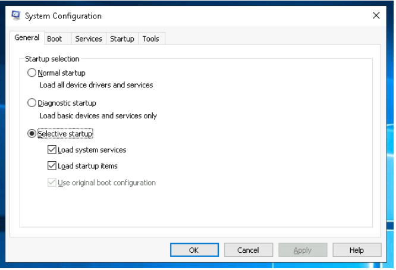

- `System Configuration` KHÔNG phải là chương trình quản lý khởi động (phải sử dụng folder `Starup` để quản lý chương trình khởi động cùng hệ thống)

- `System Properties` (View advanced system settings + Search): cho phép cấu hình các thiết lập nâng cao liên quan đến phần cứng, tên máy tính, và hiệu suất hệ thống 
    + `Computer Name` (Tên máy tính): Cho phép thay đổi tên máy tính hiển thị trong mạng hoặc gia nhập vào một miền (Domain) trong môi trường Active Directory.

    + `Hardware` (Phần cứng): Cung cấp lối tắt đến Device Manager để quản lý driver và các thiết lập cài đặt thiết bị.

    + `Advanced` (Nâng cao): 

        + `Performance` (Hiệu suất): Điều chỉnh các hiệu ứng hình ảnh để tăng tốc máy tính hoặc cấu hình bộ nhớ ảo (Virtual Memory/Page File).

        + `User Profiles` (Hồ sơ người dùng): Quản lý các cài đặt liên quan đến hồ sơ đăng nhập (như thư mục Desktop, Documents, Pictures).

        + `Startup and Recovery`: Cấu hình hệ điều hành mặc định khi khởi động và các hành động khi hệ thống gặp lỗi xanh màn hình (Dump file).

    + `System Protection` (Bảo vệ hệ thống): Nơi bạn tạo và quản lý các điểm khôi phục (System Restore Points). Điều này cực kỳ hữu ích nếu máy tính gặp sự cố sau khi cài đặt phần mềm hoặc cập nhật.

    + `Remote` (Điều khiển từ xa): Cho phép bạn bật/tắt tính năng Remote Desktop để người khác có thể truy cập vào máy tính của bạn từ xa (thường dùng cho mục đích hỗ trợ kỹ thuật).

#### Computer Management
**System Tools**
- Task Scheduler: tạo và quản lý các tác vụ thông thường mà máy tính sẽ tự động thực hiện vào những thời điểm chúng ta chỉ định
- Event Viewer: xem các sự kiện đã xảy ra trên máy tính
    + 5 loại sự kiện ghi log
        + error: vấn đề nghiêm trọng, mất data/function
        + warning: dấu hiệu vấn đề tiềm tàng, vd: dung lượng ổ thấp,...
        + information: hoạt động thành công của ứng dụng, trình điều khiển, dịch vụ
        + success audit: ghi 1 lần truy cập bảo mật được kiểm toán & thành công
        + failure audit: ghi 1 nỗ lực truy cập bảo mật được kiểm toán nhưng không thành công
- Shared Folders: danh sách đầy đủ các thư mục và tài liệu được chia sẻ mà người khác có thể truy cập. 

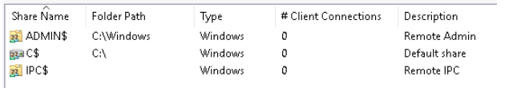
- Device Manager: xem và cấu hình phần cứng, chẳng hạn như vô hiệu hóa bất kỳ phần cứng nào được kết nối với máy tính

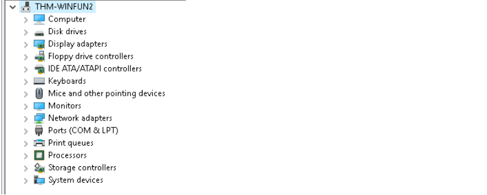

**Stories**
- Windows Server Backup
- Disk Management: là một tiện ích hệ thống trong Windows cho phép bạn thực hiện các tác vụ lưu trữ nâng cao
    - Thiết lập ổ đĩa mới
    - Mở rộng phân vùng
    - Thu nhỏ phân vùng
    - Gán hoặc thay đổi ký tự ổ đĩa (ví dụ: E:)
- Service & Application:  dịch vụ là loại ứng dụng đặc biệt chạy ngầm

#### System configuration 
**System Information** (`msinfo32`)
Thu thập thông tin về máy tính của bạn và hiển thị cái nhìn toàn diện về phần cứng, các thành phần hệ thống và môi trường phần mềm, mà bạn có thể sử dụng để chẩn đoán các sự cố máy tính

- `System Sumary`: hiển thị các thông số kỹ thuật chung của máy tính, chẳng hạn như nhãn hiệu và kiểu máy xử lý
    + `Hardware Resources`
    + `Components`: thông tin cụ thể về các thiết bị phần cứng được cài đặt trên máy tính (`Display`, `Input`,...)
    + `Software Environment`: thông tin về phần mềm được tích hợp sẵn trong hệ điều hành và phần mềm bạn đã cài đặt (ví dụ: `Environment Variables` and `Network Connections`)
        - `Environment Variables`: lưu trữ thông tin về môi trường hệ điều hành. Thông tin này bao gồm các chi tiết như `đường dẫn hệ điều hành`, `số lượng bộ xử lý` được hệ điều hành sử dụng và vị trí của các thư mục tạm thời (vd: `WINDIR` chứa vị trí thư mục cài đặt Windows)

**Resource Monitor** (resmon)
- hiển thị thông tin sử dụng CPU, bộ nhớ (memory), đĩa (disk) và mạng (network) chi tiết theo từng tiến trình hoặc tổng hợp toàn hệ thống
- cung cấp chi tiết về việc tiến trình nào đang sử dụng các file handle (trình xử lý tệp) và các module riêng lẻ
- Tính năng lọc nâng cao cho phép người dùng tách biệt dữ liệu liên quan đến một hoặc nhiều tiến trình
- tính năng phân tích tiến trình, giúp xác định các tiến trình bị tắc nghẽn (deadlock) và các xung đột khóa tệp (file locking conflicts)
- Gồm: 
    + CPU
    + Disk
    + Memory
    + Network

**Windows Registry**
- một cơ sở dữ liệu phân cấp trung tâm được sử dụng để lưu trữ thông tin cần thiết để cấu hình hệ thống cho một hoặc nhiều người dùng, ứng dụng và thiết bị phần cứng.
- Chứa thông tin: 
    + Hồ sơ cho mỗi người dùng
    + Các ứng dụng được cài đặt trên máy tính và các loại tài liệu mà mỗi ứng dụng có thể tạo ra.
    + Cài đặt thuộc tính cho thư mục và biểu tượng ứng dụng
    + Hệ thống có những phần cứng nào?
    + Các cổng đang được sử dụng.

- `Registry Editor` (regedit): xem/chỉnh sửa registry

**Windows Security**
2 thành phần: 
- Các mối đe dọa hiện tại
    + Tùy chọn quét: nhanh, toàn bộ, tùy chỉnh
    + Lịch sử mối đe dọa: Lần quét cuối cùng, Các mối đe dọa bị cách ly, Các mối đe dọa được cho phép 
- Cài đặt bảo vệ chống virus và mối đe dọa
    + Manage settings 
    + Virus & threat protection updates
    + Ransomware protection

**Tường lửa** (WF.msc)
3 loại: 
- domain: áp dụng cho các mạng mà hệ thống máy chủ có thể xác thực với bộ điều khiển miền. 
- private: do người dùng tự thiết lập và được sử dụng để chỉ định mạng riêng tư hoặc mạng gia đình.
- public: sử dụng để chỉ định các mạng công cộng như điểm truy cập Wi-Fi tại quán cà phê, sân bay và các địa điểm khác.

**Microsoft Defender SmartScreen**
- bảo vệ chống lại lừa đảo hoặc các trang web và ứng dụng chứa phần mềm độc hại, và việc tải xuống các tệp có khả năng gây hại 

**Device Security**
- Core isolation
    + Memory Integrity: Prevents attacks from inserting malicious code into high-security processes
- Security processor
- TPM (Trusted Platform Module): cung cấp các chức năng liên quan đến bảo mật dựa trên phần cứng. Chip TPM là một bộ xử lý mã hóa an toàn được thiết kế để thực hiện các hoạt động mã hóa. Chip này bao gồm nhiều cơ chế bảo mật vật lý để chống lại sự can thiệp trái phép, và phần mềm độc hại không thể can thiệp vào các chức năng bảo mật của TPM 

**Volume Shadow Copy Service** (VSS)
- điều phối các hành động cần thiết để tạo ra một bản sao nhất quán (còn được gọi là ảnh chụp nhanh hoặc bản sao tại một thời điểm cụ thể) của dữ liệu cần được sao lưu. 
- lưu trữ trong thư mục System Volume Information trên mỗi ổ đĩa đã được bật tính năng bảo vệ
- có thể thực hiện các chức năng nếu bật VSS:
    + Tạo điểm khôi phục
    + Thực hiện khôi phục hệ thống
    + Cấu hình cài đặt khôi phục
    + Xóa điểm khôi phục

#### Active Directory Basic
**Windows domain**
+ một nhóm người dùng và máy tính được quản lý bởi một doanh nghiệp nhất định.
+ tập trung hóa việc quản lý các thành phần chung của mạng máy tính Windows vào một kho lưu trữ duy nhất được gọi là Active Directory
+ Máy chủ chạy các dịch vụ Active Directory được gọi là Bộ điều khiển miền (Domain Controller)


**Active Directory Domain Service (AD DS)**
- danh mục chứa thông tin của tất cả các "đối tượng" tồn tại trên mạng của bạn
- gồm: 
    + users (chủ thể bảo mật): được xác thực bởi miền và có thể được gán quyền truy cập vào các tài nguyên như tệp hoặc máy in

    + machines: được coi là "thực thể bảo mật" và được gán một tài khoản giống như bất kỳ người dùng thông thường nào
    + printers
    + shares 
    + groups:  gán quyền truy cập vào các tệp hoặc tài nguyên khác cho toàn bộ nhóm thay vì từng người dùng riêng lẻ 
    
       

| Security Group | Description |
| :--- | :--- |
| **Domain Admins** | Người dùng trong nhóm này có quyền quản trị trên toàn bộ domain. Theo mặc định, họ có thể quản trị bất kỳ máy tính nào trong domain, bao gồm cả các máy Domain Controller (DC). |
| **Server Operators** | Người dùng trong nhóm này có thể quản trị các máy Domain Controller. Tuy nhiên, họ không thể thay đổi tư cách thành viên của bất kỳ nhóm quản trị nào. |
| **Backup Operators** | Người dùng trong nhóm này được phép truy cập vào bất kỳ tệp tin nào mà không cần quan tâm đến quyền hạn (permissions) của tệp đó. Nhóm này được sử dụng để thực hiện việc sao lưu dữ liệu trên các máy tính. |
| **Account Operators** | Người dùng trong nhóm này có thể tạo mới hoặc sửa đổi các tài khoản khác trong domain. |
| **Domain Users** | Bao gồm tất cả các tài khoản người dùng hiện có trong domain. |
| **Domain Computers** | Bao gồm tất cả các máy tính hiện có trong domain. |
| **Domain Controllers** | Bao gồm tất cả các máy Domain Controller (DC) hiện có trong domain. |
    
- OU (Organizational Units): tương tự như phòng ban, quản lí các user


**Group Policy Objects (GPO)**
- quản lí các chính sách khác nhau cho từng đơn vị, chứa các chính sách nhắm vào người dùng hoặc máy tính, cho phép bạn thiết lập mức cơ bản trên các máy và danh tính cụ thể
- Phân phối GPO
    + được phân phối đến mạng thông qua một thư mục chia sẻ mạng có tên là SYSVOL, được lưu trữ trên máy chủ DC
    + SYSVOL là một thư mục chia sẻ nằm trên máy Domain Controller (DC), Mọi người dùng trong mạng đều có quyền truy cập vào đây để "tải" chính sách về máy mình.
    + Khi thay đổi một chính sách (GPO), các máy tính trong mạng sẽ mất khoảng 2 tiếng để các máy trạm tự động đồng bộ hóa và áp dụng thay đổi mới.
    + `gpupdate /force`: áp dụng ngay GPO


**Phương thức xác thực**
- NetNTLM (cơ chế challenge-response)
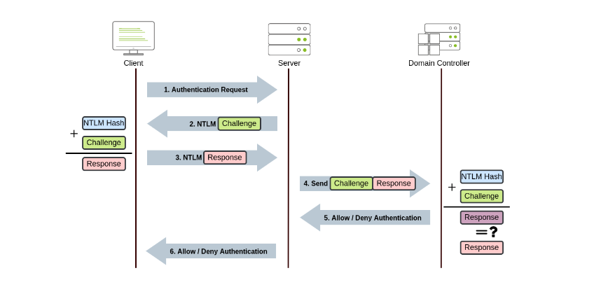

# Module 4: Command Line
### Window Command Line
- `set`:  kiểm tra đường dẫn từ dòng lệnh
- `ver`: xác định phiên bản hệ điều hành (OS)
- `systeminfo`: liệt kê nhiều thông tin khác nhau về hệ thống như thông tin hệ điều hành, chi tiết hệ thống, bộ xử lý và bộ nhớ.
- `tracert target_name` (trace route): theo dõi đường đi của mạng để đến được đích
- `nslookup example.com`:  tìm kiếm một máy chủ hoặc tên miền và trả về địa chỉ IP của nó
- `netstat`: hiển thị các kết nối mạng hiện tại và các cổng đang lắng nghe
    + Các cờ: 
        - `-a`: Hiển thị tất cả các kết nối đã thiết lập và các cổng lắng nghe.
        - `-b`: Hiển thị chương trình được liên kết với từng cổng lắng nghe và kết nối đã thiết lập.
        - `-o`: Hiển thị ID tiến trình (PID) liên kết với kết nối.
        - `-n`: sử dụng dạng số cho địa chỉ và số cổng


- `tasklist`: xem danh sách tất cả các ứng dụng, dịch vụ và tiến trình đang chạy trên máy tính (cục bộ hoặc từ xa)
    - `tasklist /svc`: Hiển thị các dịch vụ (Services) cụ thể đang chạy bên trong mỗi tiến trình.
    - `tasklist /fi "filter"`: lọc kết quả theo điều kiện nhất định
    - `tasklist /FI "imagename eq sshd.exe"`:  tìm kiếm các tác vụ liên quan đến `sshd.exe`
    - `taskkill /PID target_pid`: kết thúc tiến trình bằng `PID`
- `dir /s`: Hiển thị các tệp trong thư mục hiện tại và tất cả các thư mục con.
- `tree`: trực quan hóa các thư mục con và thư mục phụ.
- `type`: hiện nội dung file văn bản
- `del`/`erase`: xóa file
- `*`: tham chiếu đến nhiều tệp
    + vd: `copy *.md C:\Markdown` để sao chép tất cả các tệp có phần mở rộng `md` vào thư mục `C:\Markdown`
- `chkdsk`:  Kiểm tra hệ thống tập tin và các phân vùng đĩa để tìm lỗi và các sector bị hỏng.
- `driverquery`: Hiển thị danh sách các trình điều khiển thiết bị đã được cài đặt.
### Window Powershell
- `cmdlets`: các lệnh powershell
- `Get-Content`: Truy xuất (lấy) nội dung của một tệp và hiển thị nó trên bảng điều khiển. 
- `Set-Location`: Thay đổi (thiết lập) thư mục làm việc hiện tại.

- `Get-Command`:  liệt kê tất cả các cmdlet, hàm, bí danh và tập lệnh có sẵn có thể được thực thi trong phiên PowerShell hiện tại
- `-CommandType "Function"`: hiển thị các lệnh có sẵn thuộc loại “function”
- `Get-Help`: cung cấp thông tin chi tiết về các cmdlet, bao gồm cách sử dụng, tham số và ví dụ
- `Get-Alias`: liệt kê tất cả các bí danh có sẵn
- `Get-ChildItem`: liệt kê các tệp và thư mục trong một vị trí được chỉ định bằng tham số -Path
- `Set-Location -path "<path>"`: chuyển đến một thư mục khác
- `New-Item`: tạo folder mới `New-Item -Path ".\captain-cabin\captain-wardrobe" -ItemType "Directory"`

- `| Sort-Object <Length,....>`: sắp xếp result theo..
- `| Where-Object -Property "Extension" -eq ".txt"`:  lọc các tệp theo thuộc tính Extension của chúng, đảm bảo rằng chỉ những tệp có phần mở rộng bằng (-eq) `.txt` mới được liệt kê.
    - -ne:  không bằng 
    - -gt: " lớn hơn "
    - -ge: " lớn hơn hoặc bằng "
    - -lt: " nhỏ hơn "
    - -le: " nhỏ hơn hoặc bằng "
- `Select-String -Path ".\captain-hat.txt" -Pattern "hat"`: tìm kiếm các mẫu văn bản trong các tệp
- `Get-ComputerInfo`: truy xuất thông tin hệ thống toàn diện, bao gồm thông tin hệ điều hành, thông số kỹ thuật phần cứng, chi tiết BIOS, và nhiều hơn nữa
- `Get-LocalUser`: liệt kê tất cả các tài khoản người dùng cục bộ trên hệ thống
- `Get-NetIPConfiguration`: Cung cấp thông tin chi tiết về các giao diện mạng trên hệ thống, bao gồm địa chỉ IP, máy chủ DNS và cấu hình cổng mặc định.
- `Get-Process`: cung cấp cái nhìn chi tiết về tất cả các tiến trình đang chạy,
- `Get-Service`:  truy xuất thông tin về trạng thái của các dịch vụ trên máy, chẳng hạn như dịch vụ nào đang chạy, đã dừng hoặc tạm dừng
- `Get-NetTCPConnection`: hiển thị các kết nối TCP hiện tại, cung cấp thông tin chi tiết về cả các điểm cuối cục bộ và từ xa.
    - OwningProcess: 
        - chứa mã định danh tiến trình (PID - Process ID)
        - là con số duy nhất mà hệ điều hành gán cho một chương trình đang chạy để quản lý các tài nguyên mà nó sử dụng, bao gồm cả các kết nối mạng 
- `Get-FileHash`:  tạo mã băm cho tệp, đặc biệt có giá trị trong việc xử lý sự cố, săn lùng mối đe dọa và phân tích phần mềm độc hại, vì nó giúp xác minh tính toàn vẹn của tệp và phát hiện khả năng bị giả mạo
- `Invoke-Command`: 
    - thực thi các lệnh trên hệ thống từ xa

### Linux Shells
- Bash: trình thông dịch lệnh mặc định của hầu hết các bản phân phối Linux
- `/etc/shells`: chứa tất cả các shell đã được cài đặt trên hệ điều hành
- `echo $SHELL`:  xem bạn đang sử dụng trình thông dịch lệnh nào
- gõ tên shell hiện có trên hệ điều hành của mình để chuyển đổi giữa các shell
- `chsh -s /usr/bin/<tên shell>`: thay đổi vĩnh viễn trình shell mặc định

**Các loại shell**
- Bash (Bourne Again Shell)
    - tự động hoàn thành bằng phím Tab
    - lưu trữ lịch sử lệnh và ghi lại tất cả các lệnh bạn đã thực thi
    - `history`: hiển thị tất cả các lệnh trước đó.
- Fish (Friendly Interactive Shell)
    - tính năng tự động sửa lỗi chính tả cho các lệnh bạn viết
    - tô sáng cú pháp của fish sẽ tô màu các phần khác nhau của lệnh dựa trên vai trò của chúng
    - chức năng scripting, tự động hoàn thành bằng phím Tab và lịch sử lệnh tương tự như các trình shell 
- Zsh (Z Shell)
    -  tự động hoàn thành nâng cao và cũng có khả năng viết kịch bản
    - tự động sửa lỗi chính tả cho các lệnh
    - tự động hoàn thành bằng phím Tab, chức năng lịch sử lệnh


**Lệnh**
- `read  + tên biến`: nhận đầu vào từ user

# Module 5: Networking
### Khái niệm cơ bản
##### Mô hình OSI

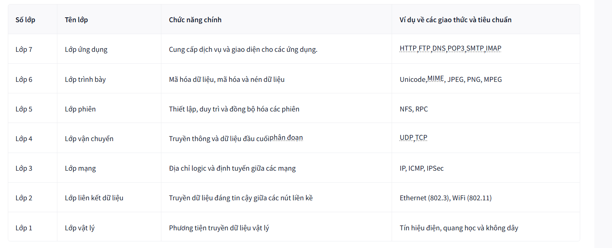

##### Mô hình TCP/IP
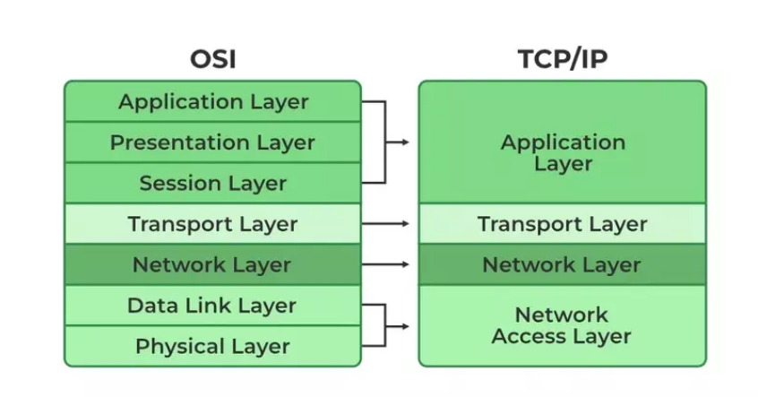

##### Địa chỉ IP và Subnetmark
RFC 1918 định nghĩa ba dải địa chỉ IP riêng sau:
- 10.0.0.0- 10.255.255.255( 10/8)
- 172.16.0.0- 172.31.255.255( 172.16/12)
- 192.168.0.0- 192.168.255.255( 192.168/16)

##### Đóng gói dữ liệu 
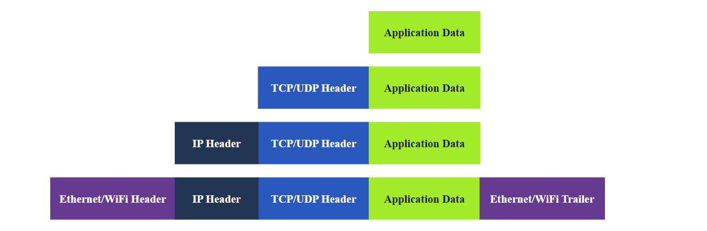
Quy trình đóng gói

- Dữ liệu ứng dụng:  
- Phân đoạn giao thức vận chuyển hoặc gói dữ liệu: thêm thông tin tiêu đề phù hợp và tạo ra TCP hoặc UDP 
- Gói mạng: thêm tiêu đề IP vào gói tin nhận được
- Khung liên kết dữ liệu: Ethernet hoặc WiFi nhận gói IP và thêm phần tiêu đề và phần cuối phù hợp, tạo thành một khung 

**Telnet**
-  dùng để kết nối thiết bị đầu cuối từ xa,  kết nối với bất kỳ máy chủ nào đang lắng nghe trên một cổng TCP
- vd: `telnet 10.48.132.147 7`

### Network Basic
### DHCP
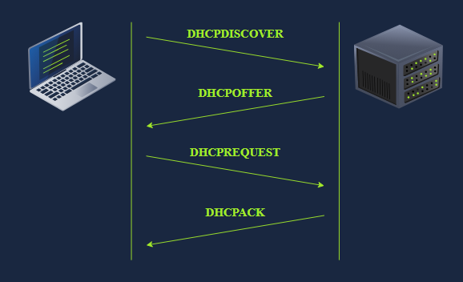

Tuân theo bốn bước:
- DHCP Discover: client tìm kiếm máy chủ cục bộ
- DHCP Offer: server phản hồi bằng thông báo DHCPOFFER với địa chỉ IP mà máy khách có thể chấp nhận.
- DHCP Request: Máy khách phản hồi bằng thông báo DHCPREQUEST để cho biết rằng nó đã chấp nhận địa chỉ IP được cung cấp.
- DHCP Acknowledge: Máy chủ phản hồi bằng thông báo DHCPACK để xác nhận rằng địa chỉ IP được cung cấp hiện đã được gán cho máy khách này.

### Các thuật toán định tuyến
**OSPF (Open Shortest Path First)**
- cho phép các bộ định tuyến chia sẻ thông tin về cấu trúc liên kết mạng và tính toán các đường dẫn hiệu quả nhất để truyền dữ liệu
- cho phép các bộ định tuyến trao đổi thông tin cập nhật về trạng thái của các liên kết và mạng được kết nối

**EIGRP (Enhanced Interior Gateway Routing Protocol)**
- cho phép các bộ định tuyến chia sẻ thông tin về các mạng mà chúng có thể truy cập và chi phí (như băng thông hoặc độ trễ) liên quan đến các tuyến đường đó.

**BGP (Border Gateway Protocol)**
- cho phép các mạng khác nhau (như mạng của các nhà cung cấp dịch vụ Internet) trao đổi thông tin định tuyến và thiết lập đường dẫn cho dữ liệu di chuyển giữa các mạng này
- đảm bảo dữ liệu có thể được định tuyến hiệu quả trên Internet, ngay cả khi đi qua nhiều mạng.

**RIP (Routing Information Protocol)**
- RIP (Routing Information Protocol)
- chia sẻ thông tin về các mạng mà chúng có thể truy cập và số bước nhảy (số bộ định tuyến) cần thiết để đến đó


### NAT
- Sử dụng một địa chỉ IP công cộng để cung cấp truy cập Internet cho nhiều địa chỉ IP riêng .

### Giao thức mạng
**Whois**
- tra cứu thông tin của bất kỳ tên miền nào đã đăng ký

**FTP** (File Transfer Protocol) - 21
- USER: được dùng để nhập tên người dùng
- PASS: được dùng để nhập mật khẩu
- RETR(retrieve): được sử dụng để tải xuống một tập tin từ máy chủ FTP về máy khách.
- STOR(store): được sử dụng để tải tệp từ máy khách lên máy chủ

- `ftp <machine_ip>`: kết nối máy chủ ftp
- sử dụng tên người dùng `anonymous` để đăng nhập mà không cần password
- `ls`: liệt kê
- `get`: lấy file
- `quit`: đóng kết nối 

**SMTP** (Simple Mail Transfer Protocol) - gửi mail - 25
- Giao thức định nghĩa cách ứng dụng mail giao tiếp với mail server và cách mail server giao tiếp với ứng dụng khác

- Lệnh: 
    - `HELO` or `EHLO`: khởi tạo 1 phiên SMTP
    - `MAIL FROM`: chỉ định địa chỉ email người gửi
    - `RCPT TO`: Chỉ định địa chỉ email của người nhận
    - `DATA`: máy khách sẽ bắt đầu gửi nội dung của tin nhắn email
    - `.`:  được gửi trên một dòng riêng để báo hiệu kết thúc tin nhắn email

**POP3** (Post Office Protocol version 3) - nhận mail - 110
- Cho phép máy khách giao tiếp với mail server để truy xuất các tin nhắn email

- Lệnh
    - `USER <username>`: xác định người dùng
    - `PASS <password>`: cung cấp mật khẩu của người dùng
    - `STAT`: yêu cầu số lượng tin nhắn và tổng kích thước.
    - `LIST`: Liệt kê tất cả các tin nhắn và kích thước của chúng.
    - `RETR <message_number>`: truy xuất thông báo được chỉ định
    - `DELE <message_number>`: đánh dấu tin nhắn để xóa
    - `QUIT`: Kết thúc phiên POP3 bằng cách áp dụng các thay đổi, chẳng hạn như xóa.

**IMAP** (Internet Message Access Protocol) - đồng bộ hóa email - 143
- Cho phép đồng bộ hóa các tin nhắn đã đọc, di chuyển và xóa
- email được lưu trữ trên máy chủ và đồng bộ hóa giữa các ứng dụng email

- Lệnh: 
    - `LOGIN <username> <password>` xác thực người dùng
    - `SELECT <mailbox>` Chọn thư mục hộp thư để làm việc.
    - `FETCH <mail_number> <data_item_name>` Ví dụ fetch 3 body[]về cách lấy thông báo số 3, bao gồm tiêu đề và nội dung.
    - `MOVE <sequence_set> <mailbox>` Di chuyển các tin nhắn được chỉ định đến hộp thư khác.
    - `COPY <sequence_set> <data_item_name>` Sao chép các tin nhắn được chỉ định vào hộp thư khác
    - `LOGOUT` đăng xuất

### Giao thức bảo mật mạng
#### TLS
- Giao thức mật mã hoạt động ở lớp vận chuyển của mô hình OSI
- Cần có chữ kí chứng chỉ TLS để xác thực danh tính

#### HTTPS, SMTPS, POP3S, IMAPS
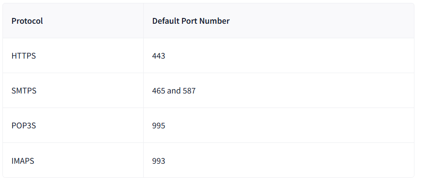

#### SFTP (SSH + FTP port 22), FTPS (FTP + TLS port 990)

### Wireshark basic
- `Statistics --> Capture File Properties`: thông tin chi tiết về file

**Gói tin**
- `Frame`  (Lớp 1): Phần này sẽ cho bạn biết bạn đang xem khung/gói dữ liệu nào và các chi tiết cụ thể liên quan đến lớp Vật lý của mô hình OSI.
- `Source  [MAC]` (Lớp 2): Phần này sẽ hiển thị địa chỉ MAC nguồn và đích; từ lớp Liên kết dữ liệu của mô hình OSI.
- `Source  [IP]` (Lớp 3): Phần này sẽ hiển thị địa chỉ IPv4 nguồn và đích; từ lớp Mạng của mô hình OSI.
- `Protocol` (Lớp 4): Phần này sẽ hiển thị chi tiết về giao thức được sử dụng (UDP/TCP) và các cổng nguồn và đích; từ lớp Vận chuyển của mô hình OSI.
- `Protocol Errors`: Phần tiếp theo của lớp thứ 4 này hiển thị các phân đoạn cụ thể từ TCP cần phải được lắp ráp lại.
- `Application Protocol` (Lớp 5): Phần này sẽ hiển thị các chi tiết cụ thể liên quan đến giao thức được sử dụng, chẳng hạn như HTTP,FTP, và Doanh nghiệp vừa và nhỏ Từ lớp Ứng dụng của mô hình OSI.
- `Application Data`:  Phần mở rộng này của lớp thứ 5 có thể hiển thị dữ liệu dành riêng cho ứng dụng.

**Lọc**
- `tcp.port==<số cổng>`: lọc theo số cổng giao thức
- `ip.addr==<địa chỉ ip>`: lọc theo ip

### Tcpdump basic
- Thư viện: `libpcap`

**Lệnh**
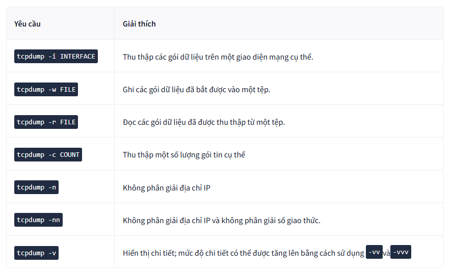

**Biểu thức lọc**
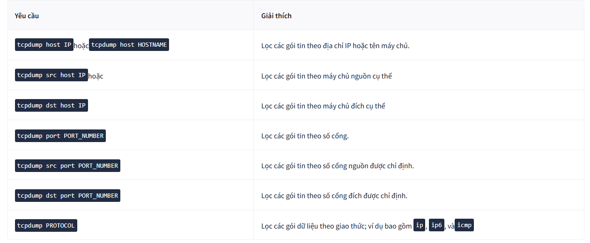

**Lọc nâng cao**
- `greater LENGTH`: Lọc các gói tin có độ dài lớn hơn hoặc bằng độ dài được chỉ định.
- `less LENGTH`: Lọc các gói tin có độ dài nhỏ hơn hoặc bằng độ dài được chỉ định.

- phép toán nhị phân: `&`, `|`, `!` 
- Header Bytes
    - proto[expr:size]: lọc gói tin theo nội dung của header byte
        - proto: tên giao thức (arp, ether, icmp, ip, ip6, tcp, và udp)
        - expr: vị trí byte
        - size: số byte muốn lấy
        - vd: ether[0] & 1 != 0 - lấy byte đầu tiên trong tiêu đề ether, thực hiện phép & với 00000001, thực hiện so sánh với 00000000, nếu không bằng => trả về true và ngược lại
    - tcp[tcpflags]: để tham chiếu đến trường các cờ (flags) của TCP. Các cờ TCP sau đây có sẵn để so sánh:
        - tcp-syn: TCP SYN (Đồng bộ hóa - Synchronize)
        - tcp-ack: TCP ACK (Xác nhận - Acknowledge)
        - tcp-fin: TCP FIN (Kết thúc - Finish)
        - tcp-rst: TCP RST (Thiết lập lại - Reset)
        - tcp-push: TCP Push (Đẩy dữ liệu đi ngay)
        - vd:   tcp[tcpflags] & (tcp-syn) != 0 - tìm các gói tin bắt đầu thiết lập kết nối (chỉ có cờ SYN)

**Hiển thị gói tin**
Gói tin hiển thị thông thường: 
```
user@TryHackMe$ tcpdump -r TwoPackets.pcap
reading from file TwoPackets.pcap, link-type EN10MB (Ethernet), snapshot length 262144
18:59:59.979771 IP 104.18.12.149.https > g5000.45248: Flags [P.], seq 2695955324:2695955349, ack 2856007037, win 16, options [nop,nop,TS val 412758285 ecr 3959057198], length 25
18:59:59.980574 IP g5000.45248 > 104.18.12.149.https: Flags [P.], seq 1:30, ack 25, win 2175, options [nop,nop,TS val 3959057384 ecr 412758285], length 29
```
Các option kèm theo: 
- `-q`: Xuất nhanh; in thông tin gói tin ngắn gọn
```
user@TryHackMe$ tcpdump -r TwoPackets.pcap -q
reading from file TwoPackets.pcap, link-type EN10MB (Ethernet), snapshot length 262144
18:59:59.979771 IP 104.18.12.149.https > g5000.45248: tcp 25
18:59:59.980574 IP g5000.45248 > 104.18.12.149.https: tcp 29
```

- `-e`: In ra tiêu đề cấp liên kết. Nếu bạn đang sử dụng mạng Ethernet hoặc WiFi và muốn bao gồm địa chỉ MAC trong kết quả Tcpdump
```
user@TryHackMe$ tcpdump -r TwoPackets.pcap -e
reading from file TwoPackets.pcap, link-type EN10MB (Ethernet), snapshot length 262144
18:59:59.979771 44:df:65:d8:fe:6c (oui Unknown) > 02:83:1e:40:5d:17 (oui Unknown), ethertype IPv4 (0x0800), length 91: 104.18.12.149.https > g5000.45248: Flags [P.], seq 2695955324:2695955349, ack 2856007037, win 16, options [nop,nop,TS val 412758285 ecr 3959057198], length 25
18:59:59.980574 02:83:1e:40:5d:17 (oui Unknown) > 44:df:65:d8:fe:6c (oui Unknown), ethertype IPv4 (0x0800), length 95: g5000.45248 > 104.18.12.149.https: Flags [P.], seq 1:30, ack 25, win 2175, options [nop,nop,TS val 3959057384 ecr 412758285], length 29
```
- `-A`: Hiển thị dữ liệu gói tin dưới dạng ASCII, tất cả các byte được ánh xạ tới các chữ cái, số và ký hiệu tiếng Anh
```
user@TryHackMe$ tcpdump -r TwoPackets.pcap -A
reading from file TwoPackets.pcap, link-type EN10MB (Ethernet), snapshot length 262144
18:59:59.979771 IP 104.18.12.149.https > g5000.45248: Flags [P.], seq 2695955324:2695955349, ack 2856007037, win 16, options [nop,nop,TS val 412758285 ecr 3959057198], length 25
E..M..@.5..)h.....BY.......|.;5}...........
..1...k......j.3.2.....&9a.....-L
18:59:59.980574 IP g5000.45248 > 104.18.12.149.https: Flags [P.], seq 1:30, ack 25, win 2175, options [nop,nop,TS val 3959057384 ecr 412758285], length 29
E..Ql.@.@.VV..BYh........;5}...............
..k...1.......1.y.&VC<#._J$..z...D#.`
```
- `-xx`: Hiển thị dữ liệu gói tin ở định dạng thập lục phân, được gọi là hex.

- `-X`: Hiển thị tiêu đề và dữ liệu gói tin ở dạng thập lục phân và ASCII.

### Nmap basic
#### Host online
- Giới hạn mục tiêu quét: 
    - `Dải IP`: Sử dụng dấu gạch ngang (VD: 192.168.0.1-10).
    - `Subnet`: Sử dụng ký hiệu CIDR (VD: 192.168.0.1/24 để quét toàn bộ 256 địa chỉ).
    - `Hostname`: Sử dụng tên miền (VD: example.thm).
- `nmap -sn [mục tiêu]`: kiểm tra máy chủ có online hay không
- Sudo/Root
    - Root/Sudo: Cho phép Nmap gửi các gói tin thô (raw packets) tùy chỉnh, giúp quét hiệu quả và chi tiết hơn.
    - Local User: Bị hạn chế ở các kiểu quét cơ bản như ICMP echo và TCP connect.
- Quét cục bộ và từ xa:

| Đặc điểm | Quét mạng Cục bộ (Local) |	Quét mạng Từ xa (Remote) |
|:---|:---|:---|
|Kết nối|	Cùng mạng Ethernet/WiFi.|	Qua một hoặc nhiều bộ định tuyến (router).|
|Giao thức chính|	Sử dụng ARP requests.|	Sử dụng ICMP Echo, TCP SYN, TCP ACK, v.v.|
|Thông tin thêm	|Có thể thấy địa chỉ MAC và nhà sản xuất card mạng.	|Không thấy địa chỉ MAC của mục tiêu (chỉ thấy của router gần nhất).|

- `-sL` (List Scan): Chỉ liệt kê danh sách các IP sẽ quét mà không gửi bất kỳ gói tin nào đến mục tiêu. Giúp kiểm tra lại mục tiêu trước khi thực hiện.

#### Port scan
Cách sử dụng Nmap để quét các cổng (port) TCP và UDP, giúp xác định dịch vụ nào đang chạy trên máy mục tiêu.

|Lệnh|Ý nghĩa|
|:--|:--|
|-sT|Quét TCP Connect (Hoàn tất bắt tay 3 bước). Cách này tin cậy nhưng dễ bị hệ thống mục tiêu ghi lại nhật ký (log)|
|-sS|"Quét TCP SYN (Chế độ ẩn mình, chỉ thực hiện kết nối rồi ngắt ngay khi có phản hồi, không hoàn tất bắt tay 3 bước)"|
|-sU|Quét các cổng UDP|
|-F|Quét nhanh 100 cổng phổ biến|
|-p-|Quét tất cả các cổng (1-65535)|

#### Version Detection

|Lựa chọn|	Giải thích|
|:--|:--|
|-O	|Phát hiện hệ điều hành|
|-sV	|Phát hiện dịch vụ và phiên bản|
|-A|	Phát hiện hệ điều hành, phát hiện phiên bản và các tính năng bổ sung khác.|
|-Pn|	Quét các máy chủ có vẻ như đang ngoại tuyến|

#### Hiệu suất và Thời gian (Timing & Performance)

|Tùy chọn	|Mô tả	|Ứng dụng|
|:--|:--|:--|
|-T<0-5>|	Các mẫu thời gian (Timing Templates)	|Từ 0 (chậm nhất/ẩn mình) đến 5 (nhanh nhất/dễ bị phát hiện).|
|--min/max-parallelism|	Số lượng probe song song|	Kiểm soát số lượng các cuộc thăm dò thực hiện cùng lúc.|
|--min/max-rate	|Tốc độ gửi gói tin|	Giới hạn số lượng gói tin gửi đi trên mỗi giây.|
|--host-timeout|	Thời gian chờ máy chủ|	Thời gian tối đa Nmap chờ phản hồi từ một máy chủ trước khi bỏ qua.|

#### Mức hiển thị kết quả quét và lưu báo cáo
**Mức hiển thị**
- `-v`: độ chi tiết
    - `-vv`, `-v2`,...
    - khi đang quét có thể ấn thêm `v` trên bàn phím để tăng kết quả hiển thị
- `-d`: gỡ lỗi 
    - cao nhất: `d9`
    - cách dùng tương tự `-v`

**Lưu báo cáo**
|Tùy chọn|Định dạng tệp|Đặc điểm|
|:--|:--|:--|
|-oN <tên_file>|Đầu ra bình thường (Normal)|"Định dạng văn bản giống như hiển thị trên Terminal, dễ đọc nhất."|
|-oX <tên_file>|Đầu ra XML|Dùng cho các chương trình phân tích dữ liệu hoặc báo cáo chuyên nghiệp.|
|-oG <tên_file>|Đầu ra Grepable|Định dạng tối ưu để lọc thông tin bằng các lệnh dòng lệnh như grep hoặc awk.|
|-oA <tên_file>|Tất cả các định dạng|Xuất cùng lúc 3 tệp với các đuôi mở rộng tương ứng: .nmap, .xml, và .gnmap.|

# Module 6: Cryptography
### Public Key Cryptography Basics
**Diffie-Hellman Key Exchange**
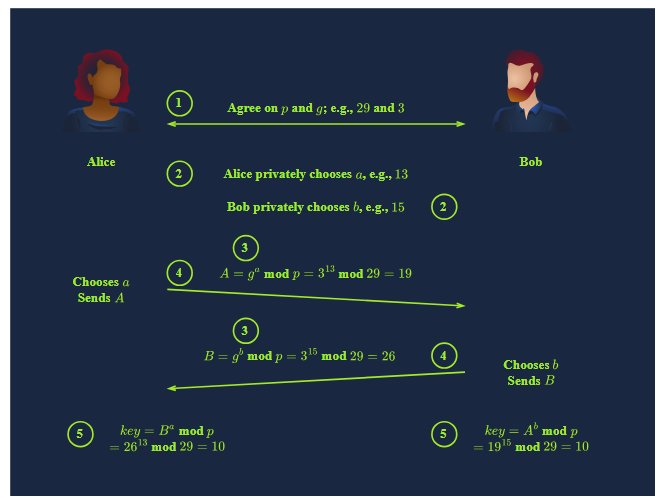
Mục đích chính của phương pháp này là cho phép hai bên thiết lập một bí mật chung trên một kênh liên lạc không an toàn mà không cần có bí mật chung từ trước. Khóa chung này sau đó sẽ được sử dụng để mã hóa đối xứng cho các cuộc giao tiếp tiếp theo.

1. Thống nhất biến công khai: 
Hai bên chọn một số nguyên tố lớn $p$ và một số sinh $g$ (với $0 < g < p$) để công bố công khai.
2. Chọn khóa riêng tư: 
Mỗi bên chọn độc lập một số nguyên riêng tư ($a$ và $b$) và giữ bí mật tuyệt đối.
3. Tính khóa công khai:
Alice tính: $A = g^a \pmod p$.
Bob tính: $B = g^b \pmod p$.
4. Trao đổi khóa: 
Alice gửi $A$ cho Bob, và Bob gửi $B$ cho Alice.
5. Tính toán bí mật chung:
Alice tính: $B^a \pmod p$.
Bob tính: $A^b \pmod p$.
**Kết quả**: Cả hai sẽ nhận được cùng một giá trị là $g^{ab} \pmod p$, đây chính là khóa bí mật chung.

**SSH**
1.  Xác thực Máy chủ (Authenticating the Server)
Khi kết nối lần đầu, máy khách (SSH client) sẽ xác thực danh tính máy chủ thông qua vân tay khóa công khai (public key fingerprint).

2. Xác thực Máy khách (Authenticating the Client)
Thay vì sử dụng mật khẩu (vốn tiềm ẩn nhiều rủi ro), xác thực bằng cặp khóa công khai/riêng tư là phương pháp bảo mật tối ưu.
- ssh-keygen: Công cụ dùng để tạo cặp khóa. Các thuật toán phổ biến bao gồm:

    - RSA: Thuật toán mặc định, có chiều dài khóa lớn.

    - Ed25519: Hệ thống chữ ký hiện đại, sử dụng đường cong Elliptic, hiệu quả và khóa ngắn hơn.

    - ECDSA/DSA: Các biến thể khác phục vụ mục đích ký số.

- Cơ chế: Khóa công khai (.pub) được đưa lên máy chủ, còn khóa riêng tư được máy khách giữ kín để chứng minh danh tính.
3. Quản lý Khóa riêng tư (SSH Private Keys)
- Quyền hạn (Permissions): Tệp khóa riêng tư phải có quyền 600 (chỉ chủ sở hữu mới có quyền đọc/ghi) hoặc khắt khe hơn để SSH client chấp nhận sử dụng.

- Passphrase: Là mật khẩu dùng để mã hóa khóa riêng tư ngay trên máy cục bộ. Passphrase không bao giờ được truyền đi hay gửi đến máy chủ; nó chỉ dùng để giải mã khóa tại máy khách.

- Lưu ý: Có thể sử dụng lệnh ssh -i <tên_file_khóa> user@host để chỉ định khóa khi đăng nhập.

4. Cơ chế Tin cậy và Nâng cấp Shell
authorized_keys: Đây là tệp nằm trong thư mục ~/.ssh/ trên máy chủ, chứa danh sách các khóa công khai được phép truy cập.

**PGP/GPG**
1. Tổng quan về PGP/GPG
- PGP (Pretty Good Privacy): Là phần mềm dùng để mã hóa tệp tin và thực hiện ký số.

- GnuPG (GPG): Bản thực thi mã nguồn mở của tiêu chuẩn OpenPGP.

- Ứng dụng: Thường dùng trong email để bảo vệ tính bảo mật (confidentiality) và xác nhận tính toàn vẹn (integrity) của thông điệp.

2. Quy trình tạo khóa (gpg --full-gen-key)
Khi tạo cặp khóa mới, bạn cần thực hiện các lựa chọn sau:

- Mục đích sử dụng: Chọn giữa chỉ ký (sign only) hoặc cả ký và mã hóa (sign and encrypt).

- Thuật toán: Có nhiều lựa chọn như RSA, DSA, Elgamal hoặc ECC (mặc định).

- Thời hạn (Expiry Date): Thiết lập thời gian khóa có hiệu lực hoặc chọn không bao giờ hết hạn.

- Thông tin định danh (User ID): Cung cấp tên thật, địa chỉ email và nhận xét về mục đích của khóa.

3. Quản lý và Bảo mật khóa
- Bảo vệ khóa riêng tư: Tương tự như SSH, khóa riêng tư GPG có thể được bảo vệ bằng mật khẩu (passphrase).

- Tấn công bẻ khóa: Nếu quên mật khẩu, có thể sử dụng công cụ gpg2john kết hợp với John the Ripper để thử phá mã.

- Sao lưu: Do tầm quan trọng của khóa, việc sao lưu bản dự phòng ở vị trí an toàn là cực kỳ cần thiết.

4. Lệnh

|Lệnh	|Chức năng|
|:---|:---|
|gpg --import <tên_file>|	Nhập khóa từ tệp sao lưu vào hệ thống mới.|
|gpg --decrypt <tên_file>|	Sử dụng khóa riêng tư để giải mã thông điệp nhận được.|
|gpg --full-gen-key|	Khởi tạo quy trình tạo cặp khóa đầy đủ.|

### Hàm băm cơ bản
**Dùng hàm băm lưu trữ password**
Rainbow Table: một bảng tra cứu các mã băm (hash) tương ứng với văn bản gốc, cho phép bạn nhanh chóng tìm ra mật khẩu mà người dùng đã sử dụng chỉ dựa vào mã băm.

**Nhận dạng hash**
- hashID có thể hỗ trợ nhận dạng, nhưng không đáng tin cậy với định dạng không có tiền tố rõ ràng
- hash trong cơ sở dữ liệu ứng dụng web, khả năng cao đó là MD5.
- hash được tìm thấy trong hệ thống mạng Windows, khả năng cao đó là NTLM.

1. Hash Pass trong linux
- lưu trong /etc/shadow (root có quyền đọc), định dạng `$prefix$options$salt$hash`

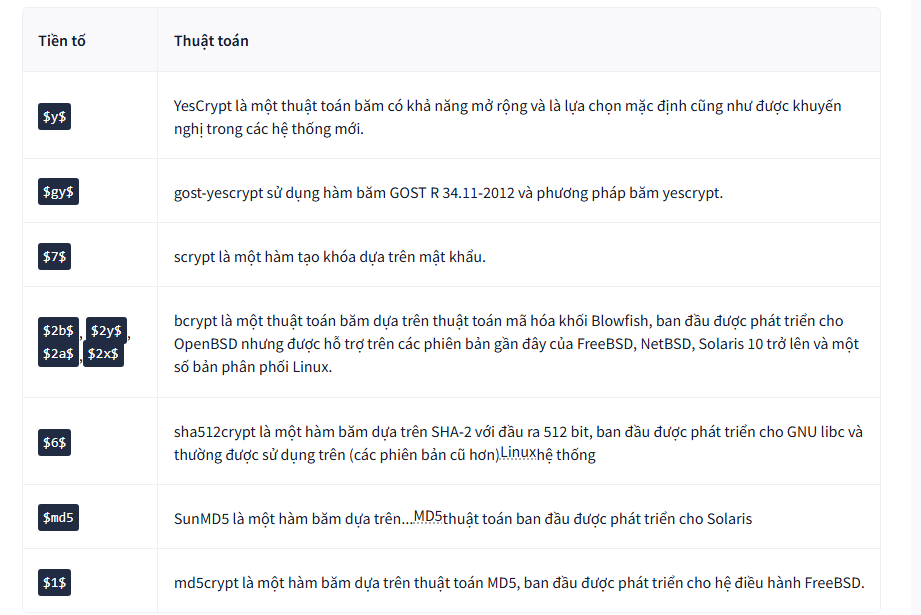

2. Hash pass trong win
- Định dạng: Mật khẩu Windows sử dụng NTLM (một biến thể của MD4).

- Đặc điểm: Hash NTLM về mặt hình thức trông rất giống với MD4 hoặc MD5, do đó ngữ cảnh là yếu tố cực kỳ quan trọng để phân biệt.

- Lưu trữ và Trích xuất:

    - Hash được lưu trong SAM (Security Accounts Manager).

    - Có thể sử dụng các công cụ như mimikatz để vượt qua hàng rào bảo mật và trích xuất (dump) các NT hash và LM hash.

**Phá mật khẩu**
- GPU: có thể sử dụng card đồ họa để giải mã nhiều loại hàm băm một cách nhanh chóng
- VMs:  
    - HashCat:

| Lệnh / Tham số | Chức năng |
| :--- | :--- |
| **`-m <hash_type>`** | Chỉ định loại mã băm bằng định dạng số (ví dụ: `-m 1000` là NTLM). |
| **`-a <attack_mode>`** | Chỉ định chế độ tấn công (ví dụ: `-a 0` là chế độ thử lần lượt/straight). |
| **`hashfile`** | Đường dẫn đến tệp tin chứa mã băm (hash) mục tiêu cần phá giải. |
| **`wordlist`** | Đường dẫn đến danh sách mật khẩu tiềm năng (ví dụ: `rockyou.txt`). |


**Kiểm tra tính toàn vẹn**


| Khái niệm | Mục đích chính | Cơ chế hoạt động | Ứng dụng thực tế |
| :--- | :--- | :--- | :--- |
| **Kiểm tra chính trực (Integrity)** | Đảm bảo dữ liệu không bị sửa đổi trái phép. | Sử dụng hàm băm; một thay đổi nhỏ ở đầu vào sẽ làm mã băm đầu ra thay đổi hoàn toàn. | Kiểm tra tệp ISO (sha256sum), tìm và xóa tệp trùng lặp. |
| **HMAC** | Xác thực nguồn gốc và đảm bảo tính toàn vẹn. | Kết hợp hàm băm mật mã với một **khóa bí mật** qua các bước đệm và phép toán XOR. | Xác nhận danh tính người gửi và đảm bảo dữ liệu không bị sửa đổi khi truyền tải. |

- Công thức HMAC:
$$HMAC(K, M) = H((K \oplus opad) \parallel H((K \oplus ipad) \parallel M))$$


