# Module 2: Network Fundamentals
### Networking
Phương thức nhận dạng thiết bị: 2 phương thức
- Địa chỉ IP
- Địa chỉ MAC (tương tự như số seri)
**Địa chỉ IP**
Dùng để xác định 1 máy chủ trong 1 khoảng thời gian nhất định
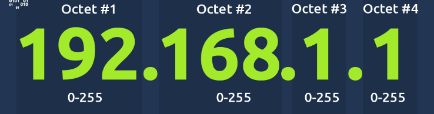
- Được chia làm 4 octet, mỗi octet có giá trị từ 0-255
- Trong cùng một thời điểm, tại một phân đoạn mạng nhất định, không thể có hai thiết bị cùng sử dụng chung một địa chỉ IP

Giao thức đóng vai trò là ngôn ngữ chung cho các thiết bị mạng. Trong đó, địa chỉ IP được coi là tên gọi hoặc số nhà và nó phải được thiết lập dựa trên các quy định chung của giao thức để đảm bảo khả năng kết nối.

- Thiết bị có thể nằm trên cả mạng riêng và mạng công cộng. Địa chỉ IP công cộng để xác định thiết bị trên môi trường Internet. Địa chỉ IP riêng để xác định thiết bị trong số các thiết bị khác. 
- 2 thiết bị có thể liên lạc với nhau bằng địa chỉ IP của chúng, nhưng khi ra ngoài Internet thì cả 2 đều có chung 1 địa chỉ IP công cộng.
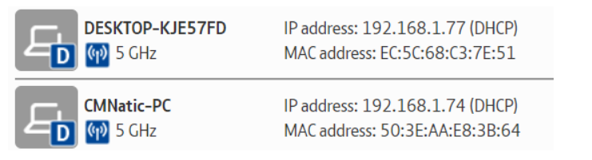
Địa chỉ IP riêng của 2 thiết bị
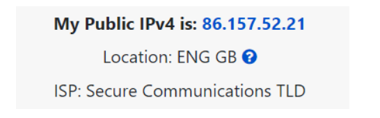
Địa chỉ IP công cộng của 2 thiết bị

**Địa chỉ MAC**
- Là địa chỉ duy nhất được gán tại nhà máy sản xuất. 
- Là số thâp lục phân, 12 kí tự, chia làm 2 nhóm, 6 kí tự đầu đại diện công ty sản xuất, 6 kí tự sau là số duy nhất
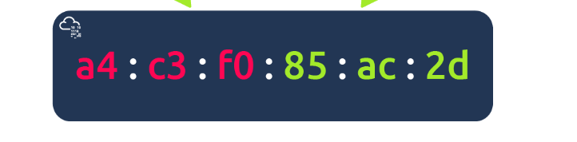
Địa chỉ MAC

**Ping (ICMP)**
- Ping sử dụng các gói tin ICMP ( Internet Control Message Protocol ) để xác định hiệu suất của kết nối giữa các thiết bị

### LAN
**Cấu trúc mạng cục bộ (LAN)**
- Cấu trúc hình sao: 
    - các thiết bị được kết nối riêng lẻ thông qua một thiết bị mạng trung tâm như switch hoặc hub
    - phổ biến nhất hiện nay vì độ tin cậy và khả năng mở rộng của nó - bất chấp chi phí
    - thông tin được gửi đến một thiết bị trong cấu trúc mạng này đều được gửi thông qua thiết bị trung tâm
    - khả năng mở rộng cao

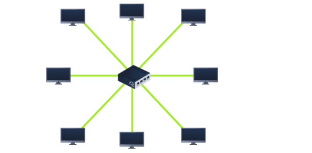
- Cấu trúc mạng xe buýt:
    - dựa trên một kết nối duy nhất được gọi là cáp trục chính
    - tất cả dữ liệu dành cho mỗi thiết bị đều truyền tải trên cùng một cáp
    - rất dễ bị chậm và tắc nghẽn nếu các thiết bị trong mạng đồng thời yêu cầu dữ liệu
    - chỉ có một điểm lỗi duy nhất dọc theo cáp trục chính, nếu cáp này bị đứt, các thiết bị sẽ không thể nhận hoặc truyền dữ liệu dọc theo bus nữa.

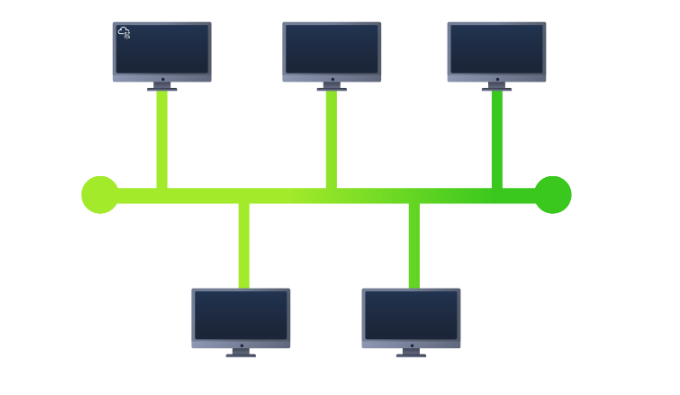

- Cấu trúc vòng (cấu trúc liên kết token):
    - Các thiết bị như máy tính được kết nối trực tiếp với nhau để tạo thành một vòng lặp
    - hoạt động bằng cách gửi dữ liệu dọc theo vòng lặp cho đến khi đến thiết bị đích, sử dụng các thiết bị khác dọc theo vòng lặp để chuyển tiếp dữ liệu
    - một thiết bị chỉ gửi dữ liệu nhận được từ thiết bị khác nếu nó không có dữ liệu nào để gửi.

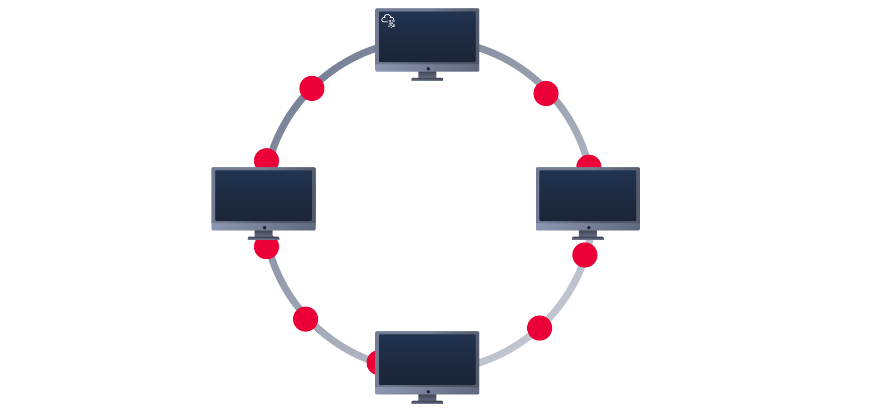
**Switch**
- là thiết bị chuyên dụng trong mạng được thiết kế để tập hợp nhiều thiết bị khác nhau như máy tính, máy in hoặc bất kỳ thiết bị nào khác có khả năng kết nối mạng bằng Ethernet
- Switch có thể kết nối một số lượng lớn thiết bị bằng cách có các cổng 4, 8, 16, 24, 32 và 64 để các thiết bị cắm vào
- Switch theo dõi thiết bị nào được kết nối với cổng nào
-  Switch và Router đều có thể được kết nối với nhau
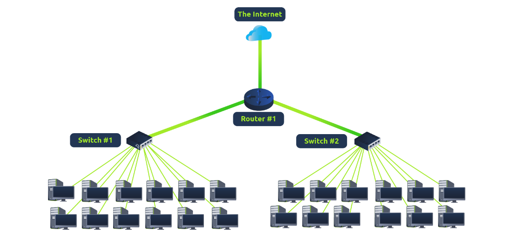

**Router**
- kết nối các mạng và truyền dữ liệu giữa chúng. Nó thực hiện điều này bằng cách sử dụng định tuyến
- Định tuyến là thuật ngữ dùng để chỉ quá trình truyền dữ liệu giữa các mạng. Định tuyến bao gồm việc tạo ra một đường dẫn giữa các mạng để dữ liệu có thể được truyền tải thành công.
- Định tuyến rất hữu ích khi các thiết bị được kết nối với nhau bằng nhiều đường dẫn
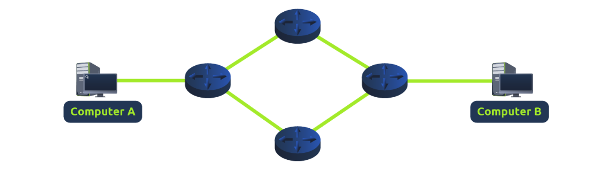

**Subnetting**
Các mạng con sử dụng địa chỉ IP theo ba cách khác nhau:
- Xác định địa chỉ mạng
- Xác định địa chỉ máy chủ
- Xác định cổng mặc định

**ARP**
- Giao thức phân giải địa chỉ (Address Resolution Protocol): cho phép các thiết bị tự nhận dạng mình trên mạng, thiết bị liên kết địa chỉ MAC của nó với địa chỉ IP trên mạng
- Mỗi thiết bị trên mạng sẽ lưu giữ nhật ký về các địa chỉ MAC được liên kết với các thiết bị khác.

**DHCP**

Giao thức cấu hình máy chủ động

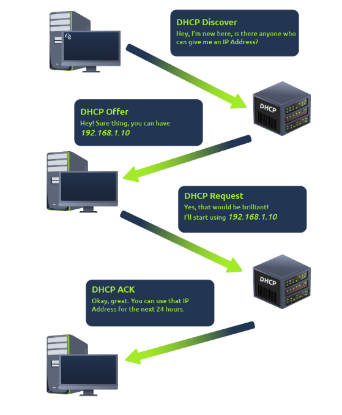

Quy trình cấp địa chỉ IP cho thiết bị

### OSI (Open Systems Interconnection) Model
-  cung cấp một khuôn khổ quy định cách thức tất cả các thiết bị được kết nối mạng sẽ gửi, nhận và giải thích dữ liệu
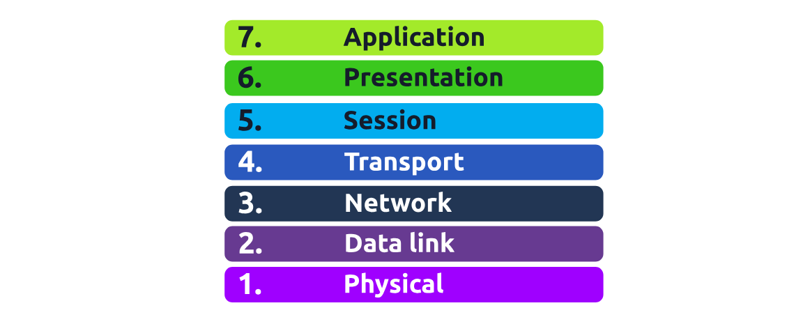

**Physical Layer**
- lớp này đề cập đến các thành phần vật lý của phần cứng được sử dụng trong mạng và là lớp thấp nhấ
- thiết bị sử dụng tín hiệu điện để truyền dữ liệu cho nhau theo hệ nhị phân

**Data Link Layer**
- định địa chỉ vật lý của quá trình truyền tải
- nhận một gói dữ liệu từ lớp mạng (bao gồm địa chỉ IP của máy tính từ xa) và thêm vào địa chỉ MAC (Media Access Control) vật lý của điểm cuối nhận
- có nhiệm vụ trình bày dữ liệu ở định dạng phù hợp để truyền tải

**Network Layer**
- diễn ra quá trình định tuyến và lắp ráp lại dữ liệu (từ các khối dữ liệu nhỏ thành khối dữ liệu lớn hơn)
- xác định con đường tối ưu nhất để gửi các khối dữ liệu này
- các giao thức lớp này: OSPF (Open Shortest Path First) và RIP (Routing Information Protocol ) 
- chọn đường theo tiêu chí: 
    - Đường dẫn nào ngắn nhất
    - Đường dẫn nào đáng tin cậy nhất
    - Đường dẫn nào có kết nối vật lý nhanh hơn

**Transport Layer**
- đóng vai trò quan trọng trong việc truyền dữ liệu qua mạng
- 2 giao thức: 
    - TCP: 
        - được thiết kế với mục tiêu đảm bảo độ tin cậy, duy trì kết nối liên tục giữa hai thiết bị trong suốt thời gian dữ liệu được gửi và nhận, tích hợp chức năng kiểm tra lỗi, đảm bảo rằng dữ liệu được gửi từ các khối nhỏ trong lớp phiên (lớp 5) đã được nhận và lắp ráp lại theo đúng thứ tự
        -  sử dụng trong các trường hợp như chia sẻ tập tin, duyệt internet hoặc gửi email.
    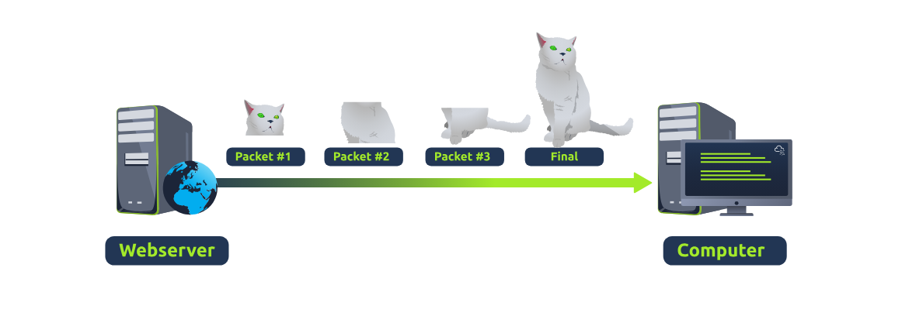

    - UDP: 
        - Không có chức năng kiểm tra lỗi và độ tin cậy
        - không duy trì kết nối liên tục trên thiết bị
        - hữu ích trong những trường hợp cần gửi các mẩu dữ liệu nhỏ
        - được sử dụng để phát hiện thiết bị,  hoặc các tệp lớn hơn như video trực tuyến
    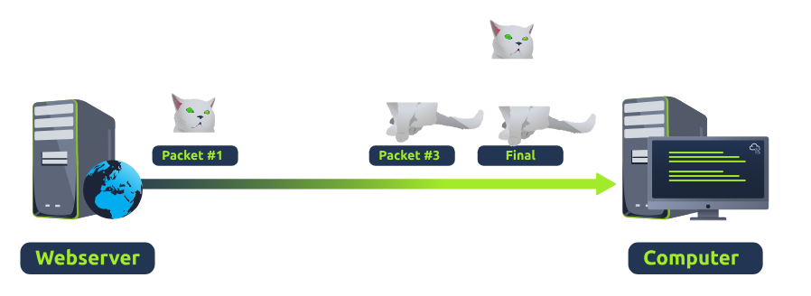

**Session Layer**
- Khi kết nối được thiết lập, một phiên sẽ được tạo.
- chịu trách nhiệm đóng kết nối nếu nó không được sử dụng trong một thời gian hoặc nếu nó bị mất
- dữ liệu không thể truyền giữa các phiên khác nhau, mà chỉ có thể truyền trong cùng một phiên.

**Presentation Layer**
- là lớp mà quá trình tiêu chuẩn hóa bắt đầu diễn ra
- hoạt động như một bộ chuyển đổi dữ liệu giữa lớp ứng dụng (lớp 7) và máy tính nhận
- Các tính năng bảo mật như mã hóa dữ liệu (ví dụ như HTTPS khi truy cập trang web an toàn) được thực hiện ở lớp này.

**Application Layer**
- là lớp chứa các giao thức và quy tắc để xác định cách người dùng tương tác với dữ liệu được gửi hoặc nhận.

### Packets & Frames
**Khái niệm Packet & Frame**
Packet & Frame là những mẩu dữ liệu nhỏ, có thể ghép lại thành mẩu thông tin/thông điệp lớn.
- Packet: 1 phần dữ liệu lớp 3, chứa thông tin tiêu đề IP và dữ liệu
- Frame: ở Lớp 2, chức năng đóng gói gói dữ liệu và bổ sung thêm thông tin như địa chỉ MAC.

Một số packet sử dụng Internet Protocol sẽ có 1 tập các header chứa thông tin bổ sung cho dữ liệu gửi qua mạng: time to live, checksum (cung cấp khả năng kiểm tra tính toàn vẹn cho các giao thức như TCP/IP), source address, destination address

**TCP/IP (Quá trình bắt tay 3 bước)**
- Rất giống với mô hình OSI, gồm 4 lớp: 
    + Application
    + Transport
    + Internet
    + Network Interface
- Đặc điểm: 
    - dựa trên kết nối (thực hiện kết nối giữa 2 máy trước khi truyền dữ liệu - gọi là quá trình bắt tay 3 bước)
    - đồng bộ hóa giữa 2 thiết bị
- Các header được thêm trong quá trình đóng gói của TCP: Source Port, Destination Port, Source IP, Destination IP, Sequence Number, Acknowledgement Number, Checksum, Data

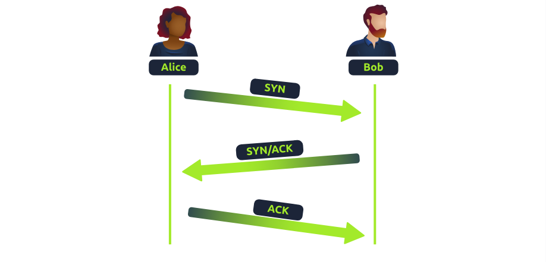
Quá trình bắt tay 3 bước
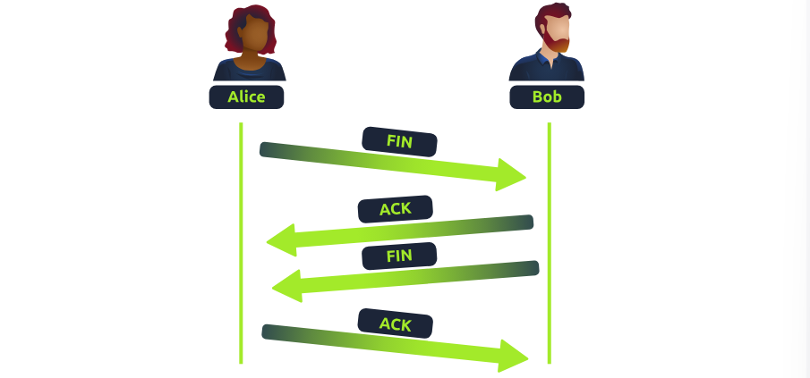
Quá trình đóng kết nối TCP

**UDP/IP**
- Giao thức không trạng thái, không đồng bộ hóa, không bắt tay 3 bước
- Các header cần có trong UDP: time to live, source IP, destination IP, source port, destination port, data

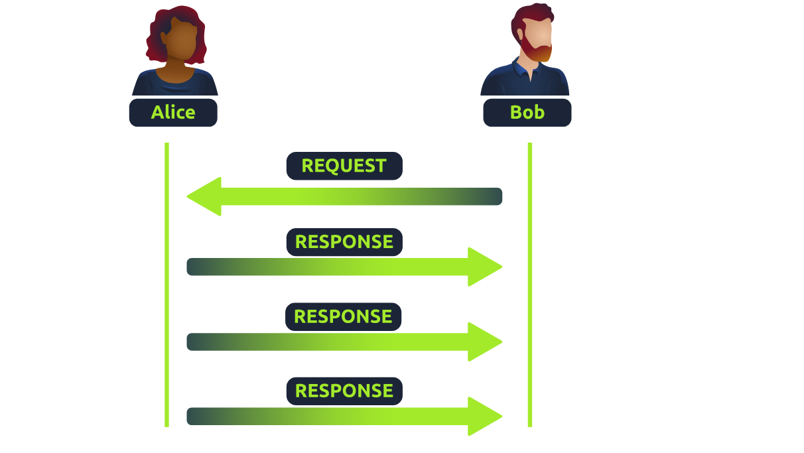
Quá trình truyền dữ liệu của UDP

### Extending your network
- Sử dụng router để chuyển tiếp cổng, giúp các ứng dụng và dịch vụ từ các mạng khác nhau có thể truy cập được tới nhau

**Tường lửa cơ bản**
- Có trạng thái: kiểm tra dựa vào toàn bộ quá trình kết nối
- Không trạng thái: kiểm tra từng gói tin đơn lẻ

**VPN cơ bản**
- là một công nghệ cho phép các thiết bị trên các mạng riêng biệt giao tiếp an toàn bằng cách tạo ra một đường dẫn chuyên dụng giữa chúng qua Internet (được gọi là Tunnel). 
- Các thiết bị được kết nối trong Tunnel này tạo thành mạng riêng của chúng.
- VPN hoạt động bằng cách sử dụng khóa riêng và chứng chỉ công khai, khóa riêng và chứng chỉ công khai phải khớp thì mới kết nối được
- Các công nghệ VPN hiện có: PPP, PPTP, IPSec

**Thiết bị LAN**
- Switch: hoạt đông tầng 2-3 trong OSI, các switch lớp 2 không thể hoạt động ở lớp 3
- Switch cấp 3 có thể làm 1 số chức năng của router, nó sẽ gửi khung dữ liệu đến các thiết bị (giống như lớp 2) và định tuyến các gói dữ liệu đến các thiết bị khác bằng giao thức IP.

# Module 3: How the web works
### DNS (Domain Name System) in Detail
**Phân cấp tên miền:** 
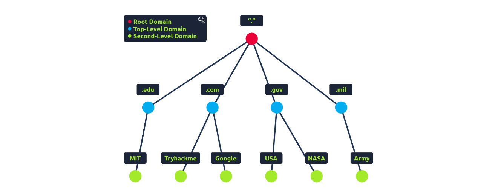
- TLD (Top-Level Domain): 
    + nằm ở bên phải nhất của tên miền
    + có 2 loại: 
        + **gTLD**: cho biết mục đích của trang web: `.com` - thương mại, `.org` - tổ chức,...
        + **ccTLD**: mục đích địa lý
- Second-Level Domain: 
    - giới hạn bởi 63 ký tự 
    - vd: `google.com` => `Second-Level Domain: google`
- Subdomain: 
    - nằm bên trái tên miền cấp 2
    - giới hạn 63 kí tự
    - được dùng nhiều tên miền phụ, ngăn cách nhau bởi dấu chấm (vd: `admin.local.learn.com`), giới hạn 253 kí tự 

**Record Type:**
- `A`: phân giải thành IPv4
- `AAAA`: phân giải thàh IPv6
- `CNAME`: trỏ đến tên miền khác
- `MX`: trỏ tới máy chủ chịu trách nhiệm xử lý email cho tên miền đang truy vấn, có cờ `Priority` cho biết độ ưu tiên của máy chủ trong trường hợp có nhiều máy chủ xử lí mail
- `TXT`: gồm các trường dữ liệu tự do, nhiều công dụng, công dụng chính là liệt kê các máy chủ có quyền gửi mail thay cho tên miền
ví dụ: 
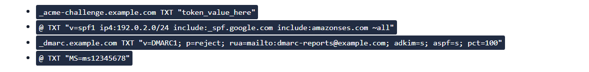

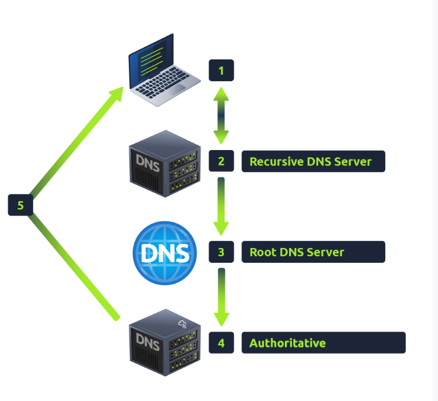
Quy trình truy vấn 1 tên miền

- Recursive DNS Server: lưu trữ cục bộ những truy vấn gần đây
- Root DNS Server: chuyển hướng yêu cầu lên TLD Server
- TLS Server: lưu các bản ghi về Authoritative Server
- Authoritative Server: lưu trữ bản ghi DNS - tên miền

### HTTP in Detail
URL: chỉ dẫn cách truy cập 1 tài nguyên trên Internet
**Header**
- Request: 
    - `Accept Encording`: các phương pháp nén dữ liệu mà trình duyệt hỗ trợ
- Response:
    - `Set-Cookie`
    - `Cache-Control`: thời gian lưu trữ phản hồi trong cache của browser trước khi yêu cầu lại
    - `Content-Encoding`: phương pháp dùng để nén data

**Cookie**
- mẩu dữ liệu nhỏ được lưu trữ trên máy tính user
- được lưu lại khi nhận được tiêu đề "Set-Cookie" từ máy chủ web
- được sử dụng cho nhiều mục đích nhưng phổ biến nhất là để xác thực trang web

### Các thành phần khác
**Bộ cân bằng tải**
    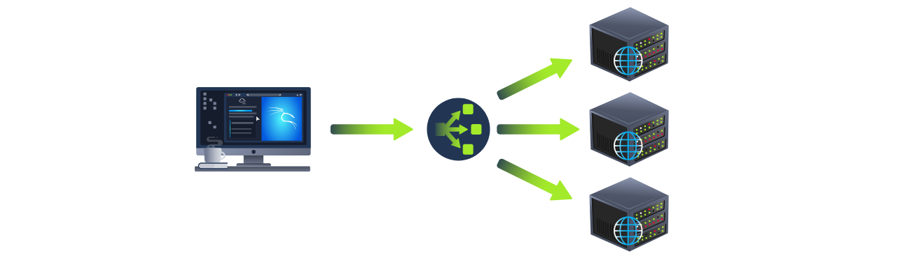
- sử dụng các thuật toán khác nhau để quyết định máy chủ nào phù hợp nhất để xử lý yêu cầu: 
    + round-robin: gửi lần lượt từng server
    + weighted: check yêu cầu đang xử lí của từng server, chọn server ít yêu cầu nhất
**CDN (Mạng phân phối nội dung)**
- Cho phép lưu trữ các tệp tĩnh của trang web và phân phối nó cho các server khác
- Có yêu cầu truy cập => CDN tìm vị trí server lưu trữ => gửi request tới đó
**WAF**
- Nằm giữa request và web server

# Module 4: Kiến thức cơ bản về máy tính
**Thành phần:**
- Main Board
- RAM
- SSD/HDD
- GPU
- PSU

**Quá trình khởi động:**

- Ấn nút khởi động
- Firmware Start (Phần mềm khởi động - UEFI/BIOS): chương trình cốt lõi giúp đánh thức và quản lý quá trình khởi động của các thành phần phần cứng
- POST (Kiểm tra tự động): Quy trình kiểm tra xem mọi linh kiện cần thiết đã có mặt, được cấu hình đúng và hoạt động bình thường hay chưa
- Select Boot Device: Danh sách ưu tiên các nơi (như ổ cứng, USB) mà hệ thống sẽ tìm kiếm chương trình khởi động hệ điều hành
- Start Bootloader: Chương trình chịu trách nhiệm chuyển hệ điều hành từ ổ cứng vào bộ nhớ RAM và bàn giao quyền điều khiển hệ thống cho nó.

### Các loại máy tính
4 loại: 
- Để bàn
- Xách tay
- Máy trạm: độ chính xác & tin cậy cao, sử dụng các thành phần chuyên dụng để giảm thiểu lỗi trong quá trình tính toán dài hoặc phức tạp
- Máy chủ: không màn hình & bàn phím, cung cấp nhiều dịch vụ cho user qua internet
- Khác: điện thoại, máy tính bảng, thiết bị iot,...

### Ảo hóa cơ bản
- Ảo hóa cho phép nhiều ứng dụng cùng chia sẻ chung phần cứng vật lý với nhau

**Các thành phần ảo hóa**
- Hypervisor
    - Phần mềm tạo và quản lý máy ảo
        + chia máy tính => nhiều máy ảo, chia mỗi máy có: CPU, bộ nhớ, kho lưu trữ
        + cách ly các máy riêng biệt
        + quản lý vòng đời: khởi động, dừng, tạm dừng, sao chép, xóa
    - 2 loại: 
        + loại 1: chạy trên phần cứng vật lý, phù hợp cho tác vụ chuyên nghiệp
        + loại 2: chạy trên hệ điều hành, phù hợp cho thí nghiệm & học tập
- Virtual machine
- Containers (Các khoang trong máy ảo)
    - Môi trường nhẹ, biệt lập, chạy duy nhất 1 ứng dụng, có các thành phần cần thiết để hoạt động 
    - Chạy trên nhân hệ điều hành

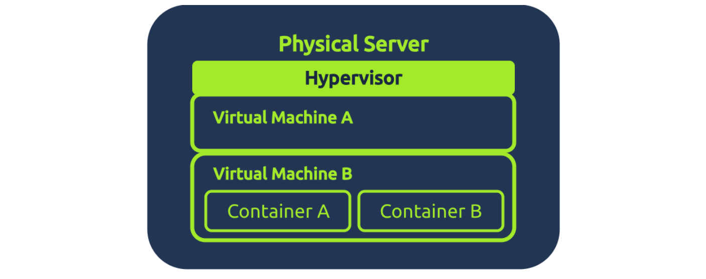
Minh họa cho quan hệ giữa physical server - hypervisor - virtual machine - container

### Điện toán đám mây cơ bản
**Phân loại**
- `Public Cloud`: chủ yếu được các công ty khởi nghiệp, trang web và ứng dụng toàn cầu sử dụng vì giá cả phải chăng, dễ mở rộng quy mô và không yêu cầu quản lý cơ sở hạ tầng.
- `Private Cloud`: chủ yếu được ngân hàng, tổ chức chăm sóc sức khỏe và chính phủ sử dụng vì nó cung cấp khả năng kiểm soát, tùy chỉnh và tuân thủ tốt hơn đối với dữ liệu nhạy cảm
- `Hybrid Cloud`: sử dụng bởi các công ty như nền tảng thương mại điện tử, những công ty cần bảo mật dữ liệu nhạy cảm trong khi vẫn có thể mở rộng quy mô công khai khi nhu cầu cao

**Dịch vụ chính**
- `IaaS`: cho phép thuê các thành phần máy tính cơ bản như máy chủ và thiết bị lưu trữ từ đám mây
- `PaaS`: cung cấp môi trường sẵn sàng sử dụng để xây dựng và chạy ứng dụng mà không cần quản lý máy chủ
- `SaaS`: phần mềm sử dụng trực tuyến mà không cần cài đặt gì cả, ví dụ như Gmail hoặc Zoom.

**Thuật ngữ cơ bản**
- `EC2` (Máy tính/Máy chủ ảo): đại diện cho một máy tính ảo trên nền tảng đám mây
- Loại máy ảo (ví dụ: t2, t3, m5): mô tả sức mạnh của máy tính ảo

# Module 5: Hệ điều hành cơ bản

Vị trí của OS 

**Các lớp đặc quyền**
- Không gian kernel: 
    + vùng lõi đặc quyền, bị khóa chặt của hệ thống
    + quản lý trực tiếp phần cứng và tài nguyên hệ thống, hoạt động
    + truy cập không giới hạn vào tất cả các tài nguyên
- Không gian ứng dụng:
    + nơi tất cả các ứng dụng tiêu chuẩn chạy
    + không truy cập trực tiếp vào phần cứng
    + phải thực hiện một lệnh gọi hệ thống và yêu cầu nhân hệ điều hành thực hiện thay mặt chúng nếu muốn truy cập tài nguyên phần cứng

**Chức năng**
- Quản lý tiến trình
- Quản lý bộ nhớ
- Quản lý file
- Quản lý người dùng
- Quản lý thiết bị

# Module 6: Software Basics
### Mã hóa dữ liệu
- ASCII: một chuẩn 7 bit định nghĩa 128 ký tự
- Unicode:  là một bộ ký tự chuẩn, gán một số duy nhất cho mỗi ký tự trong tất cả các ngôn ngữ
    + UTF-8: phổ biến nhất, quyết định số byte dựa trên độ phức tạp của ký tự
    + UTF-16: sử dụng 2 hoặc 4 byte cho mỗi ký tự
    + UTF-32: mỗi điểm mã Unicode sử dụng chính xác 4 byte

# Module 7: Attacks and Defenses
### CIA
- Confidentiality (Tính bí mật)
- Integrity (Tính toàn vẹn)
- Availability (Tính sẵn dùng)

### Mật mã
Mã hóa đối xứng
- Giải mã & mã hóa chung key

Mã hóa bất đối xứng
- Dùng 2 khóa riêng biệt cho 2 quá trình mã hóa và giải mã
