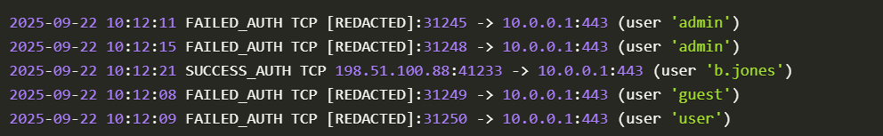
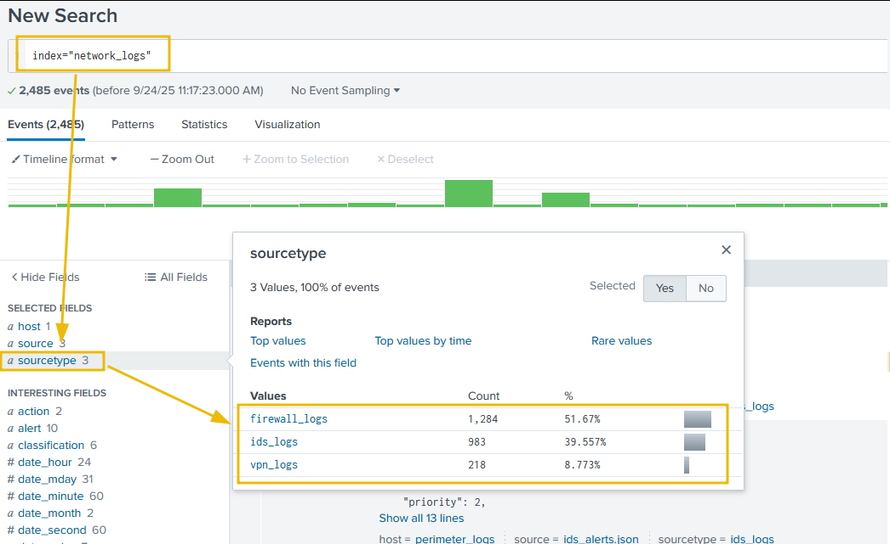

# 1. Các yếu tố cơ bản về network security
### Network Visibility
- là khả năng theo dõi và hiểu những gì đang xảy ra trên toàn mạng
- khả năng này phải dựa trên 2 nguồn log: Host-Centric Logs và Network-Centric logs

**Host-Centric Logs**
- Tập trung vào các thiết bị đơn lẻ trên mạng
- Nguồn: 
    - OS Logs: log sự kiện windows, linux, sysmon, 
    - Application log: log từ phần mềm chạy trên server web (apache, mysql,...)
    - Security Tool Logs: EDR, HIDS, phần mềm antivirus

**Network-Centric Logs**
- Cho biết những gì xảy ra giữa các thiết bị
- Nguồn: 
    - Firewall
    - IDS/IPS: hệ thống phát hiện và ngăn chặn xâm nhập mạng
    - Switch, Router: không tạo ra log thông thường nhưng tạo ra dữ liệu luồng, cho biết các cuộc hội thoại lưu lượng truy cập
    - Web proxies: ghi lại mọi lượt truy cập của người dùng vào web
    - VPN: giám sát các truy cập từ xa vào mạng công ty

### Network perimeter (Vành đai mạng)
- Điểm ngăn giữa mạng nội bộ và mạng ngoài (internet)
**Chu vi**
- Ranh giới được xác định bằng các thiết bị phần cứng: 
    - Tường lửa: Là những "người gác cổng" lọc lưu lượng truy cập giữa mạng nội bộ và mạng bên ngoài.
    - Bộ định tuyến/Cổng kết nối: Các thiết bị định tuyến lưu lượng truy cập và thực thi các quy tắc truy cập.
    - Demilitarized Zone (DMZ): Một phân đoạn mạng đệm nơi các máy chủ hướng ra công chúng (web, thư điện tử,...)VPN) được đặt.
    - Remote Access Gateways / VPNs: Các điểm truy cập an toàn cho nhân viên làm việc ngoài văn phòng.

## Giám sát
sử dụng tường lửa, hệ thống phát hiện/ngăn chặn xâm nhập (IDS/IPS), và kiểm soát truy cập để kiểm tra

- Phát hiện các cuộc tấn công ở giai đoạn đầu như quét cổng hoặc tấn công vét cạn mật khẩu.
- Phát hiện các lỗi cấu hình khiến các dịch vụ nhạy cảm bị lộ thông tin.
- Xác định các bất thường trong lưu lượng truy cập đi ra có thể là dấu hiệu của phần mềm độc hại hoặc rò rỉ dữ liệu.

**Kịch bản 1: Quét cổng (Port Scanning)**
Cùng một địa chỉ IP bên ngoài (203.0.113.10) đang cố gắng kết nối nhanh chóng đến nhiều cổng trên cùng một máy tính nội bộ.
Nhận định: Đây là một cuộc tấn công quét cổng điển hình. Kẻ tấn công đang tìm kiếm một dịch vụ đang mở để nhắm mục tiêu.

**Kịch bản 2: Tấn công máy chủ web (SQL Injection)**

WAF (Web Application Firewall) Logs
```
timestamp=2025-09-22T09:14:44Z src_ip=192.0.2.130 action=ALLOW request="GET /index.html"
timestamp=2025-09-22T09:14:45Z src_ip=198.51.100.92 action=ALLOW request="GET /products.php?id=9"
timestamp=2025-09-22T09:14:46Z src_ip=[REDACTED] action=BLOCK request="GET /search.php?q=<script>alert('XSS')</script>" rule_id=941100 attack_type="XSS"
timestamp=2025-09-22T09:14:47Z src_ip=192.0.2.140 action=ALLOW request="GET /css/style.css"
timestamp=2025-09-22T09:15:42Z src_ip=[REDACTED] action=BLOCK request="GET /../../../../etc/passwd" rule_id=930120 attack_type="Directory Traversal"
...
.....
```
**Kịch bản 3: VPN Brute-Force**

=> số lượng yêu cầu lớn trong khoảng thời gian ngắn

### Điều tra xâm nhập
Nhật ký tường lửa:firewall.log
Nhật ký WAF:ids_alerts.log 
Nhật ký VPN:vpn_auth.log 

**Phương pháp 1: Phân tích nhật ký thủ công**

| Giai đoạn | Trạng thái | Bằng chứng cốt lõi |
| :--- | :--- | :--- |
| **Thâm nhập** | Thành công | VPN login SUCCESS sau 118 lần FAIL (Dấu hiệu Brute Force). |
| **Lan rộng** | Thành công | Cảnh báo **SMB Lateral Movement** giữa các máy chủ nội bộ. |
| **Kiểm soát** | Duy trì | **Beaconing** liên tục trên cổng `4444` (Dấu hiệu C2 Communication). |
| **Đánh cắp** | Đã xảy ra | Nhiều gói tin **HTTP POST** dung lượng lớn đẩy ra ngoài (Data Exfiltration). |

**Phương pháp 2: Phân tích nhật ký thông qua Splunk**



# 2. Network Discovery Detection
| Đặc điểm | Kẻ tấn công (Attacker) | Người phòng thủ (Defender) |
| :--- | :--- | :--- |
| **Mục tiêu chính** | Tìm kiếm "lỗ hổng" để xâm nhập. | Kiểm kê tài sản và giảm thiểu rủi ro. |
| **Thông tin tìm kiếm** | IP, cổng mở, dịch vụ, phiên bản phần mềm có lỗi. | Các IP/Dịch vụ không cần thiết đang mở, các bản vá còn thiếu. |
| **Kết quả mong muốn** | Xác định Bề mặt tấn công (Attack Surface). | Giảm tối đa Bề mặt tấn công. |

### 2.1 Quét mạng trong và ngoài
| Đặc điểm | External Scanning (Quét từ ngoài) | Internal Scanning (Quét nội bộ) |
| :--- | :--- | :--- |
| **IP Nguồn** | IP công cộng (Public IP). | IP nội bộ (Private IP - `10.x`, `172.16.x`, `192.168.x`). |
| **Giai đoạn MITRE** | Reconnaissance (Thăm dò). | Discovery (Khám phá). |
| **Mức độ nguy hiểm** | **Thấp/Trung bình** (Kẻ tấn công chưa vào được mạng). | **Cao** (Kẻ tấn công đã chiếm được một máy trong mạng). |
| **Hành động của SOC** | Chặn IP trên Firewall biên. | **Incident Response (IR)**: Điều tra máy bị chiếm, tìm mã độc. |

# 3. Data Exfiltration Detection
### 3.1 Tổng quan
**Tác nhân & Kĩ thuật đánh cắp**
| Nhóm Hacker | Kỹ thuật đặc trưng | Mục tiêu chiến thuật |
| :--- | :--- | :--- |
| **APT29 (Cozy Bear)** | HTTPS qua tên miền hợp lệ | Sử dụng mã hóa để ẩn nội dung và dùng tên miền tin cậy để qua mặt tường lửa. |
| **FIN7** | HTTP POST đến C2 server | Nhồi dữ liệu đánh cắp vào các yêu cầu "POST" thông thường để trông giống lưu lượng web bình thường. |
| **Lunar Spider** | Kênh C2 mã hóa & chia giai đoạn | Duy trì sự hiện diện lâu dài và đẩy dữ liệu ra từ từ để tránh gây đột biến lưu lượng (**Traffic Spikes**). |
| **DarkSide** | Tống tiền kép (**Dual Extortion**) | Không chỉ mã hóa máy (Ransomware) mà còn lấy cắp dữ liệu trước để dọa tung lên mạng nếu không trả tiền. |
| **APT10** | Chuyển luồng Cloud-to-Cloud | Lợi dụng API của các dịch vụ đám mây để chuyển dữ liệu trực tiếp giữa các đám mây, tránh đi qua hạ tầng giám sát nội bộ. |

**Các giai đoạn phổ biến**
- Discovery / Collection (Khám phá / Thu thập): Kẻ tấn công dò tìm và xác định vị trí của các tệp tin nhạy cảm trong hệ thống.

- Staging / Compression (Tập kết / Nén dữ liệu): Kẻ tấn công gom nhóm, nén, mã hóa hoặc thay đổi định dạng các tệp tin để chuẩn bị đưa ra ngoài (thường dùng các định dạng như ZIP, RAR, 7z, tar, mã hóa base64 hoặc kỹ thuật giấu tin - steganography).

- Exfiltration transport (Phương thức vận chuyển): Thực hiện việc truyền tải dữ liệu qua mạng, thông qua các thiết bị lưu trữ rời (như USB), dịch vụ đám mây hoặc các kênh ngầm (covert channels) khó bị phát hiện.

- Command & Control (C2) coordination (Điều phối qua máy chủ C2): Sử dụng hệ thống máy chủ điều khiển để ra lệnh, quản lý quá trình truyền tải và xác nhận rằng dữ liệu đã được gửi đi thành công.

**Techniques and Indicators**
| Kỹ thuật | Ví dụ minh họa | Chỉ số tấn công (IoA) & Nơi tìm kiếm |
| :--- | :--- | :--- |
| **Dựa trên mạng (Network-based)** | Tải lên HTTP/HTTPS (S3, Webmail); FTP/SFTP/SCP; đường hầm DNS; giao thức ICMP; TCP/UDP tùy chỉnh. | **Proxy/Web Gateway:** Yêu cầu POST lớn. <br>**Firewall:** Byte gửi đi cao đến IP lạ. <br>**Netflow:** Đột biến luồng dữ liệu ra. <br>**DNS Log:** Tên máy chủ quá dài hoặc truy vấn TXT lạ. |
| **Dựa trên máy chủ (Host-based)** | PowerShell (`Invoke-WebRequest`), rclone, awscli, curl/wget; tạo file nén (zip/rar); USB rời; dòng dữ liệu ẩn (ADS). | **Sysmon/EDR:** Tạo tiến trình (ID 1), kết nối mạng (ID 3), tạo tệp (ID 11). <br>**Windows Security:** Log 4663/4656 (truy cập đối tượng). <br>**Linux:** Shell history, Auditd logs. |
| **Đám mây (Cloud exfiltration)** | S3 `PutObject`; tải lên Azure Blob; Google Cloud Storage; chia sẻ file qua Drive/SharePoint ra ngoài. | **CloudTrail/Azure Activity/GCP Audit:** Nhật ký truy cập bộ nhớ đám mây. Theo dõi hành vi bất thường của **Service Account**. |
| **Kênh ngầm & Mã hóa (Covert & encoding)** | Đường hầm DNS; mã hóa Base64; giấu tin trong ảnh/âm thanh (Steganography); chia nhỏ file gửi đi từ từ (**Low-and-slow**). | **DNS & Proxy Log:** Nhiều yêu cầu POST nhỏ liên tục. Đối chiếu việc tải lên ngắt quãng với các tiến trình khả nghi đang chạy. |
| **Nội bộ & Công cụ cộng tác** | Tải lên/chia sẻ file qua Slack, Teams, Dropbox, Google Drive; tài khoản nhân viên bị chiếm quyền. | **Audit logs:** Sự kiện chia sẻ, tải tệp xuống. <br>**Mail logs:** Nhật ký gửi/nhận thư điện tử từ các địa chỉ lạ hoặc dung lượng đính kèm lớn. |
| **IoA chung & Tín hiệu phân loại** | Dữ liệu ra ngoài lớn đến IP lạ; tên miền đích không xác định; dòng lệnh khả nghi; đọc nhiều file rồi kết nối ra ngoài ngay. | **Correlate (Đối chiếu):** Kết hợp dữ liệu từ Proxy, Firewall, Netflow với Sysmon/EDR và nhật ký Mail server để tìm mối liên hệ. |

### 3.2 Rò rỉ dữ liệu qua DNS (DNS Tunneling)

**Dấu hiệu**
- Nhiều truy vấn DNS được gửi đến một tên miền bên ngoài duy nhất, đặc biệt là khi số lượng truy vấn rất cao so với mức cơ bản.
- Các nhãn tên miền phụ dài hoặc tên truy vấn đầy đủ dài bất thường (> 60–100 ký tự).
- Tên truy vấn có độ phức tạp cao hoặc dạng Base32/Base64 (nhiều chữ cái viết hoa và viết thường, chữ số, -dấu =phẩy trong Base64).
- Các loại bản ghi hiếm (TXT, NULL) hoặc nhiều phản hồi TXT lớn.
- Hành vi phản hồi bất thường: thường xuyên xuất hiện NXDOMAIN (nếu kẻ tấn công sử dụng phương thức trích xuất dữ liệu bằng truy vấn mà không trả lời), hoặc các mảnh TCP/UDP lớn cho DNS.
- Các truy vấn được thực hiện định kỳ (hành vi phát tín hiệu).

**Cách phát hiện**
- Sử dụng Wireshark hoặc Splunk

