# 1. Giới thiệu Blue Team
Các vai trò trong SOC
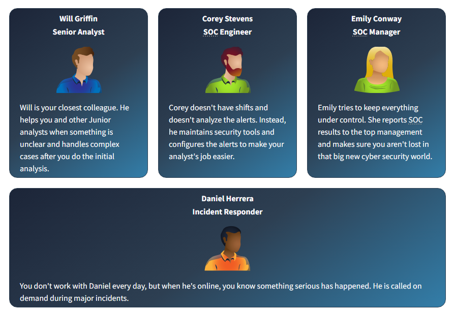

Phát hiện cảnh báo nguy hiểm trong SIEM dashboard
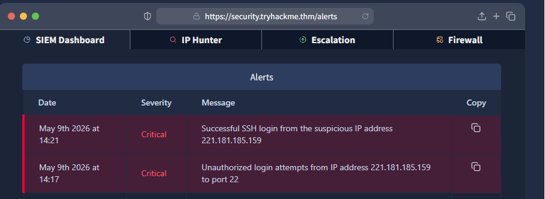

Kiểm tra IP độc hại
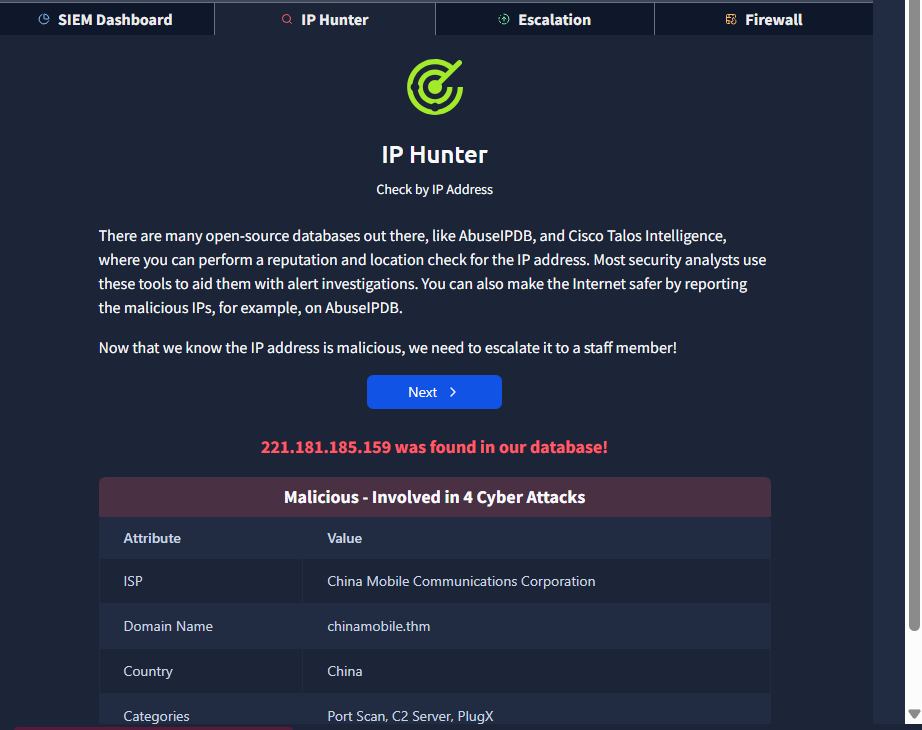

Gửi lên cấp cao hơn
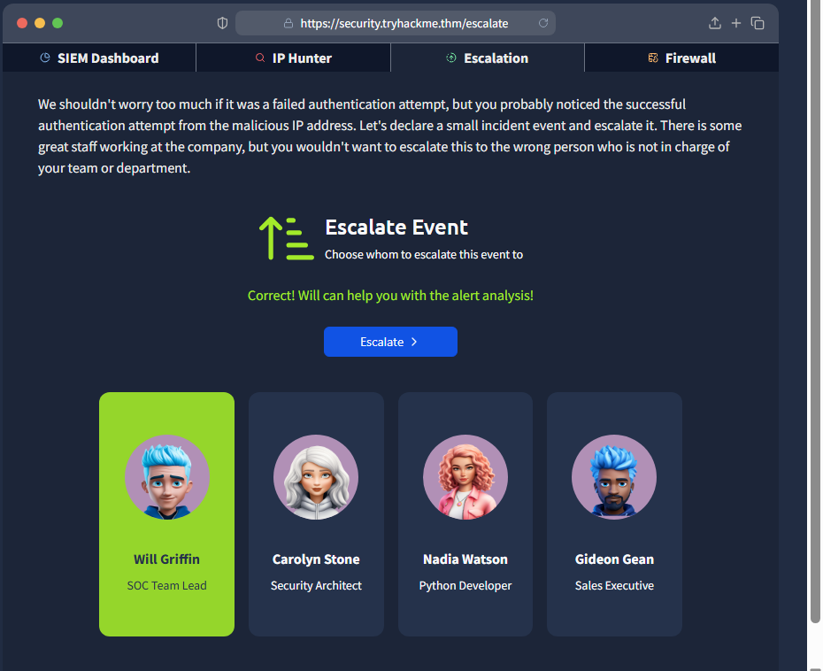

Thực hiện block IP nguy hiểm
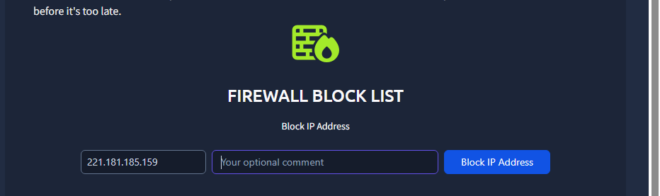

### Vai trò của SOC trong Blue Team
Hệ thống phân cấp
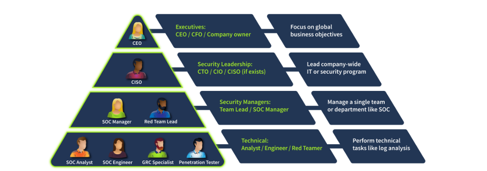

- Đội ngũ GRC : Các chuyên gia quản lý chính sách và đảm bảo tuân thủ các quy định như PCI DSS (là tiêu chuẩn an ninh dữ liệu bắt buộc dành cho tất cả các tổ chức tham gia vào việc xử lý, lưu trữ hoặc truyền tải dữ liệu thẻ thanh toán (thẻ tín dụng, thẻ ghi nợ, v.v.))

#### SOC

**Các vai trò trong SOC**
- L1 Analysts: phân loại alert, gửi alert phức tạp lên L2
- L2 Analysts: điều tra trường hợp phức tạp hơn
- Engineers: cấu hình tool bảo mật như EDR, SIEM
- Manager: quản lý đội SOC

#### Cyber Incident Response Team (CIRT)
Các vai trò trong CIRT
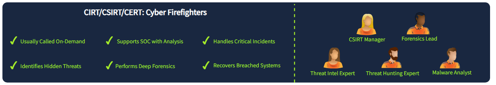

#### So sánh Internal SOC và MSSP

| Chủ đề | Internal SOC (SOC Nội bộ) | MSSP (Managed Security Services Provider) |
| :--- | :--- | :--- |
| **Kịch bản ví dụ** | Làm việc trong đội SOC của một ngân hàng và bảo vệ hệ thống của chính ngân hàng đó. | Làm việc cho một MSSP toàn cầu, bảo vệ cho khoảng 60 khách hàng khác nhau. |
| **Nhịp độ làm việc** | Các ca trực thường bình tĩnh, không chịu quá nhiều áp lực về thời gian. | Ca trực thường bắt đầu với một hàng đợi dài các cảnh báo khẩn cấp cần xử lý ngay. |
| **Công cụ bảo mật** | Làm việc với số lượng ít công cụ nhưng yêu cầu phải hiểu cực kỳ sâu về chúng. | Phải làm việc với hàng chục công cụ và nền tảng bảo mật đa dạng từ nhiều khách hàng. |
| **Trải nghiệm sự cố** | Ít có cơ hội va chạm thực tế (ví dụ: chỉ thấy khoảng 2 cuộc tấn công lớn mỗi năm). | Đối mặt với các cuộc tấn công và vi phạm hàng tuần, mang lại nhiều bài học thực tế. |
| **Đặc điểm chung** | Phù hợp để phát triển chuyên sâu vào một hệ thống cố định. | Áp lực cao nhưng là lựa chọn tốt để khởi đầu sự nghiệp nhanh chóng. |

#### Humans as Attack Vectors
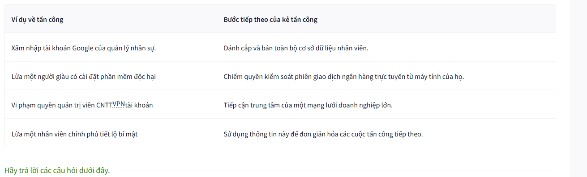

#### System as Attack Vectors
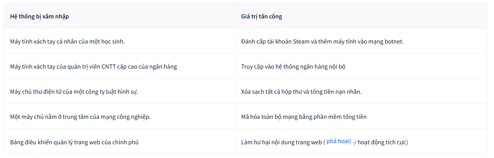
- Supply Chain: Cuộc tấn công xảy ra khi phần mềm độc hại đến từ một ứng dụng hoặc thư viện đáng tin cậy

**Các lỗ hổng bảo mật**
- zero-day:  kẻ tấn công phát hiện ra lỗ hổng trước bất kỳ ai khác

# 2. Internals SOC
**Mục tiêu**
- Làm quen với khái niệm về báo động SOC
- Khám phá các trường cảnh báo, trạng thái và phân loại.
- Tìm hiểu cách thực hiện phân loại cảnh báo với tư cách là chuyên viên phân tích cấp độ 1.

### 2.1 SOC L1 Alert Triage
#### Events, Alert
- sự kiện xảy ra => được lưu lại (hàng trăm log) => gửi về SIEM/EDR 
- với những sự kiện nổi bật => chuyển thành alert (chuyển đổi theo chính sách) => hiển thị những alert đáng ngờ (giảm tải thời gian lọc hàng trăm log thô cho analyst)

**Các Giải pháp Công nghệ Phổ biến trong SOC**

| Giải pháp | Ví dụ điển hình | Mô tả |
| :--- | :--- | :--- |
| **SIEM System** | Splunk ES, Elastic | Có khả năng quản lý cảnh báo mạnh mẽ và là lựa chọn hoàn hảo cho hầu hết các đội ngũ SOC. |
| **EDR hoặc NDR** | MS Defender, CrowdStrike | Dù EDR và NDR có bảng điều khiển cảnh báo riêng, nhưng tốt nhất nên sử dụng SIEM hoặc SOAR để quản lý tập trung. |
| **SOAR System** | Splunk SOAR, Cortex SOAR | Các đội SOC lớn thường sử dụng SOAR để tổng hợp cảnh báo từ nhiều nguồn và tự động hóa quy trình ứng phó sự cố. |
| **ITSM System** | Jira, TheHive | Một số đội ngũ sử dụng các giải pháp quản lý dịch vụ CNTT (ticketing) chuyên dụng để theo dõi và xử lý các sự cố bảo mật. |

#### Thuộc tính của 1 alert
| № | Thuộc tính | Mô tả | Ví dụ |
| :--- | :--- | :--- | :--- |
| 1 | **Alert Time** | Hiển thị thời gian tạo cảnh báo. Thường trễ vài phút so với thời gian thực của sự kiện. | Alert Time: March 21, 15:35 Event Time: March 21, 15:32 |
| 2 | **Alert Name** | Bản tóm tắt những gì đã xảy ra, dựa trên tên của quy tắc phát hiện (detection rule). | Unusual Login Location Email Marked as Phishing Windows RDP Bruteforce |
| 3 | **Alert Severity** | Xác định mức độ khẩn cấp. Do kỹ sư phát hiện thiết lập ban đầu nhưng phân tích viên có thể thay đổi. | (🟢) Low (🟡) Medium (🟠) High (🔴) Critical |
| 4 | **Alert Status** | Cho biết trạng thái xử lý: có ai đang làm việc hay việc phân loại đã hoàn tất chưa. | (🆕) New / Unassigned (🔄) In Progress / Pending (✅) Closed / Resolved |
| 5 | **Alert Verdict** | Còn gọi là phân loại cảnh báo, giải thích đây là mối đe dọa thực sự hay chỉ là nhiễu. | (🔴) True Positive (Mối đe dọa thực) (🟢) False Positive (Cảnh báo giả) |
| 6 | **Alert Assignee** | Hiển thị phân tích viên (SOC Analyst) chịu trách nhiệm chính trong việc đánh giá cảnh báo này. | Assignee (Người sở hữu cảnh báo) Chịu trách nhiệm về kết quả phân tích. |
| 7 | **Alert Description** | Giải thích nội dung cảnh báo: logic của quy tắc, tại sao đây là tấn công và cách xử lý (triage). | Logic tạo rule Dấu hiệu tấn công Hướng dẫn xử lý cơ bản |
| 8 | **Alert Fields** | Cung cấp các giá trị kỹ thuật cụ thể đã kích hoạt cảnh báo và nhận xét của phân tích viên. | Affected Hostname Entered Commandline IP Address, User ID... |

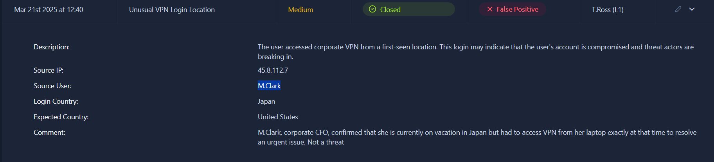
- Kết quả xử lí: false positive
- User: M.Clark

#### Alert Triage
- Lọc alert: chọn những alert chưa ai xử lí
- Sắp xếp theo severity: từ cao tới thấp
- Sắp xếp theo thời gian: từ cũ tới mới

Quy trình tham khảo để phân loại cảnh báo
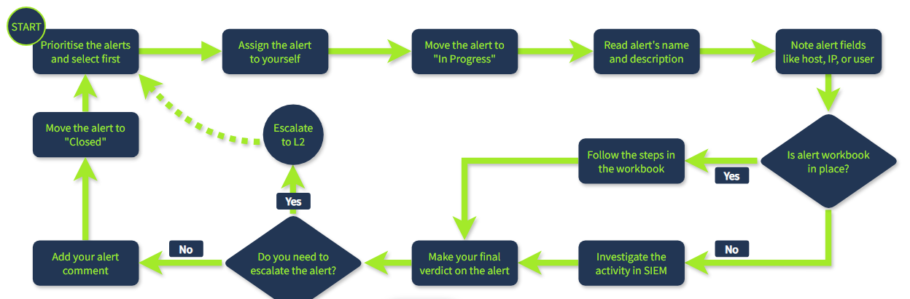

1. Hành động ban đầu
2. Điều tra
- Xác định đối tượng bị đe dọa
- Lưu ý hành động được mô tả
- Xem event xung quanh
- Xác minh bằng các nền tảng tình báo mối đe dọa
3. Hành động cuối cùng

Xem mô tả của alert
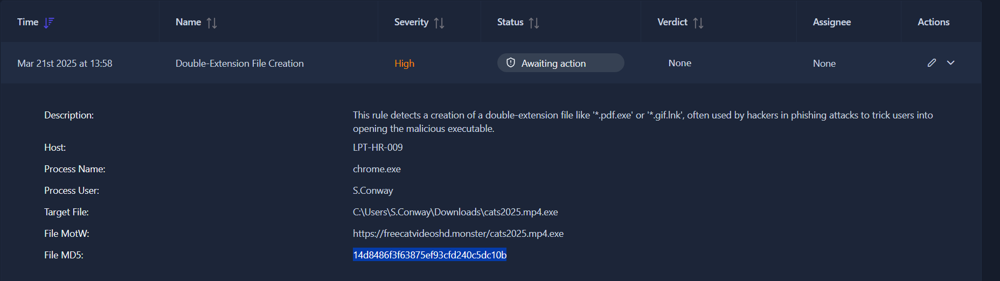
Kiểm tra file MD5 bằng Virus Total
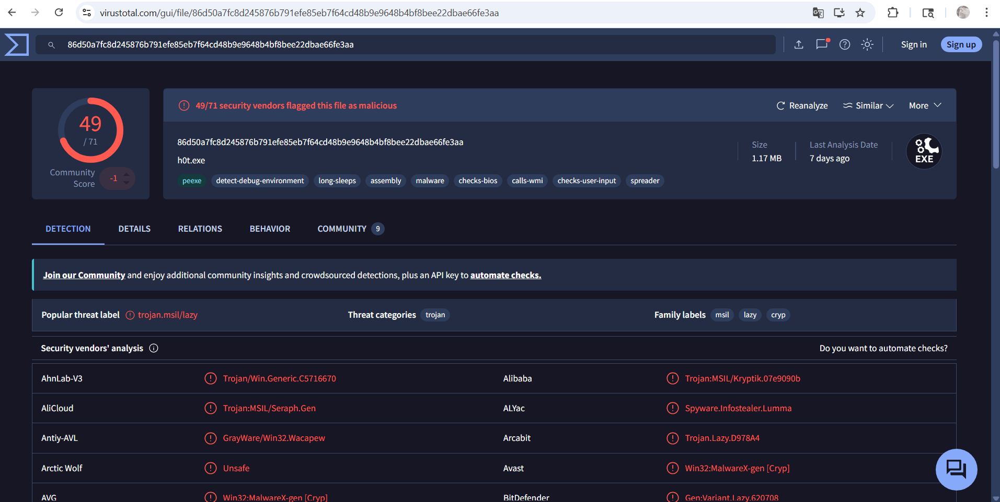
Gán nhãn và đóng alert
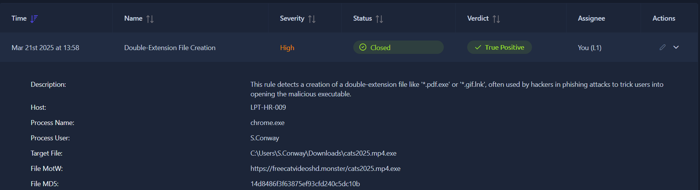

### 2.2 SOC L1 Alert Reporting
Các mức độ báo cáo 
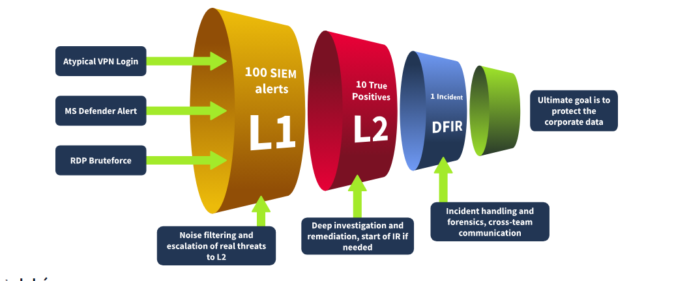
- Báo cáo cảnh báo (Alert Reporting) (trước khi chuyển lên L2 hoặc đóng): đôi khi cần mô tả chi tiết quá trình điều tra (đặc biệt với True Positive)
- Cảnh báo leo thang (Alert Escalation): chuyển lên L2 với True Positive, trong trường hợp cần phân tích sâu hơn 
- Giao tiếp: liên hệ với các bộ phận khác trong hoặc sau quá trình phân tích

**Vai trò của báo cáo**
- Cung cấp bối cảnh cho việc leo thang
- Lưu giữ các phát hiện để làm hồ sơ.
- Nâng cao kỹ năng điều tra

**Thông tin cần thiết trong báo cáo**
- Who : Người dùng nào đăng nhập, chạy lệnh hoặc tải xuống tệp tin.
- what : Hành động hoặc chuỗi sự kiện cụ thể nào đã được thực hiện?
- when : Hoạt động đáng ngờ bắt đầu và kết thúc chính xác vào thời điểm nào?
- where : Thiết bị, địa chỉ IP hoặc trang web nào liên quan đến cảnh báo.
- why : quan trọng nhất, lý do cho quyết định cuối cùng của analyst

**Trường hợp gửi báo cáo leo thang**
- Cảnh báo này là dấu hiệu của một cuộc tấn công mạng quy mô lớn, cần được điều tra kỹ lưỡng hơn.
- Cần thực hiện các biện pháp khắc phục như loại bỏ phần mềm độc hại, cách ly máy chủ hoặc đặt lại mật khẩu.
- Việc liên lạc với khách hàng, đối tác, ban quản lý hoặc các cơ quan thực thi pháp luật là cần thiết.
- Bạn chưa hiểu rõ cảnh báo và cần sự trợ giúp từ các chuyên gia phân tích cấp cao hơn.

**Các bước báo cáo leo thang**
- Chuyển cảnh báo sang trạng thái Đang xử lý và tiến hành phân tích.
- Viết báo cáo cảnh báo và đưa ra kết luận của bạn , ví dụ như "Đúng kết quả dương tính" (True Positive).
- Nếu cần leo thang xử lý, hãy giao cảnh báo cho người phụ trách cấp L2 trong ca trực.
- L2 sẽ nhận được thông báo và bắt đầu từ báo cáo cảnh báo của bạn.

**Lưu ý**
- Tạo yêu cầu leo thang bằng cách liên hệ trực tiếp/kênh chat/văn bản.
- Yêu cầu hỗ trợ với cấp trên khi chưa rõ là hoàn toàn bình thường

### 2.3 SOC Workbooks and Lookups (Sổ tay & Bảng tra cứu)
Khi thấy alert cảnh báo về 1 đối tượng thực hiện 1 hành vi, cần kiểm tra đối tượng và hành vi đó có vai trò và vị trí như nào trong hệ thống

**Kiểm kê danh tính**
- Danh mục user, máy, dịch vụ và xem chi tiết đặc quyền, vai trò, vị trí của họ

| Giải pháp | Ví dụ | Mô tả |
| :--- | :--- | :--- |
| Active Directory | On-prem AD, Entra ID | Bản thân AD là một cơ sở dữ liệu định danh và thường được SOC sử dụng |
| SSO Providers | Okta, Google Workspace | Giải pháp thay thế trên đám mây cho AD, giúp quản lý và tìm kiếm người dùng dễ dàng |
| HR Systems | BambooHR, SAP, HiBob | Chỉ giới hạn cho nhân viên, nhưng thường cung cấp đầy đủ dữ liệu nhân sự |
| Custom Solution | CSV hoặc Excel Sheets | Các nhóm IT hoặc bảo mật thường tự duy trì các giải pháp riêng này |

**Kiểm kê tài sản**
- tra cứu tài sản, là danh sách tất cả các tài nguyên máy tính trong môi trường CNTT của một tổ chứ

| Giải pháp | Ví dụ | Mô tả |
| :--- | :--- | :--- |
| Active Directory | On-prem AD, Entra ID | AD không chỉ là định danh mà còn là cơ sở dữ liệu kiểm kê tài sản vững chắc |
| SIEM or EDR | Elastic, CrowdStrike | Một số agent SIEM hoặc EDR thu thập thông tin về các máy chủ được giám sát |
| MDM Solution | MS Intune, Jamf MDM | Một lớp giải pháp chuyên dụng được tạo ra để liệt kê và quản lý tài sản |
| Custom Solution | CSV or Excel Sheets | Giống như kiểm kê định danh, các giải pháp tùy chỉnh rất phổ biến |

**Sơ đồ mạng**
- Phân tích giúp hiểu rõ hoạt động mạng đáng ngờ

#### Workbooks
- sổ tay vận hành hoặc quy trình làm việc, là một tài liệu có cấu trúc xác định các bước cần thiết để điều tra và khắc phục các mối đe dọa cụ thể một cách hiệu quả và nhất quán

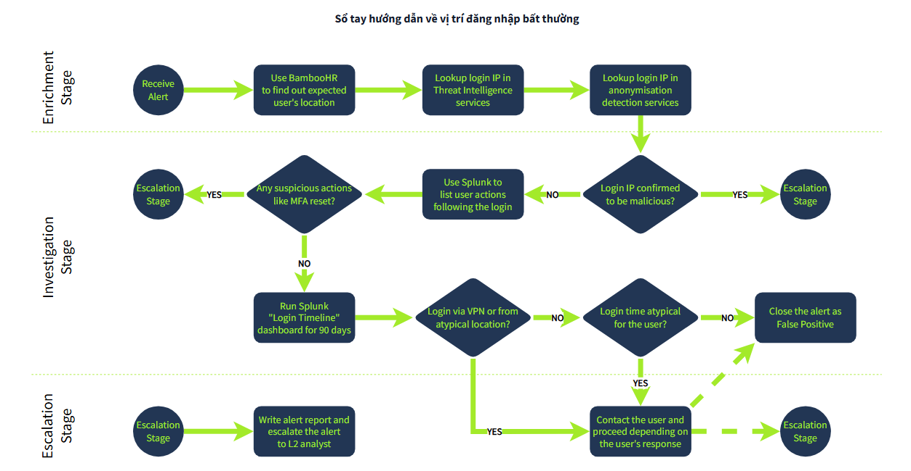

*   **Làm giàu dữ liệu (Enrichment):** Sử dụng Thông tin tình báo về mối đe dọa (Threat Intelligence) và danh mục định danh (identity inventory) để thu thập thông tin về người dùng bị ảnh hưởng.
*   **Điều tra (Investigation):** Sử dụng dữ liệu đã thu thập và nhật ký SIEM để đưa ra kết luận liệu hoạt động đăng nhập có phải là hoạt động bình thường (được mong đợi) hay không.
*   **Leo thang (Escalation):** Chuyển tiếp cảnh báo lên cấp độ 2 (L2) hoặc liên hệ xác minh việc đăng nhập với người dùng nếu cần thiết.

### 2.4 SOC Metrics and Objectives (Chỉ số & Mục tiêu)

**Chỉ số**

| Chỉ số (Metric) | Công thức (Formula) | Ý nghĩa đo lường (Measures) |
| :--- | :--- | :--- |
| Số lượng cảnh báo (Alerts Count) | `AC = Total Count of Alerts Received` | Khối lượng công việc tổng thể của các chuyên viên phân tích SOC |
| Tỉ lệ cảnh báo giả (False Positive Rate) | `FPR = False Positives / Total Alerts` | Mức độ "nhiễu" của các cảnh báo |
| Tỉ lệ leo thang cảnh báo (Alert Escalation Rate) | `AER = Escalated Alerts / Total Alerts` | Kinh nghiệm của các chuyên viên phân tích L1 |
| Tỉ lệ phát hiện mối đe dọa (Threat Detection Rate) | `TDR = Detected Threats / Total Threats` | Độ tin cậy của đội ngũ SOC |

1. Số lượng cảnh báo (Alerts Count)
- Mục tiêu: Nên duy trì từ 5 - 30 cảnh báo/ngày cho mỗi chuyên viên L1.
- Lưu ý: 
    - Quá nhiều cảnh báo sẽ gây quá tải và dễ bỏ sót mã độc. 
    - Số lượng quá ít có thể là dấu hiệu hệ thống SIEM đang gặp lỗi hoặc thiếu khả năng hiển thị.

2. Tỷ lệ Dương tính giả (False Positive Rate)
- Mức cảnh báo: Nếu tỷ lệ này trên 80% được coi là vấn đề nghiêm trọng.
- Hệ quả: Tỷ lệ giả cao gây tâm lý chủ quan cho nhân sự. 
- Hành động: Cần phải thực hiện tinh chỉnh (tuning) các quy tắc phát hiện để giảm bớt "nhiễu" cho hệ thống.

3. Tỷ lệ Leo thang cảnh báo (Alert Escalation Rate)
- Mục tiêu: Nên giữ ở mức dưới 50%, lý tưởng nhất là dưới 20%.
- Ý nghĩa: Chỉ số này phản ánh năng lực xử lý độc lập của đội ngũ L1. 
- Đánh giá: Tỷ lệ này quá cao cho thấy nhân sự L1 chưa đủ kinh nghiệm hoặc quy trình lọc nhiễu chưa tốt.

4. Tỷ lệ Phát hiện mối đe dọa (Threat Detection Rate)
- Mục tiêu: Bắt buộc phải đạt mức 100%.
- Hệ quả: Bất kỳ mối đe dọa nào bị bỏ sót (dù do lỗi kỹ thuật hay sai sót cá nhân) đều có thể dẫn đến thảm họa như rò rỉ dữ liệu hoặc mã hóa tống tiền (ransomware).

#### Chỉ số phân loại 
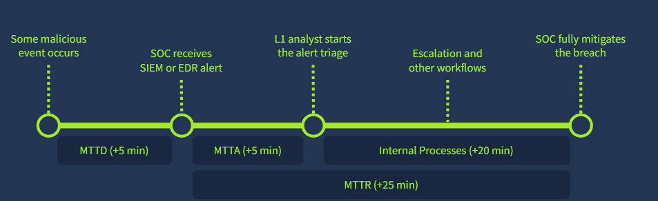

| Chỉ số (Metric) | SLA phổ biến (Common SLA) | Mô tả (Description) |
| :--- | :--- | :--- |
| **SOC Team Availability** | 24/7 | Lịch làm việc của đội ngũ SOC, thường là Thứ Hai - Thứ Sáu (8/5) hoặc chế độ trực 24/7. |
| **Mean Time to Detect (MTTD)** | 5 phút | Thời gian trung bình từ khi cuộc tấn công bắt đầu cho đến khi được các công cụ SOC phát hiện. |
| **Mean Time to Acknowledge (MTTA)** | 10 phút | Thời gian trung bình để các chuyên viên phân tích L1 bắt đầu phân loại (triage) một cảnh báo mới. |
| **Mean Time to Respond (MTTR)** | 60 phút | Thời gian trung bình để đội ngũ SOC thực sự ngăn chặn sự lây lan của một vụ xâm nhập. |

#### Cải thiện chỉ số

| Vấn đề (Issue) | Khuyến nghị (Recommendations) |
| :--- | :--- |
| **Tỷ lệ Dương tính giả trên 80%** (False Positive Rate over 80%) | **Đội ngũ của bạn nhận được quá nhiều "nhiễu" trong các cảnh báo. Hãy thử:** 1. Loại trừ các hoạt động tin cậy như cập nhật hệ thống khỏi các quy tắc phát hiện của EDR hoặc SIEM. 2. Xem xét tự động hóa việc phân loại cho các cảnh báo phổ biến nhất bằng SOAR hoặc các tập lệnh tùy chỉnh. |
| **Thời gian trung bình để phát hiện trên 30 phút** (Mean Time to Detect over 30 min) | **Đội ngũ của bạn phát hiện mối đe dọa với độ trễ cao. Hãy thử:** 1. Liên hệ với kỹ sư SOC để điều chỉnh các quy tắc phát hiện chạy nhanh hơn hoặc với tần suất cao hơn. 2. Kiểm tra xem nhật ký (logs) SIEM có được thu thập theo thời gian thực hay không (tránh việc bị trễ 10 phút). |
| **Thời gian trung bình để tiếp nhận trên 30 phút** (Mean Time to Acknowledge over 30 min) | **Chuyên viên L1 bắt đầu phân loại cảnh báo với độ trễ cao. Hãy thử:** 1. Đảm bảo các chuyên viên phân tích được thông báo theo thời gian thực ngay khi có cảnh báo mới. 2. Cố gắng phân phối đều các cảnh báo trong hàng đợi cho các chuyên viên đang trực ca. |
| **Thời gian trung bình để phản ứng trên 4 giờ** (Mean Time to Respond over 4 hours) | **Đội ngũ SOC không thể ngăn chặn vụ vi phạm kịp thời. Hãy thử:** 1. Với vai trò L1, hãy làm mọi cách để nhanh chóng leo thang (escalate) mối đe dọa lên L2. 2. Đảm bảo đội ngũ đã có tài liệu hướng dẫn quy trình ứng phó cho các kịch bản tấn công khác nhau. |

# 3. Giải pháp SOC 
### 3.1 Giới thiệu EDR
EDR (Endpoint Detection and Response):  là giải pháp bảo mật được thiết kế để giám sát, phát hiện và phản hồi các mối đe dọa nâng cao ở cấp độ thiết bị đầu cuối.

**Một số sản phẩm EDR**
- CrowdStrike Falcon(opens in new tab)
- SentinelOne ActiveEDR(opens in new tab)
- Microsoft Defender for Endpoint(opens in new tab)
- OpenEDR(opens in new tab)
- Symantec EDR

**3 đặc điểm của EDR**
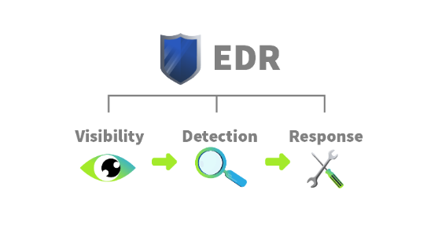

1. Khả năng Hiển thị (Visibility)
EDR vượt trội hơn các giải pháp truyền thống nhờ khả năng cung cấp cái nhìn toàn diện và chi tiết về hoạt động tại điểm cuối:

- Thu thập dữ liệu chuyên sâu: Ghi lại mọi thay đổi về tiến trình (process), Registry, tệp tin và hành vi người dùng.

- Trực quan hóa (Process Tree): Hiển thị các tiến trình dưới dạng sơ đồ cây, giúp nhà phân tích theo dõi dòng thời gian và mối quan hệ giữa các hành động.

- Dữ liệu lịch sử: Hỗ trợ truy xuất dữ liệu cũ để phục vụ việc săn lùng mối đe dọa (Threat Hunting).

2. Khả năng Phát hiện (Detection)
Cơ chế phát hiện của EDR thông minh và đa lớp:

- Kết hợp linh hoạt: Sử dụng cả chữ ký (signature) truyền thống và phân tích hành vi (behavior-based).

- Công nghệ hiện đại: Áp dụng Machine Learning để nhận diện các sai lệch so với hành vi bình thường và phát hiện mã độc không dùng tệp (fileless malware) trong bộ nhớ.

- Bối cảnh hóa: Ánh xạ các phát hiện theo khung kỹ thuật MITRE ATT&CK, giúp nhà phân tích hiểu rõ chiến thuật của kẻ tấn công.

3. Khả năng Phản hồi (Response)
- EDR cho phép nhà phân tích can thiệp trực tiếp và nhanh chóng từ bảng điều khiển trung tâm:

- Hành động tức thời: Cô lập máy tính khỏi mạng, chấm dứt tiến trình độc hại hoặc cách ly tệp tin.

- Điều khiển từ xa: Cho phép truy cập từ xa vào máy chủ bị ảnh hưởng để điều tra và xử lý độc lập.

4. Lưu ý quan trọng
- Phạm vi: EDR là giải pháp chuyên biệt cho máy chủ và máy trạm (điểm cuối).

- Hạn chế: Công cụ này không tập trung vào việc phát hiện các mối đe dọa ở cấp độ mạng (network level).

EDR biến dữ liệu thô thành một bức tranh toàn cảnh có bối cảnh, giúp đội ngũ SOC chuyển từ thế bị động sang chủ động trong việc săn lùng và triệt tiêu mối đe dọa

**EDR bổ sung cho Antivirus**
1. Phép so sánh: Sân bay (Điểm cuối)

Để bảo vệ một sân bay, chúng ta cần hai lớp phòng thủ khác nhau:

- Kiểm soát nhập cảnh (Antivirus): Chỉ kiểm tra hộ chiếu tại cửa ngõ. Nếu tên không nằm trong "danh sách đen" (cơ sở dữ liệu chữ ký), người đó được vào. Tuy nhiên, nó sẽ bỏ lọt những tội phạm mới hoặc kẻ giả dạng tinh vi.

- An ninh nội khu (EDR): Là các nhân viên an ninh và camera giám sát (CCTV) bên trong. Họ không chỉ nhìn mặt mà còn giám sát hành vi: Họ có đi vào vùng cấm không? Có để lại hành lý vô chủ không? EDR phát hiện những kẻ đã vượt qua được lớp cửa khẩu bằng cách theo dõi mọi hoạt động bất thường.

2. Khả năng đối phó mã độc nâng cao

| Giai đoạn tấn công | Antivirus (AV) | EDR (Endpoint Detection and Response) |
| :--- | :--- | :--- |
| **1. Tải file về** | Bỏ qua nếu file chưa có mã nhận diện (signature). | Ghi lại hoạt động tải file để theo dõi sau này. |
| **2. Mở file Word** | Cho phép vì `Winword.exe` là phần mềm hợp lệ. | Ghi nhận việc thực thi và tiếp tục giám sát. |
| **3. Chạy Macro/PowerShell** | Thường không phát hiện được macro mới. | **Cảnh báo ngay** vì mối quan hệ "Cha-Con" bất thường giữa Word và PowerShell. |
| **4. Tải Payload** | Khó nhận diện script PowerShell bị làm rối (obfuscated). | Gắn cờ hành vi thực thi script đáng nghi. |
| **5. Tiêm mã (Injection)** | Không giám sát được việc tiêm mã vào bộ nhớ. | Phát hiện hành vi tiêm mã vào tiến trình hệ thống (`svchost.exe`). |
| **6. Chiếm quyền điều khiển** | Thiếu khả năng quan sát kết nối mạng. | Cảnh báo khi tiến trình hệ thống kết nối ra ngoài bất thường. |

3. Điểm khác biệt cốt lõi
- AV (Dựa trên Chữ ký): Tập trung vào việc "Biết mặt kẻ thù". Nếu mối đe dọa là mới (Zero-day), AV thường thất bại.

- EDR (Dựa trên Hành vi & Tầm nhìn): Tập trung vào việc "Giám sát hành động". EDR ghi lại toàn bộ chuỗi tấn công (Attack Chain), giúp nhà phân tích thấy được bức tranh tổng thể để xử lý tận gốc.

- Tính toàn cục: EDR cho phép kiểm tra một file đáng nghi trên toàn bộ các máy tính trong tổ chức cùng một lúc, thay vì chỉ quét cục bộ từng máy.

**Cách hoạt động**
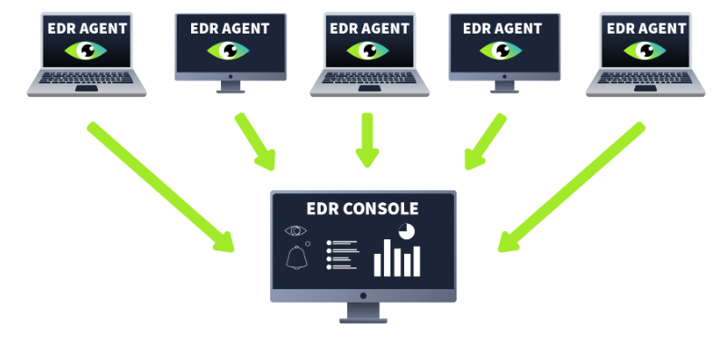

1. EDR Agents (Bộ cảm biến)

Đây là tai mắt của hệ thống, được cài đặt trực tiếp trên các máy trạm/máy chủ:

- Nhiệm vụ: Giám sát liên tục mọi hoạt động tại chỗ và gửi dữ liệu chi tiết về trung tâm theo thời gian thực.

- Khả năng tại chỗ: Có thể tự thực hiện một số phân tích dựa trên chữ ký và hành vi cơ bản để kích hoạt cảnh báo ngay lập tức.

2. EDR Console (Bộ não trung tâm)

Nơi tiếp nhận và xử lý dữ liệu từ các Agent gửi về:

- Phân tích & Tương quan: Sử dụng thuật toán phức tạp và Machine Learning để kết nối các "điểm dữ liệu" rời rạc thành một chuỗi tấn công hoàn chỉnh.

- Threat Intelligence: Đối chiếu dữ liệu thu được với các nguồn tin tình báo về mối đe dọa trên toàn cầu để nhận diện kẻ tấn công.

- Giao diện tập trung: Cung cấp cái nhìn tổng thể (Dashboard) về tình trạng bảo mật của toàn bộ tổ chức.

3. Quy trình của SOC analyst

Khi một cảnh báo (Alert) xuất hiện, quy trình xử lý diễn ra như sau:

- Ưu tiên: EDR tự động phân loại mức độ nghiêm trọng (Critical -> Informational) để chuyên viên biết cần xử lý cái gì trước.

- Điều tra: Xem xét chi tiết các tệp đã chạy, kết nối mạng, thay đổi registry... để xác định đó là True Positive (Mối đe dọa thực sự) hay False Positive (Cảnh báo giả).

- Phản ứng: Nếu là tấn công thực sự, nhà phân tích có thể thực hiện các thao tác diệt tận gốc ngay trên Console mà không cần tiếp cận máy tính vật lý.

4. Hệ sinh thái bảo mật

EDR mạnh mẽ nhưng không hoạt động đơn độc. 

- Phối hợp: EDR bảo vệ điểm cuối, trong khi Firewall bảo vệ mạng, Email Gateway bảo vệ hòm thư...

- Hợp nhất (SIEM): Tất cả các giải pháp này thường được tích hợp vào hệ thống SIEM (Security Information and Event Management) - nơi tập hợp mọi dữ liệu bảo mật về một mối duy nhất để quản lý tập trung và tối ưu hiệu quả điều tra.

#### EDR Telemetry
Telemetry được hiểu là "hộp đen" của một máy tính (endpoint). Nó là tập hợp các dữ liệu thô về mọi hoạt động diễn ra trong hệ thống, được gửi từ các Agent về bộ não trung tâm (EDR Console) để phân tích.

**Các loại Telemetry chính được thu thập**

| Loại dữ liệu giám sát | Mô tả chi tiết | Lợi ích trong phát hiện tấn công |
| :--- | :--- | :--- |
| **Tiến trình (Process)** | Theo dõi mọi tiến trình thực thi và kết thúc trong hệ thống. | Phát hiện quan hệ "Cha-Con" bất thường (như Word mở PowerShell) hoặc các file lạ tự kích hoạt. |
| **Kết nối mạng (Network)** | Giám sát mọi luồng dữ liệu truyền tải ra và vào (Inbound/Outbound). | Nhận diện kết nối tới C2 Server, hành vi rò rỉ dữ liệu hoặc di chuyển ngang (Lateral Movement). |
| **Dòng lệnh (Command Line)** | Ghi lại toàn bộ các câu lệnh được thực thi trong CMD, PowerShell, Terminal... | Phát hiện các script độc hại bị làm rối hoặc các lệnh thực thi ngầm mà AV truyền thống bỏ sót. |
| **Tệp và Thư mục (File)** | Theo dõi các thao tác tạo, xóa, sửa đổi hoặc đổi tên tệp tin. | Nhận diện sớm dấu hiệu của mã hóa tống tiền (Ransomware) hoặc hoạt động tải mã độc (Payload). |
| **Registry (Windows)** | Giám sát các thay đổi trong cấu hình hệ thống và các khóa khởi động. | Ngăn chặn và phát hiện các kỹ thuật duy trì sự hiện diện lâu dài (Persistence) của hacker trên máy. |

#### Khả năng phát hiện và phản hồi
**Khả năng phát hiện**
| Kỹ thuật Phát hiện | Mô tả | Ví dụ / Lợi ích |
| :--- | :--- | :--- |
| **Behavioral Detection** (Phát hiện hành vi) | Theo dõi hành động thực tế của ứng dụng thay vì chỉ quét mã nhận diện. | Phát hiện quan hệ "Cha-Con" bất thường như: **Word mở PowerShell**. |
| **Anomaly Detection** (Phát hiện bất thường) | Học thói quen hàng ngày của máy tính (Baseline) để tìm ra các sai lệch. | Báo động khi một máy tính bỗng dưng sửa đổi **Registry khởi động tự động** (vốn hiếm khi xảy ra). |
| **IOC Matching** | So khớp mã Hash file, IP, Domain với nguồn tin tình báo mã độc toàn cầu. | Sử dụng **Threat Intelligence** để nhận diện ngay các dấu hiệu độc hại đã được định danh. |
| **MITRE ATT&CK Mapping** | Gắn nhãn các cảnh báo theo khung tiêu chuẩn quốc tế về kỹ thuật tấn công. | Giúp biết rõ kẻ địch đang ở giai đoạn nào (ví dụ: bám trụ - **Persistence** hay đánh cắp dữ liệu). |
| **Machine Learning (ML)** | Phân tích các chuỗi hành động phức tạp để tìm ra mối liên kết ẩn. | Phát hiện các cuộc tấn công tinh vi không dùng tệp (**Fileless**) mà từng bước riêng lẻ trông có vẻ "sạch". |

**Khả năng Phản ứng (Response)**
| Hành động cụ thể | Mô tả chi tiết | Mục đích |
| :--- | :--- | :--- |
| **Isolate Host** (Cô lập máy) | Ngắt kết nối mạng của máy bị nhiễm. | Ngăn chặn mã độc lây lan sang các máy khác (**Lateral Movement**) và khoanh vùng sự cố. |
| **Terminate Process** | Dừng ngay lập tức một tiến trình đang chạy. | Loại bỏ mối đe dọa tức thì mà không cần tắt máy, tránh gián đoạn công việc. |
| **Quarantine** (Cách ly) | Di chuyển file nghi ngờ vào vùng giam giữ an toàn. | Ngăn file thực thi và lưu giữ lại để nhà phân tích kiểm tra sau. |
| **Remote Access** | Truy cập từ xa vào dòng lệnh (Shell) của máy nạn nhân. | Cho phép điều tra sâu hoặc thực hiện các script xử lý tùy chỉnh từ xa. |

**Thu thập bằng chứng (Artefacts Collection)**
| Loại bằng chứng | Nội dung thu thập | Giá trị trong điều tra (Forensics) |
| :--- | :--- | :--- |
| **Memory Dump** | Trích xuất toàn bộ dữ liệu trong bộ nhớ RAM. | Tìm kiếm mã độc chạy ẩn, các chuỗi ký tự (strings) hoặc thông tin đăng nhập trong bộ nhớ. |
| **Event Logs** | Thu thập các tệp nhật ký hệ thống (Windows Event Logs). | Truy vết lịch sử đăng nhập, thực thi lệnh và các sự kiện hệ thống quan trọng. |
| **Registry Hives** | Trích xuất các tệp cấu hình Registry của Windows. | Kiểm tra các dấu vết bám trụ (**Persistence**) hoặc thay đổi cấu hình hệ thống của hacker. |

### 3.2 Giới thiệu về SIEM
**Log Sources**
| Loại Log | Tập trung vào | Thiết bị phát sinh | Ví dụ hoạt động |
| :--- | :--- | :--- | :--- |
| **Host-Centric** (Tại máy chủ/trạm) | Hoạt động bên trong hệ điều hành của thiết bị. | Windows, Linux, Máy chủ (Server), Laptop. | Truy cập file, đăng nhập, chạy tiến trình (Process), sửa Registry, chạy lệnh PowerShell. |
| **Network-Centric** (Tại mạng) | Hoạt động giao tiếp giữa các thiết bị hoặc ra Internet. | Firewall, Router, IDS/IPS, VPN Gateway. | Kết nối SSH, truyền file qua FTP, truy cập Web (HTTP/S), truy cập nội bộ qua VPN. |

**Tính năng chính**
| Tính năng | Mô tả chi tiết | Lợi ích mang lại |
| :--- | :--- | :--- |
| **Thu thập tập trung** | Gom log từ mọi nguồn (PC, Server, Firewall...) về một kho duy nhất qua Agent hoặc API. | Không còn phải truy cập thủ công vào từng máy để xem log. |
| **Bình thường hóa (Normalization)** | Phân tách log thô thành các trường (Parsing) và đưa về một định dạng thống nhất. | Giúp so sánh và tìm kiếm dữ liệu từ các nguồn khác nhau (Windows vs Linux) một cách dễ dàng. |
| **Tương quan dữ liệu (Correlation)** | Kết nối các sự kiện rời rạc để tìm ra mối quan hệ và kịch bản tấn công. | Phát hiện các cuộc tấn công tinh vi mà nếu nhìn từng bước riêng lẻ sẽ thấy rất bình thường. |
| **Cảnh báo thời gian thực** | Tự động đối chiếu dữ liệu với bộ quy tắc (Rules) để kích hoạt báo động ngay lập tức. | Giúp nhà phân tích SOC phản ứng nhanh với các sự cố đang diễn ra. |
| **Dashboard & Báo cáo** | Trực quan hóa dữ liệu dưới dạng biểu đồ, bảng biểu (Top IP, số lượng cảnh báo...). | Cung cấp cái nhìn tổng thể về "sức khỏe" an ninh của toàn hệ thống chỉ trong nháy mắt. |

#### Log Sources & Ingestion
**Các nguồn log phổ biến**
| Nguồn Log | Công cụ/Đường dẫn lưu trữ | Đặc điểm chính |
| :--- | :--- | :--- |
| **Windows** | Event Viewer | Sử dụng **Event ID** để định danh loại hoạt động (ví dụ: `4624` là đăng nhập thành công, `4625` là đăng nhập thất bại). |
| **Linux (Hệ thống)** | `/var/log/auth.log`, `/var/log/kern.log` | Lưu trữ dưới dạng văn bản (text), bao gồm tin nhắn từ nhân hệ điều hành, hoạt động xác thực và lỗi hệ thống. |
| **Linux (Cron Job)** | `/var/log/cron` | Theo dõi các tác vụ lập lịch tự động; thường được hacker lợi dụng để duy trì sự hiện diện (**Persistence**). |
| **Web Server** (Apache/HTTPD) | `/var/log/apache2` hoặc `/var/log/httpd` | Chứa thông tin về IP truy cập, phương thức (GET/POST), mã trạng thái (200, 404) và User-Agent của trình duyệt. |

**Các phương thức nạp log (Log Ingestion) vào SIEM**
| Phương thức | Cách thức hoạt động | Trường hợp sử dụng |
| :--- | :--- | :--- |
| **Agent / Forwarder** | Cài một phần mềm nhỏ (như Wazuh Agent, Splunk Forwarder) lên máy trạm để đẩy log về. | Dùng cho các máy tính cá nhân (Endpoint), Máy chủ cần giám sát chi tiết và liên tục. |
| **Syslog** | Sử dụng giao thức tiêu chuẩn (UDP/TCP 514) để gửi dữ liệu thời gian thực qua mạng. | Dùng cho thiết bị mạng (Router, Switch), Firewall hoặc các dịch vụ hệ thống trên Linux. |
| **Manual Upload** | Tải lên các tệp log offline dưới định dạng tệp tin (CSV, JSON, .log). | Dùng khi cần điều tra nhanh một sự cố đã xảy ra hoặc phân tích dữ liệu lịch sử từ máy cũ. |
| **Port-Forwarding** | SIEM mở một cổng (Port) để "nghe", các thiết bị/ứng dụng tự gửi dữ liệu thẳng vào cổng đó. | Dùng trong các cấu hình mạng đặc thù hoặc tích hợp các ứng dụng tùy chỉnh (Custom App). |

#### Quy trình cảnh báo và phân tích
**Quy tắc phát hiện**
- Dựa trên ngưỡng (Threshold): Ví dụ: >5 lần đăng nhập sai trong 10 giây => cảnh báo Brute Force.
- Dựa trên sự kiện đơn lẻ: Ví dụ: Event ID 104 (xóa nhật ký hệ thống) => cảnh báo hành vi xóa dấu vết.
- Dựa trên tiến trình lạ: Ví dụ: Event ID 4688 kết hợp lệnh whoami => cảnh báo thám sát hệ thống sau xâm nhập.

**Chuẩn hóa dữ liệu**
Dữ liệu thô phải được phân tách thành các cặp Trường - Giá trị 

**Alert Investigation**
Sau khi cảnh báo được kích hoạt, cần xác định bản chất của nó:
- True Positive (TP - Cảnh báo đúng): Xác nhận có mối đe dọa thực sự.

    - Hành động: Điều tra sâu, cô lập máy chủ nhiễm mã độc, chặn IP tấn công.

- False Positive (FP - Cảnh báo giả): Hành vi bình thường bị hiểu lầm là tấn công.

    - Hành động: Tinh chỉnh quy tắc (Tuning) để tránh báo giả trong tương lai.

- Nghi vấn (Suspicious): Chưa rõ ràng.

    - Hành động: Liên hệ chủ sở hữu thiết bị để xác minh hoạt động.

### 3.3 Splunk basic
Cho phép người dùng thu thập, phân tích và đối chiếu nhật ký mạng và máy móc trong thời gian thực.

#### Splunk component
- Splunk Forwarder
    - tác nhân nhẹ được cài đặt trên thiết bị đầu cuối cần được giám sát, và nhiệm vụ chính của nó là thu thập dữ liệu và gửi đến máy chủ trung gian
    - Một số nguồn dữ liệu: 
        - Web server generating web traffic.
        - Windows machine generating Windows Event Logs, PowerShell, and Sysmon data.
        - Linux host generating host-centric logs.
        - Database generating DB connection requests, responses, and errors.

- Splunk Indexer
    -  xử lý dữ liệu nhận được từ các bộ chuyển tiếp
    -   phân tích và chuẩn hóa dữ liệu thành các cặp trường-giá trị, phân loại dữ liệu và lưu trữ kết quả dưới dạng sự kiện
- Search Head
    - tìm kiếm nhật ký đã được lập chỉ mục sử dụng SPL
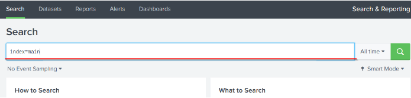

#### Sử dụng Splunk
**Splunk Bar**

- Messages: Xem các thông báo và tin nhắn ở cấp độ hệ thống.

- Settings: Cấu hình các thiết lập cho thực thể (instance) Splunk.

- Activity: Xem xét tiến trình của các công việc tìm kiếm (search jobs) và các tiến trình đang chạy.

- Help: Xem các bài hướng dẫn và tài liệu hướng dẫn sử dụng.

- Find: Tìm kiếm trên toàn bộ ứng dụng.

**Apps Panel**

Liệt kê danh sách các ứng dụng (như Search & Reporting, Splunk Enterprise Security, hoặc các ứng dụng phân tích dữ liệu cụ thể cho Windows/Linux).

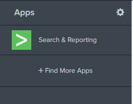

**Explore Splunk**

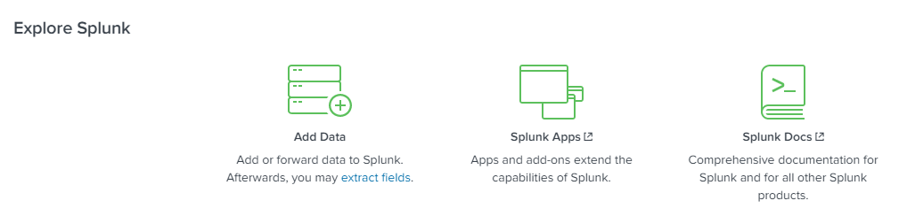

Bảng điều khiển này chứa các liên kết nhanh để:

- Add data: Thêm dữ liệu vào thực thể (instance) Splunk.
    - có thể chọn các phương thức nạp dữ liệu (Ingestion) như cài đặt Forwarder, nạp file log tĩnh (Upload), hoặc lấy dữ liệu qua giao thức Syslog hay HTTP Event Collector (HEC).

- Add new Splunk apps: Thêm các ứng dụng Splunk mới.

- Access the Splunk documentation: Truy cập tài liệu hướng dẫn của Splunk.

#### Add data
Splunk có thể nhận mọi loại dữ liệu.  Khi dữ liệu được thêm vào Splunk, dữ liệu được xử lý và chuyển đổi thành một chuỗi các sự kiện riêng lẻ
Nguồn dữ liệu có thể là log sự kiện, log trang web, log tường lửa, v.v. Các nguồn dữ liệu được nhóm thành các danh mục.

**Các loại nguồn dữ liệu**
| Nhóm nguồn dữ liệu | Mô tả |
| :--- | :--- |
| **Files and directories** | Dữ liệu được thu thập trực tiếp từ các tệp tin và thư mục (đây là nguồn phổ biến nhất). |
| **Network events** | Dữ liệu thu được từ các cổng mạng (Network ports) hoặc giao thức SNMP từ các thiết bị từ xa. |
| **Cloud / Database services** | Dữ liệu từ các dịch vụ đám mây (AWS, Kinesis) hoặc các hệ quản trị cơ sở dữ liệu như Oracle, MySQL, SQL Server. |
| **Security services** | Log thu thập từ các giải pháp bảo mật của bên thứ ba như McAfee, Active Directory, Symantec. |
| **Windows sources** | Các nguồn dữ liệu đặc thù của hệ điều hành Windows bao gồm: Event Logs, Registry, WMI và Active Directory. |

Màn hình sau khi nhấp vào Add Data
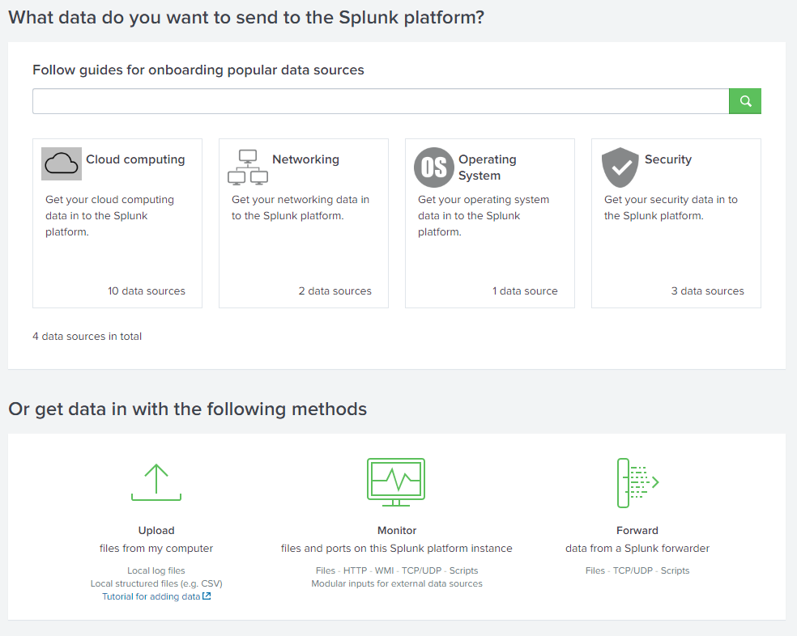

### 3.4 Elastic Stack Basics
- được sử dụng để phân tích nhật ký và điều tra
- là 1 giải pháp SIEM
-  là một tập hợp các thành phần mã nguồn mở khác nhau hoạt động cùng nhau để thu thập dữ liệu từ bất kỳ nguồn nào, lưu trữ và tìm kiếm dữ liệu đó, đồng thời hiển thị trực quan dữ liệu theo thời gian thực. 

Các thành phần: 

| Thành phần | Vai trò | Chức năng chi tiết |
| :--- | :--- | :--- |
| **Beats** | Người vận chuyển (Data Shippers) | Là các Agent siêu nhẹ cài trên máy trạm để thu thập dữ liệu cụ thể (ví dụ: **Winlogbeat** cho Windows logs, **Packetbeat** cho mạng). |
| **Logstash** | Bộ xử lý trung tâm (Processing Engine) | Tiếp nhận dữ liệu, thực hiện **Parsing** (phân tách) và **Normalization** (bình thường hóa) thông qua 3 giai đoạn: Input -> Filter -> Output. |
| **Elasticsearch** | Kho lưu trữ & Tìm kiếm (Search Engine) | Lưu trữ dữ liệu dưới dạng tài liệu **JSON**, cho phép tìm kiếm toàn văn và phân tích dữ liệu với tốc độ cực nhanh. |
| **Kibana** | Giao diện trực quan (Visualization) | Cung cấp bảng điều khiển (**Dashboard**) để nhà phân tích điều tra, vẽ biểu đồ và theo dõi dữ liệu theo thời gian thực. |

Quy trình làm việc:
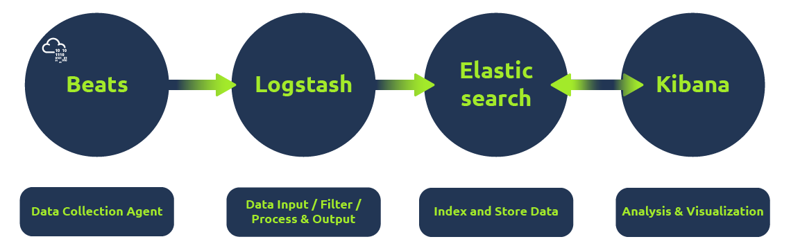

#### Discover Tab
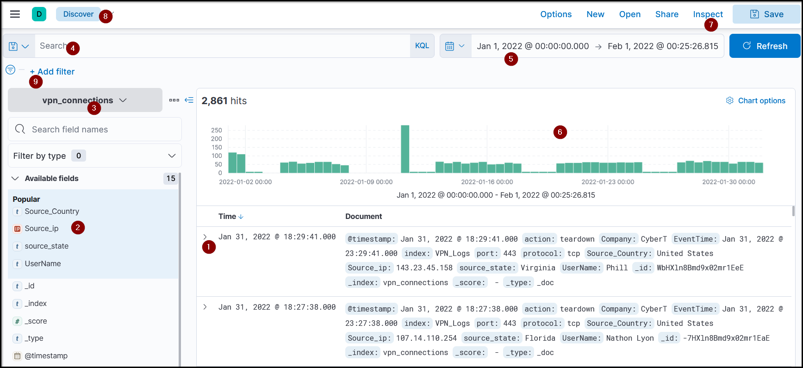

| Thành phần | Dịch nghĩa / Chức năng chính | Vai trò trong điều tra SOC |
| :--- | :--- | :--- |
| **Discover Tab** | Tab Khám phá | Không gian làm việc chính trong Kibana để khám phá, tìm kiếm và phân tích dữ liệu thô. |
| **Index Pattern** | Mẫu chỉ mục | Chọn mẫu chỉ mục tương ứng với dữ liệu cần tìm (ví dụ: chọn index `vpn` để xem log VPN). |
| **Search Bar** | Thanh tìm kiếm | Nơi nhập các truy vấn tìm kiếm (KQL/Lucene) và áp dụng bộ lọc để thu hẹp kết quả. |
| **Time Filter** | Bộ lọc thời gian | Thu hẹp kết quả dựa trên khoảng thời gian cụ thể (ví dụ: 15 phút qua, 24 giờ qua). |
| **Time Interval** | Biểu đồ khoảng thời gian | Hiển thị số lượng sự kiện theo thời gian, giúp phát hiện các đợt tăng vọt (**spikes**) bất thường. |
| **Fields Pane** | Bảng danh sách các trường | Hiển thị các trường đã được phân tách (**parsed**); giúp thêm/xóa trường vào bộ lọc nhanh chóng. |
| **Logs** | Nhật ký (Bản ghi) | Hiển thị chi tiết từng dòng log gồm các trường (**fields**) và giá trị (**values**) cụ thể. |
| **Add Filter** | Thêm bộ lọc | Áp dụng bộ lọc cho các trường cụ thể nhanh chóng thay vì phải gõ lệnh truy vấn thủ công. |
| **TOP Bar** | Thanh công cụ phía trên | Chứa các tùy chọn để lưu tìm kiếm (**Save**), mở tìm kiếm cũ hoặc chia sẻ kết quả điều tra. |

**Index Pattern**
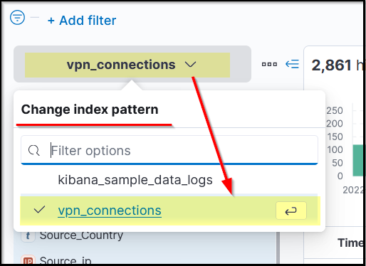
Là cầu nối để Kibana truy cập dữ liệu trong Elasticsearch. Nó xác định nguồn dữ liệu nào bạn muốn khám phá (ví dụ: vpn_connections). Một mẫu chỉ mục có thể đại diện cho nhiều kho dữ liệu có cấu trúc giống nhau.

**Fields Pane**
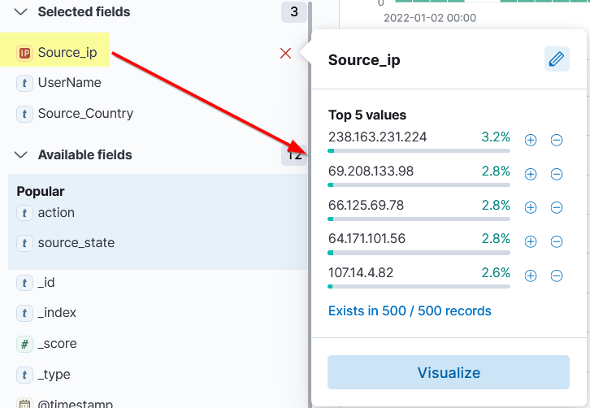
Nằm ở bên trái, hiển thị danh sách các trường dữ liệu đã được bình thường hóa. Nhấp vào một trường để xem 5 giá trị xuất hiện nhiều nhất; dùng nút (+) để lọc lấy giá trị đó hoặc (-) để loại trừ nó.

**Time Filter**
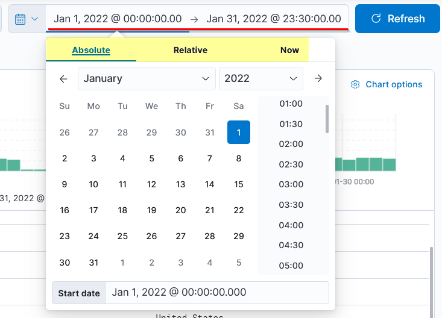
Cho phép lọc log dựa trên thời gian với rất nhiều tùy chọn linh hoạt (thời gian tuyệt đối hoặc tương đối).

**Timeline**
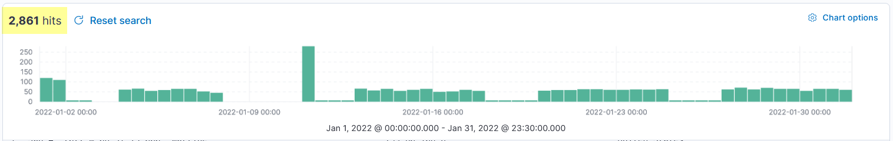
Cung cấp cái nhìn tổng quan về số lượng sự kiện theo thời gian. Rất hữu ích để xác định các đợt tăng vọt (spikes) log bất thường – dấu hiệu của một cuộc tấn công.

**Create Table**

Chuyển dữ liệu từ dạng thô (nhiều "nhiễu") sang dạng bảng có cấu trúc bằng cách chọn các trường quan trọng. Giúp thông tin trở nên rõ ràng, chuyên nghiệp và dễ trình bày hơn.

#### KQL

 KQL  (Kibana Query Language) là ngôn ngữ truy vấn tìm kiếm được sử dụng để tìm kiếm nhật ký/tài liệu đã được nhập vào Elasticsearch. 

- Tìm kiếm văn bản tự do:
    - Cho phép dùng `*` (vd `United*`)
    - Toán tử: and, or, not
- Tìm kiếm theo trường
    - vd `Source_ip : 238.163.231.224 AND UserName : Suleman `

### 3.5 Giới thiệu SOAR
Security Orchestration, Automation, and Response (SOAR) là công cụ hợp nhất tất cả các công cụ bảo mật được sử dụng trong một hệ thống SOC

3 trụ cột chính trong SOAR
| Thành phần | Dịch nghĩa / Chức năng | Vai trò trong quy trình SOC |
| :--- | :--- | :--- |
| **1. Orchestration** | Điều phối | Kết nối nhiều công cụ bảo mật khác nhau (SIEM, Threat Intel, IAM, Ticketing) vào một giao diện thống nhất. Sử dụng **Playbooks** để định nghĩa các bước điều tra chuẩn hóa. |
| **2. Automation** | Tự động hóa | Thực thi các bước trong Playbook mà không cần con người nhấp chuột thủ công. Tự động kiểm tra danh tiếng IP, truy vấn lịch sử đăng nhập và cập nhật trạng thái sự cố. |
| **3. Response** | Phản ứng | Khả năng thực hiện các hành động ngăn chặn trực tiếp từ SOAR như: Chặn IP trên Firewall, vô hiệu hóa tài khoản trên IAM, giúp xử lý mối đe dọa ngay lập tức. |

#### Xây dựng SOAR Playbook
**Phishing playbook**
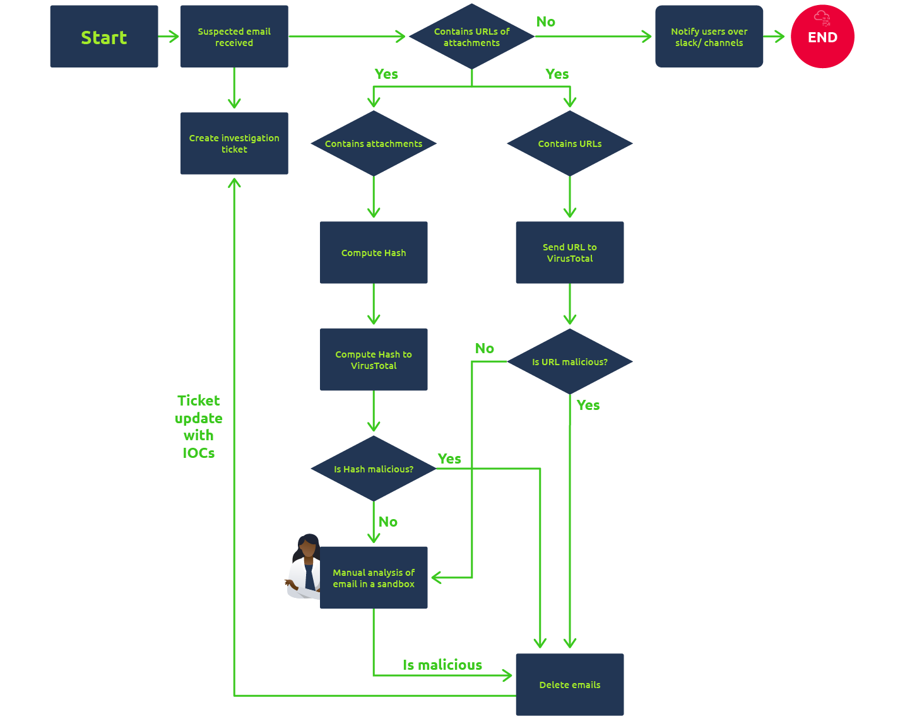

**CVE Patching Playbook**

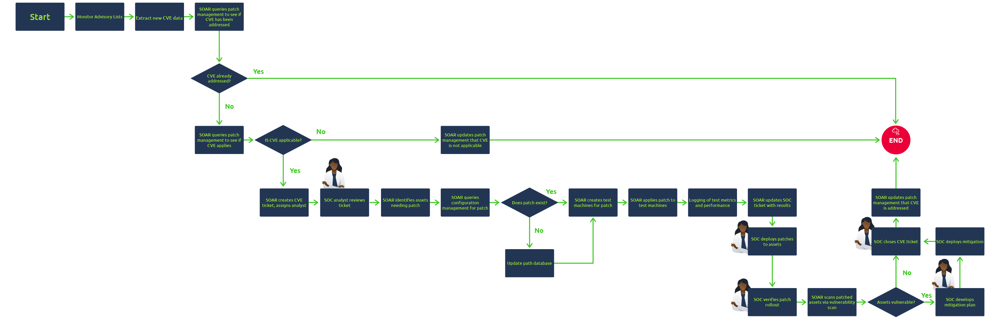

# 4. Cyber Defence Frameworks
### 4.1 Pyramid Of Pain
- giúp xác định mức độ hiệu quả của các quy tắc (rules) thiết lập trên Wazuh hay các kịch bản (playbooks) trên Shuffle.
- tập trung vào việc đo lường mức độ "đau đớn" mà bạn gây ra cho kẻ tấn công khi bạn chặn đứng được các chỉ số nhận diện (IOCs) của chúng.

#### 1. Hash Value
- Hàm băm thông dụng: MD5, SHA-1, SHA-2
- Một hàm băm không được coi là an toàn về mặt mật mã nếu hai tệp có cùng giá trị băm hoặc giá trị tổng hợp.
- Công cụ tra cứu mã băm: 
    - VirusTotal
    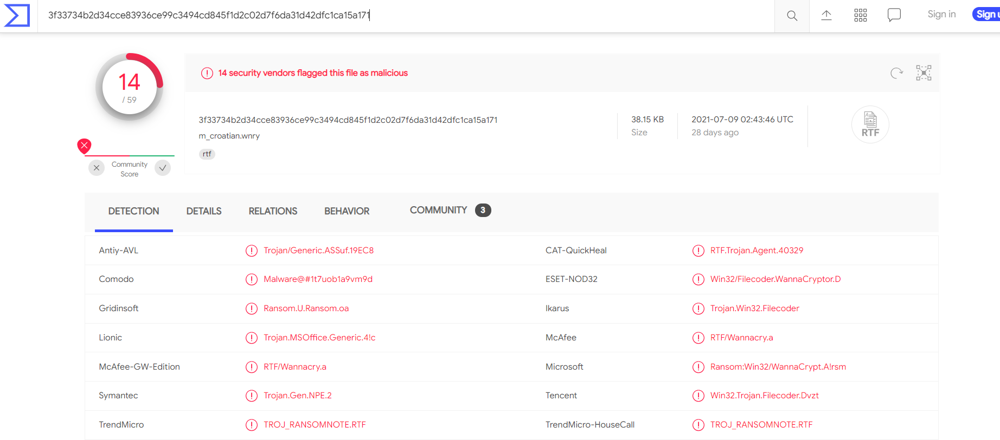
    - MetaDefender Cloud - OPSWAT
    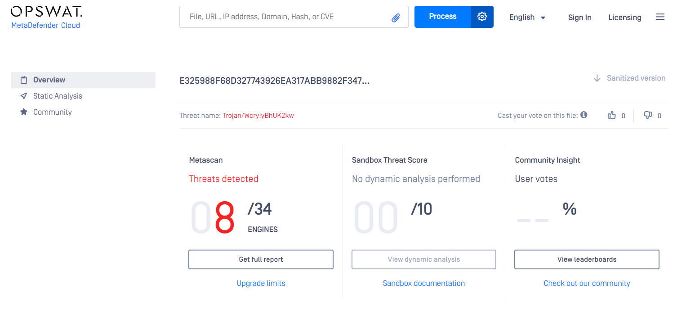
- Thay đổi giá trị băm của 1 file: thêm 1 chuỗi vào cuối file

#### 2. IP Address
**1. Vị trí của IP trong Pyramid of Pain**

- Màu sắc: Được đánh dấu bằng màu xanh lá cây.

- Đặc điểm: Đây là chỉ số nhận diện (IOC) thuộc tầng thấp. Việc chặn IP là hành động phòng thủ phổ biến nhưng không triệt để. Hacker có thể dễ dàng thay đổi địa chỉ IP công cộng để tiếp tục cuộc tấn công.

**2. Kỹ thuật né tránh: Fast Flux**

Kẻ tấn công sử dụng kỹ thuật Fast Flux để làm cho việc chặn IP trở nên vô dụng:

- Cơ chế: Thay đổi liên tục các địa chỉ IP liên kết với một tên miền (Domain) duy nhất.

- Cách thức: Sử dụng mạng lưới máy tính ma (Botnet) làm proxy trung gian. Khi một IP bị chặn, tên miền sẽ ngay lập tức trỏ sang một IP khác trong mạng lưới.

- Mục đích: Che giấu máy chủ điều khiển trung tâm (C&C), gây khó khăn cho các chuyên gia bảo mật trong việc phát hiện và triệt phá hạ tầng của chúng.

#### 3. Domain Name
- Màu: xanh ngọc
- Domain Name thường khó thay đổi hơn IP do phải mua tên miền, tuy nhiên nhiều nhà cung cấp có tiêu chuẩn lỏng lẻo và cung cấp API nên attacker dễ dàng lợi dụng hơn

Malicious  Sodinokibi  C2 ( Command and Control Infrastructure)  domains
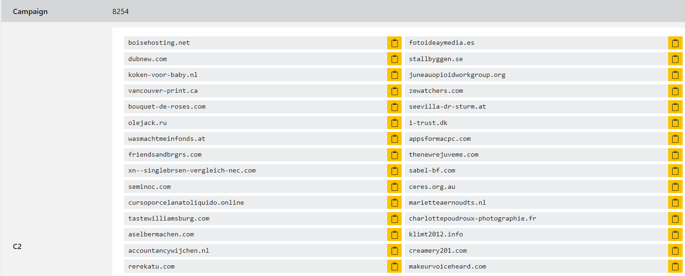

- Tấn công Punycode (Ký tự tương đồng): Hacker thường sử dụng Punycode để đánh lừa người dùng bằng cách tạo ra các URL trông rất giống trang web thật.
- Rút gọn URL (URL Shorteners): Kẻ tấn công thường che giấu các tên miền độc hại dưới các dịch vụ rút gọn như bit.ly, tinyurl.com, goo.gl

**Phòng ngừa:** Phân tích trên Any.run
- HTTP Requests: Xem các tài nguyên mà mã độc tải về (như file thực thi khác) hoặc các lần gọi về máy chủ (callbacks).

- Connections: Theo dõi luồng giao tiếp giữa tiến trình độc hại và các máy chủ bên ngoài (C2 traffic).

- DNS Requests: Malware thường thực hiện yêu cầu DNS để kiểm tra kết nối internet. Nếu không nhận được phản hồi, nó có thể tự dừng hoạt động vì nghi ngờ đang bị nhốt trong Sandbox.

#### 4. Host Artifacts (màu vàng - gây khó chịu)
Dấu vết do kẻ tấn công để lại trên hệ thống là những bằng chứng hoặc thông tin quan sát được, chẳng hạn như giá trị trong registry, quá trình thực thi đáng ngờ, các mẫu tấn công hoặc IOC (Chỉ báo về sự xâm phạm), các tập tin do ứng dụng độc hại để lại, hoặc bất cứ thứ gì đặc trưng cho mối đe dọa hiện tại.

Quá trình thực thi Word đáng ngờ

Event đáng ngờ khi mở app độc hại 
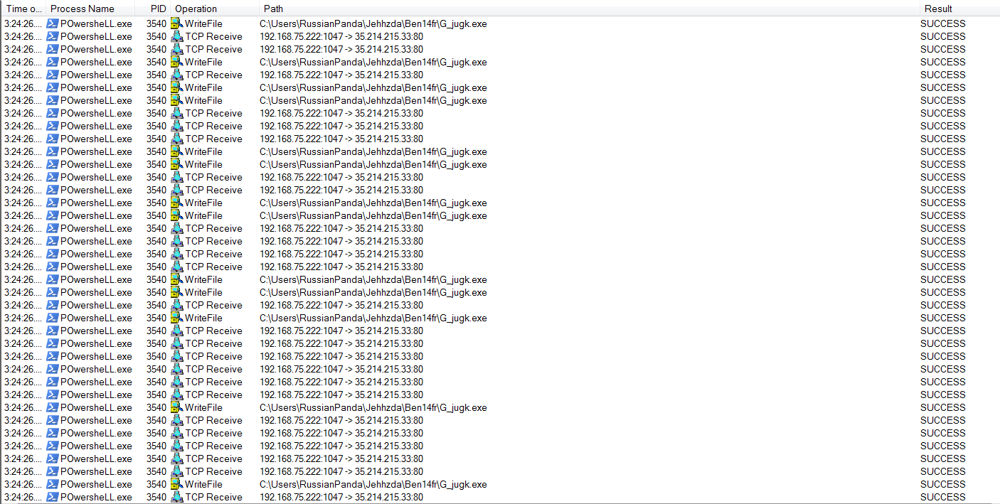

File bị sửa đổi/xóa
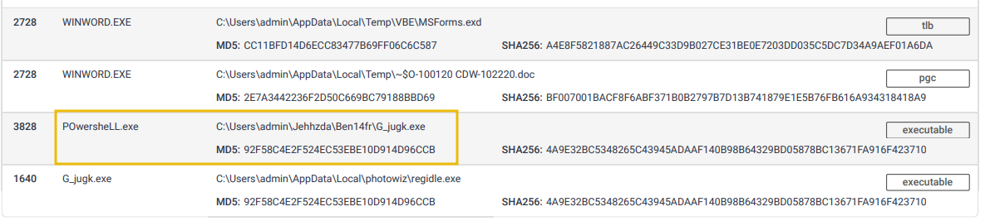

#### 5. Network Artifacts (màu vàng - gây khó chịu)

- nếu bạn có thể phát hiện và ứng phó với mối đe dọa, kẻ tấn công sẽ cần nhiều thời gian hơn để quay lại và thay đổi chiến thuật hoặc sửa đổi các công cụ của mình, điều này cho bạn thêm thời gian để ứng phó và phát hiện các mối đe dọa sắp tới hoặc khắc phục các mối đe dọa hiện có.
- hiện vật: một chuỗi user-agent, thông tin C2, hoặc URI các mẫu được tuân theo bởi các HTTP POST request

- dấu hiệu có thể chứa trong file PCAP, từ IDS
- `tshark --Y http.request -T fields -e http.host -e http.user_agent -r analysis_file.pcap `: 
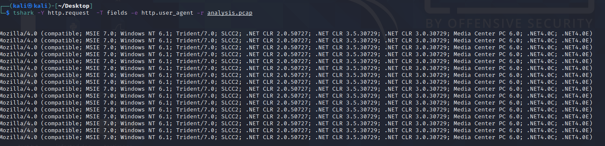
các chuỗi User-Agent phổ biến nhất được tìm thấy cho  Emotet Trojan

#### 6. Tools (Khó khăn)
- Attacker sử dụng để tạo các tài liệu độc hại, backdoor để thiết lập c2 server, file .exe, .dll, password crackers
- Cách chống: sử dụng Antivirus signatures, detection rules, and YARA rules
- Nguồn: MalwareBazaar và  Malshare
- Sử dụng SSDeep: 
    - Fuzzy hashing là một bước tiến quan trọng so với băm mật mã truyền thống (cryptographic hashing) khi nói đến việc phát hiện mã độc và công cụ của kẻ tấn công.
    - Phân tích độ tương đồng: Nó chia tệp thành các khối và tính toán mã băm cho từng khối, tạo ra một chuỗi đại diện cho cấu trúc tệp.
    - Chống lại sự biến đổi: Nếu hacker chỉ thay đổi 2% mã nguồn, mã SSDeep của tệp mới sẽ vẫn giống 98% so với tệp cũ.

#### 7. TTPs (Khó khăn) (Tactics, Techniques & Procedures)
- là hành vi và tư duy của kẻ tấn công.
- để hiểu và phát hiện TTPs: sử dụng ma trận MITRE ATT&CK, chứa mọi hành vi mà hacker có thể thực hiện

# 5. Network Traffic Analysis
### 5.1 Network Traffic Basic
- quy trình bao gồm việc thu thập, kiểm tra và phân tích dữ liệu khi nó di chuyển trong mạng

**Mục tiêu**
- Giám sát hiệu suất mạng
- Kiểm tra các bất thường trong mạng. Ví dụ: hiệu suất tăng đột ngột, mạng chậm, v.v.
- Kiểm tra nội dung các thông tin liên lạc đáng ngờ cả nội bộ và bên ngoài. 

**Lợi ích**
- Phát hiện hoạt động đáng ngờ hoặc độc hại
- Tái cấu trúc các cuộc tấn công trong quá trình ứng phó sự cố.
- Xác minh và kiểm tra cảnh báo

**Các loại lưu lượng mạng có thể quan sát**
- Lớp Application: 
    - Header
    - Payload
- Transport

Log firewall 
    - Chứa ip nguồn và đích, có thể xem số thứ tự gói tin để phát hiện tấn công đánh cắp phiên

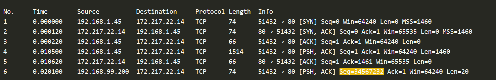 
Gói tin 6 có số thự tự tăng vọt => cần điều tra thêm

- Network
    - Phát hiện tấn công phân mảnh 
    - vd: Sử dụng các Offset chồng lấn lên nhau. Khi hệ thống đích lắp ghép lại, nó có thể tạo ra một mã độc hoàn chỉnh mà IDS trước đó không nhận diện được do chỉ nhìn thấy từng mảnh rời rạc.

    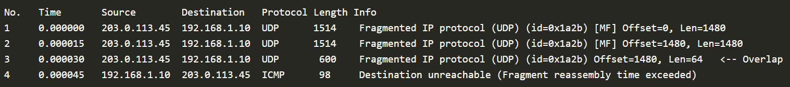

- Link 
    - Phát hiện tấn công ARP poisoning/spoofing
    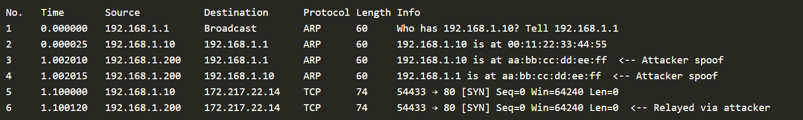
Cùng 1 ip nhưng trả lời với nhiều địa chỉ MAC

**Nguồn và luồng lưu lượng mạng**
- Nguồn
    - Intermediary Sources: 
        - firewalls, switches, web proxies, IDS, IPS, routers, access points, wireless LAN controllers
        - lưu lượng thu từ các thiết bị trên chủ yếu là từ giao thức định tuyến (EIGRP, OSPF, BGP), giao thức quản lý (SNMP, PING), giao thức ghi nhật ký (SYSLOG) và các giao thức hỗ trợ khác (ARP, STP,DHCP).
    - Endpoint Sources: tạo ra lưu lượng truy cập lớn nhất trong mạng
- Flows
    - được xác định bởi các dịch vụ có sẵn trong mạng (vd: AD, HTTP,...)

    - North-South Traffic: 
        - được giám sát khi đi từ LAN <=> WAN
        - dịch vụ phổ biến cho luồng này: giao thức máy khách-máy chủ như HTTPS,DNS,SSH,VPN,SMTP,RDP
        - đều đi qua firewall
    - East-West Traffic: 
        - diễn ra trong mạng LAN nội bộ

| Phân loại | Các dịch vụ tiêu biểu | Vai trò trong mạng nội bộ |
| :--- | :--- | :--- |
| **Directory & Identity** | Kerberos/LDAP, RADIUS/TACACS+, CA | Xác thực người dùng và quản lý danh tính tập trung (ví dụ: trong Active Directory). |
| **File & Print** | SMB/CIFS, IPP/LPD | Hỗ trợ truy cập ổ đĩa mạng dùng chung và dịch vụ in ấn nội bộ. |
| **Infrastructure** | DHCP, ARP, Internal DNS, Routing protocols | Duy trì sự vận hành ổn định của hạ tầng mạng (cấp IP, phân giải tên miền nội bộ, định tuyến). |
| **Application** | SQL over TCP, REST/gRPC APIs | Hỗ trợ giao tiếp giữa các Microservices và kết nối từ ứng dụng đến cơ sở dữ liệu. |
| **Backup & Replication** | File/Database Replication | Thực hiện sao lưu dữ liệu giữa các máy chủ hoặc đồng bộ hóa giữa các trung tâm dữ liệu. |
| **Monitoring & Management** | SNMP, Syslog, NetFlow/IPFIX | Theo dõi sức khỏe thiết bị, hiệu năng mạng và tập trung hóa nhật ký hệ thống (logging). |

**Quan sát lưu lượng mạng**
Có thể quan sát lưu lượng mạng qua:
- log
- toàn bộ gói tin: bằng cách sử dụng các công cụ như Wireshark, TCPdump, IPS/IDSnhư Snort, Suricata vàzeek
- thống kê lưu lượng
    - chỉ đếm và ghi lại thông tin: ai gửi, ai nhận, thời gian, số lượng
    - phát hiện các hành vi: gọi về C2 server, đánh cắp dữ liệu, di chuyển ngang
    - 2 giao thức phổ biến
        - NetFlow: Do Cisco phát triển. Nó cung cấp cái nhìn tổng quan về luồng dữ liệu giữa các IP (ví dụ từ IP A đến IP B) mà không cần lưu nội dung chi tiết.

        - IPFIX: Được coi là bản kế thừa của NetFlow. Điểm khác biệt lớn nhất là IPFIX là tiêu chuẩn chung (vendor-neutral), cho phép mọi hãng thiết bị (không chỉ Cisco) sử dụng và có tính linh hoạt cao hơn trong việc chọn lựa các trường dữ liệu cần thu thập.

### 5.3 WireShark: Các thao tác gói tin
#### 5.3.1 Menu Statistics | Summary
**1. Resolved Addresses (Địa chỉ đã phân giải)**
- Chức năng: Liệt kê danh sách các địa chỉ IP và tên miền (DNS) tương ứng có trong tệp pcap.

- Lợi ích: Giúp xác định nhanh các tài nguyên mạng (website, server) mà hệ thống đã truy cập để đánh giá mức độ tin cậy.

**2. Protocol Hierarchy (Phân cấp giao thức)**
- Chức năng: Hiển thị tất cả các giao thức theo cấu trúc hình cây (Tree view) kèm theo số lượng gói tin và tỷ lệ phần trăm.

- Lợi ích: Giúp nhận diện các dịch vụ lạ hoặc các cổng (ports) đang chiếm lưu lượng lớn bất thường.

**3. Conversations (Cuộc hội thoại)**
- Chức năng: Thống kê lưu lượng giữa hai điểm cuối cụ thể (Ethernet, IPv4, IPv6, TCP, UDP).

- Lợi ích: Xác định "ai đang nói chuyện với ai", từ đó tìm ra các kết nối đáng nghi giữa máy trạm và máy chủ bên ngoài.

**4. Endpoints (Điểm cuối)**
- Chức năng: Tương tự Conversations nhưng tập trung vào số liệu của từng địa chỉ duy nhất.

- Lợi ích: Giúp liệt kê tất cả các máy tính, thiết bị tham gia vào lưu lượng mạng.

**5. Name Resolution (Phân giải tên)**
- Wireshark hỗ trợ chuyển đổi các con số khô khan thành tên dễ đọc:

- MAC Address: Chuyển 3 byte đầu của MAC thành tên nhà sản xuất (ví dụ: Apple, Intel).

- IP & Port: Có thể kích hoạt trong phần Preferences để hiển thị tên miền thay vì IP và tên dịch vụ thay vì số cổng.

**6. IP Geolocation (Định vị địa lý IP)**
- Chức năng: Sử dụng cơ sở dữ liệu (như MaxMind) để bản đồ hóa vị trí địa lý của các địa chỉ IP nguồn và đích.

- Lợi ích: Phát hiện ngay lập tức các kết nối đến các quốc gia không liên quan đến hoạt động của doanh nghiệp (ví dụ: một máy trạm bỗng dưng gửi dữ liệu sang một quốc gia lạ).

#### 5.3.2 Menu Statistics | Protocol Details
Tiếp nối các công cụ thống kê trước đó, Wireshark cung cấp các bộ lọc chuyên sâu cho từng giao thức cụ thể. Việc nắm vững các menu này giúp bạn nhanh chóng cô lập các dấu hiệu tấn công ở tầng mạng và tầng ứng dụng.

Dưới đây là tóm tắt nội dung về thống kê IP, DNS và HTTP:

**1. Thống kê IPv4 và IPv6 (IPvX Statistics)**

- Chỉ tập trung vào một phiên bản IP cụ thể trong một cửa sổ duy nhất.

- Liệt kê tất cả các sự kiện liên quan đến IPv4 hoặc IPv6 để phục vụ mục đích điều tra riêng biệt (ví dụ: tìm kiếm các kết nối IPv6 lạ thường bị bỏ sót trong cấu hình Firewall cũ).

**2. Thống kê DNS (DNS Statistics)**

- Hiển thị thống kê dựa trên số lượng gói tin và tỷ lệ phần trăm.

- có thể xem các mã phản hồi (rcode - giúp phát hiện lỗi NXDOMAIN khi malware quét tên miền), mã hành động (opcode), loại truy vấn (A, AAAA, TXT - nơi hacker hay giấu dữ liệu), và số liệu thống kê truy vấn tổng quát.

**3. Thống kê HTTP (HTTP Statistics)**
- Menu này cực kỳ hữu ích để điều tra các cuộc tấn công nhắm vào ứng dụng Web hoặc quá trình tải mã độc qua HTTP.

- Phân tích yêu cầu/phản hồi: Thống kê dựa trên các mã phản hồi (200 OK, 404 Not Found, 500 Internal Server Error).

- Giúp nhà phân tích xem toàn bộ các yêu cầu gốc (original requests). Có thể nhanh chóng phát hiện các đợt quét lỗ hổng (nhiều mã 404) hoặc hành vi trích xuất dữ liệu thành công (mã 200 kèm gói tin lớn).

#### 5.4 Packet Filtering
- Capture Filter: lọc lúc bắt
    - Scope: host, net, port and portrange.
    - Direction: src, dst, src or dst, src and dst,
    - Protocol: ether, wlan, ip, ip6, arp, rarp, tcp and udp.
    - Sample filter to capture port 80 traffic: tcp port 80
- Display Filter: lọc hiển thị 

**Toán tử**
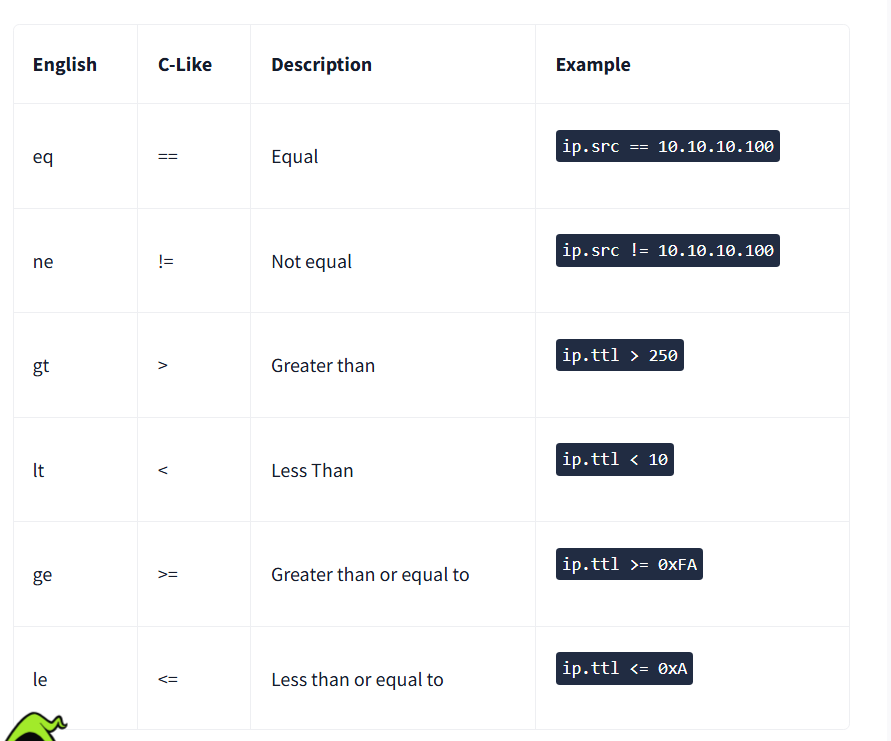

**Bộ lọc IP**
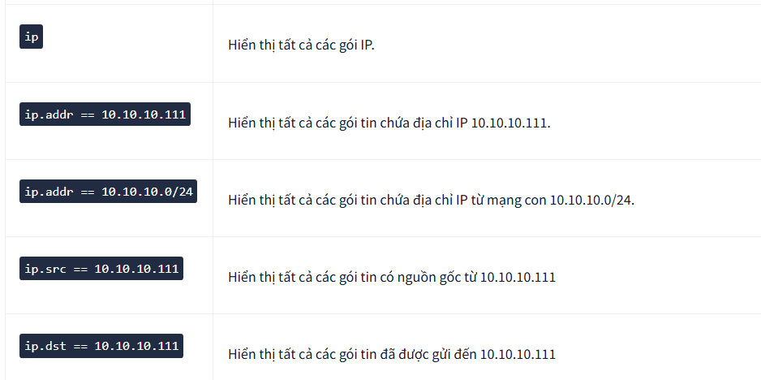

**Lọc TCP and UDP**
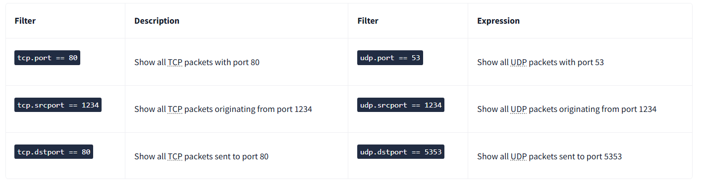

**Lọc HTTP and DNS**
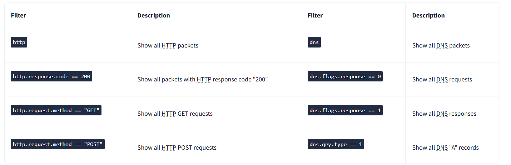

**Lọc nâng cao**
- `contains`: `http.server contains "Apache"`
- matches: 	http.host matches "\.(php|html)"
- `in`: `tcp.port in {80 443 8080}`
- `upper`: `upper(http.server) contains "APACHE"`
- `lower`: `lower(http.server) contains "apache"`
- `string`: `string(frame.number) matches "[13579]$"`
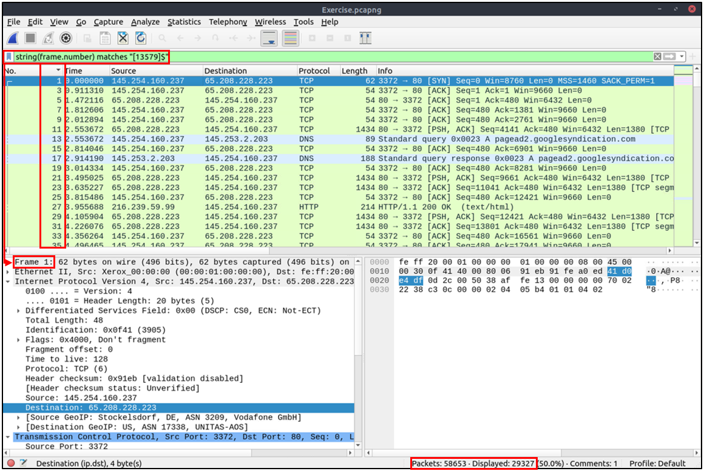

### 5.4 WireShark: Traffic Analysis
#### 5.4.1 Nmap Scan
**Các cờ**

| Mục tiêu tìm kiếm | Bộ lọc chính xác (Chỉ flag đó) | Bộ lọc Bit (Flag đó được bật) | Ghi chú |
| :--- | :--- | :--- | :--- |
| **Giao thức TCP** | `tcp` | - | Tìm kiếm toàn bộ gói tin TCP. |
| **Giao thức UDP** | `udp` | - | Tìm kiếm toàn bộ gói tin UDP. |
| **Chỉ flag SYN** | `tcp.flags == 2` | `tcp.flags.syn == 1` | Dùng trong quá trình bắt đầu bắt tay 3 bước. |
| **Chỉ flag ACK** | `tcp.flags == 16` | `tcp.flags.ack == 1` | Xác nhận đã nhận gói tin. |
| **Chỉ SYN, ACK** | `tcp.flags == 18` | `(tcp.flags.syn == 1) and (tcp.flags.ack == 1)` | Phản hồi từ server trong bắt tay 3 bước. |
| **Chỉ flag RST** | `tcp.flags == 4` | `tcp.flags.reset == 1` | Ngắt kết nối ngay lập tức do lỗi hoặc từ chối. |
| **Chỉ RST, ACK** | `tcp.flags == 20` | `(tcp.flags.reset == 1) and (tcp.flags.ack == 1)` | Phản hồi RST kèm xác nhận. |
| **Chỉ flag FIN** | `tcp.flags == 1` | `tcp.flags.fin == 1` | Yêu cầu kết thúc kết nối bình thường. |

**TCP Connect Scan (-sT)**
Đây là kiểu quét hoàn thành đầy đủ quy trình bắt tay 3 bước.

- Đặc điểm: Dùng bởi user không có quyền root.

- Dấu hiệu: window_size thường lớn hơn 1024 bytes vì Nmap giả vờ là một ứng dụng thật đang đợi dữ liệu.

- Bộ lọc phát hiện: `tcp.flags.syn==1 and tcp.flags.ack==0 and tcp.window_size > 1024`

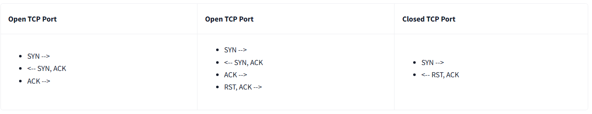

**Stealth SYN Scan (-sS)**
Kiểu quét mặc định và phổ biến nhất. Nó không bao giờ hoàn thành kết nối (Half-open scan).
- Dấu hiệu: window_size thường nhỏ hơn hoặc bằng 1024 bytes.

- Bộ lọc phát hiện: `tcp.flags.syn==1 and tcp.flags.ack==0 and tcp.window_size <= 1024`

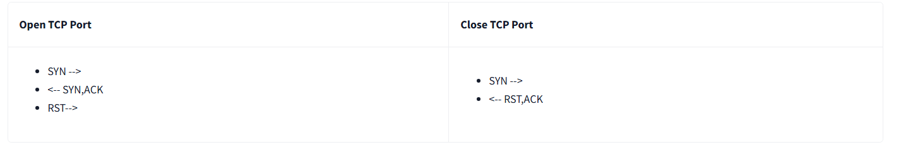

**UDP Scan (-sU)**
UDP là giao thức không hướng kết nối, nên việc quét nó rất chậm và khó chính xác.

- Cơ chế: Gửi gói tin UDP trống. Nếu cổng đóng, hệ thống sẽ trả về lỗi ICMP.

- Dấu hiệu: Xuất hiện các gói tin ICMP Type 3, Code 3 (Destination unreachable, Port unreachable).

- Bộ lọc phát hiện: `icmp.type==3 and icmp.code==3`

#### 5.4.2 ARP Poisoning/Spoofing (A.K.A. Man In The Middle Attack)
**Cần phân tích:**
- Hoạt động trên mạng cục bộ
- Cho phép giao tiếp giữa các địa chỉ MAC.
- Không phải là một giao thức an toàn.
- Không phải là giao thức có thể định tuyến
- Nó không có chức năng xác thực.
- Các dạng phổ biến là yêu cầu & phản hồi, thông báo và các gói dữ liệu không cần thiết.

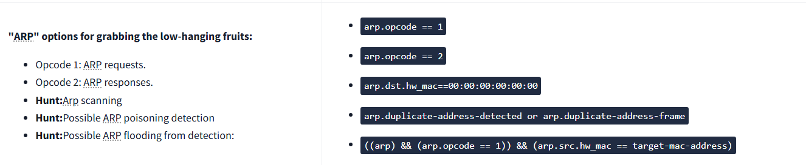

B1: Tạo nhiễu
Máy b4 có địa chỉ là 192.168.1.25, nhưng ngay sau đó lại tự nhận mình là Gateway 192.168.1.1

B2: Đầu độc
Tạo nhiều request lừa các máy trong mạng và gateway, khiến tất cả dữ liệu đều sẽ gửi về địa chỉ MAC của nó 

Kết quả: Tất cả các gói tin đều gửi về địa chỉ của attacker
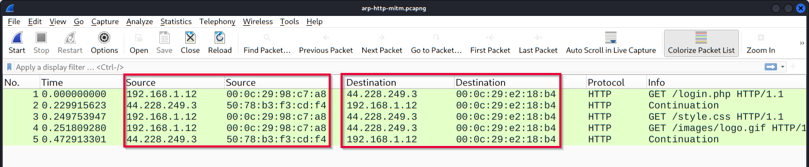

#### 5.4.3 Xác định server
Khi điều tra hoạt động xâm nhập hoặc lây nhiễm phần mềm độc hại, chuyên viên phân tích bảo mật cần biết cách xác định các máy chủ trên mạng ngoài việc đối khớp địa chỉ IP và MAC.

**Các giao thức có thể sử dụng để xác định server**: 
- DHCP
- NetBIOS
- Kerberos

**DHCP**
- Toàn bộ các gói: dhcp hoặc bootp
- "DHCP Request" chứa thông tin về tên máy chủ. (`dhcp.option.dhcp == 3`)
- "DHCP ACK" thể hiện các yêu cầu đã được chấp nhận (`dhcp.option.dhcp == 5`)
- "DHCP NAK" biểu thị các yêu cầu bị từ chối. (`dhcp.option.dhcp == 6`)
- Lọc theo danh mục chứa từ khóa: `dhcp.option.hostname contains "keyword"`

**NetBIOS**
Hệ  thống  Nhập / Xuất  Cơ bản Mạng , là công nghệ cho phép các ứng dụng trên các máy chủ khác nhau giao tiếp với nhau.

- `nbns`: toàn bộ 
- `nbns.name contains "keyword"`: lọc theo từ khóa

**Kerberos**
- `kerberos`: toàn bộ
- `kerberos.CNameString contains "keyword"` (`CNameString`: tên người dùng)
    - Các giá trị tên kết thúc bằng "$" là tên máy chủ, còn các giá trị không có "$" là tên người dùng.
- pvno: Phiên bản giao thức.
- realm: Tên miền của vé được tạo ra.
- sname: Tên dịch vụ và tên miền cho vé được tạo.
- `addresses`: Địa chỉ IP của máy khách và tên NetBIOS.

#### 5.4.4 DNS và ICMP
**ICMP**
- Được thiết kế để chẩn đoán và báo cáo sự cố liên lạc mạng 
- Có thể bị sử dụng để tấn công DOS, đánh cắp data, thiết lập kết nối C2
- Dấu hiệu tấn công:
    - Kích thước gói bất thường & Lưu lượng ICMP lớn (attacker có thể điều chỉnh kích thước thành length gói tin phù hợp (64byte) => khó phát hiện)
- `data.len > 64 and icmp`: các gói tin có kích thước > 64

**DNS**
- Thường bị lợi dụng để đánh cắp data và thiết lập kết nối c2
- Dấu hiệu nhận biết: 
    - Truy vấn dài hơn truy vấn mặc định
    - Được tạo cho tên miền phụ
- `dns.qry.name.len > 15 and !mdns`
- `!mdns`: Vô hiệu hóa truy vấn thiết bị liên kết cục bộ.

**FTP**
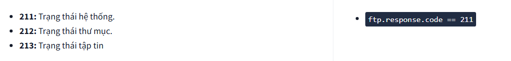

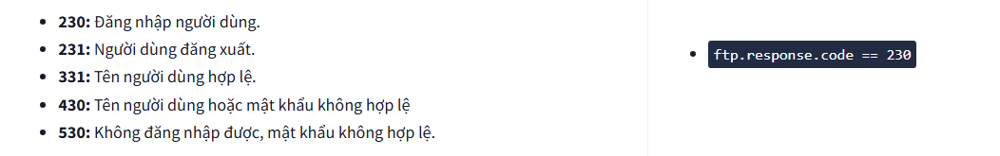
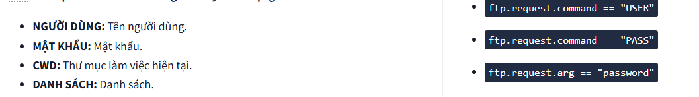
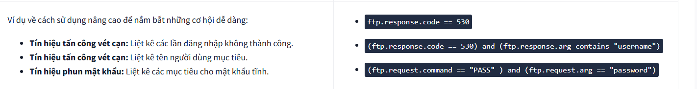

**HTTP**
- Trường "user-agent" là một trong những nguồn tài nguyên tuyệt vời để phát hiện các bất thường trong lưu lượng HTTP. 
- Phát hiện/săn lùng bất thường/mối đe dọa dựa trên user-agent là một nguồn dữ liệu bổ sung cần kiểm tra và hữu ích khi có sự bất thường rõ ràng. 
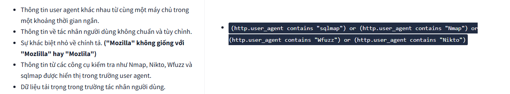
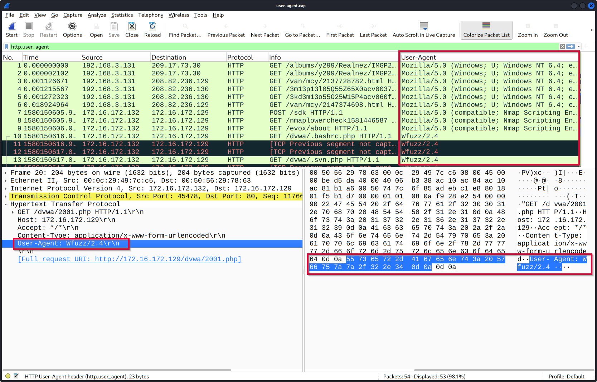

- Phân tích cuộc tấn công Log4j
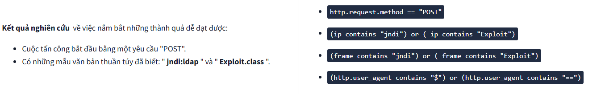
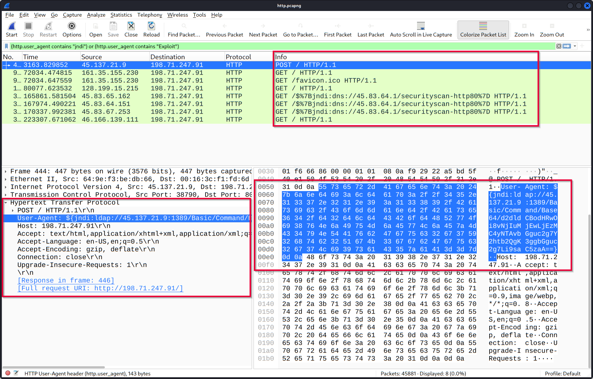

**HTTPS**
- SSDP là một giao thức mạng cung cấp chức năng quảng cáo và tìm kiếm các dịch vụ mạng.
- `tls.handshake.type == 1`: TLS Client Request
- `tls.handshake.type == 2`: TLS Server response

#### 5.4.5 NetworkMiner
NetworkMiner là một công cụ mã nguồn mở dùng để bắt gói tin, xử lý tệp PCAP và phân tích giao thức

**2 chế độ vận hành: **
- Passive Sniffer: lắng nghe lưu lượng mạng mà không gửi đi bất kỳ gói tin nào.
- PCAP Parser: nạp file PCAP, tự động tách và tái cấu trúc lại các tệp tin, chứng chỉ (certificates), hình ảnh và tin nhắn từ lưu lượng đó để phân tích ngoại tuyến.

**Vai trò**
Liệt kê thông tin: 
- IP & MAC: Định danh chính xác thiết bị.

- Hostnames: Tên máy (rất quan trọng để biết nạn nhân là ai, ví dụ: KETOAN-PC).

- OS Information: Nhận diện hệ điều hành (Windows, Linux, iOS...).

**Kiểu dữ liệu hỗ trợ**
- Live Traffic
- Traffic Captures
- Log Files
#### Anomalies
 - hiển thị các bất thường được phát hiện trong tệp pcap đã xử lý
 - NetworkMiner không được chỉ định là một hệ thống phát hiện xâm nhập (IDS). Tuy nhiên, các nhà phát triển đã thêm một số tính năng phát hiện lỗ hổng EternalBlue và các nỗ lực giả mạo.

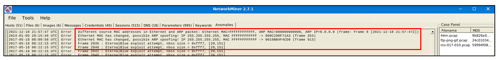

